# ⬆️ Amazon Web Services Certified (AWS Certified) Machine Learning Specialty (MLS-C01) Practice Tests Exams Questions & Answers

## ❣️ Support

There are many ways to support us; in exchange, you'll get this material in a proper format:
- ❤️ [shop.ditectrev.com, in EPUB or PDF formats, with answers marked](https://shop.ditectrev.com/product/amazon-web-services-certified-aws-certified-machine-learning-specialty-mls-c01-practice-tests-exams-questions-answers),
- ❤️ [shop.ditectrev.com, in EPUB or PDF formats, without answers marked](https://shop.ditectrev.com/product/amazon-web-services-certified-aws-certified-machine-learning-specialty-mls-c01-practice-tests-exams-questions-no-answers),
- 📖 [Udemy is the only one to have explanations for questions](https://www.udemy.com/course/aws-certified-machine-learning-specialty-mls-c01-exams-t/?referralCode=BEEF21376E8952CA2D78),
- 📚 [Google Play Books, in PDF format, with answers marked](https://play.google.com/store/books/details?id=9xUFEQAAQBAJ),
- 📚 [Google Play Books, in PDF format, without answers marked](https://play.google.com/store/books/details?id=8xUFEQAAQBAJ),
- 🛍️ [Etsy, in PDF format, with answers marked](https://ditectrev.etsy.com/listing/1580957028),
- 🛍️ [Etsy, in PDF format, without answers marked](https://ditectrev.etsy.com/listing/1595134115),
- 🛒 [eBay, in PDF format, with answers marked](https://www.ebay.com/itm/404924359468?mkcid=16&mkevt=1&mkrid=711-127632-2357-0&ssspo=_ptbuk3gqdw&sssrc=2524149&ssuid=_ptbuk3gqdw&widget_ver=artemis&media=COPY),
- 🛒 [eBay, in PDF format, without answers marked](https://www.ebay.com/itm/405079754307?mkcid=16&mkevt=1&mkrid=711-127632-2357-0&ssspo=_ptbuk3gqdw&sssrc=2524149&ssuid=_ptbuk3gqdw&widget_ver=artemis&media=COPY),
- 🔄 [Patreon subscription allows you to get access to all of the materials in EPUB and PDF formats. You can also buy separate items on Patreon, but the subscription technically allows us to include all updates for EPUB and PDF formats. Hence, you get EPUB and PDF updates when you subscribe to Patreon](https://patreon.com/Ditectrev?utm_medium=unknown&utm_source=join_link&utm_campaign=creatorshare_creator&utm_content=copyLink).

💰 If you work for a company, you could probably easily claim this expense while preparing for your exam. For us, it's about being in the game or not.

⭐ Good ratings & reviews help us to survive. Please don't forget to leave a nice one when you purchase an item. 

## ✨ This course is unlike any Amazon Web Services Certified (AWS Certified) Machine Learning Specialty (MLS-C01) course you will find online

✋ Join a live online community and a course taught by industry experts and pass the Amazon Web Services Certified (AWS Certified) Machine Learning Specialty (MLS-C01) confidently. We aim to build an ecosystem of Information Technology (IT) certifications and online courses in cooperation with the technology industry. We believe it will give our students 100% confidence in the pacing market in an open-source environment. We are just at the beginning of our way, so it's even better for you to join now!

## ⌛️ Short and to the point; why should you take the course

1. Always happy to answer your questions on Udemy's Q&A's and outside :)
2. Failed? Please submit a screenshot of your exam result and request a refund (via our upcoming platform, not possible on Udemy); we'll always accept it.
3. Learn about topics, such as:
   - Amazon Athena;
   - Amazon CloudWatch;
   - Amazon Comprehend;
   - Amazon Elastic Compute Cloud (Amazon EC2);
   - Amazon Elastic Map Reduce (Amazon EMR);
   - Amazon Kinesis;
   - Amazon SageMaker;
   - Amazon Simple Storage Service (Amazon S3);
   - Amazon Textract;
   - Amazon Transcribe;
   - Apache Parquet;
   - Apache Spark;
   - AWS Batch;
   - AWS Glue;
   - AWS Lambda;
   - Convolutional Neural Network (CNN);
   - K-means;
   - Linear Regression;
   - Logistic Regression;
   - Principal Component Analysis (PCA);
   - Recurrent Neural Network (RNN);
   - Virtual Private Clouds (VPC);
   - **Much More!**
4. Questions are similar to the actual exam, without duplications (like in other courses ;-)).
5. The Practice Tests Exams simulate the actual exam's content, timing, and percentage required to pass the exam.
6. This course is **not** an Amazon Web Services Certified (AWS Certified) Machine Learning Specialty (MLS-C01) Exam Dump. Some people use brain dumps or exam dumps, but that's absurd, which we don't practice.
7. 137 **unique** questions.

## ☝️ Course Updates

**[v1.0.0](../../releases/tag/v1.0.0): October 24, 2023.**

- Launch of the course.

**[v1.0.1](../../releases/tag/v1.0.1): October 30, 2023.**

- Fix all remaining typos with support of automated proofreading software.

**[v1.0.2](../../releases/tag/v1.0.2): January 19, 2024.**

- Fix 1 question with a wrong answer.

**[v1.0.2](../../releases/tag/v1.0.2): July 31, 2024.**

- AI-generated explanations (only paid [Udemy](https://www.udemy.com/course/aws-certified-machine-learning-specialty-mls-c01-exams-t/?referralCode=BEEF21376E8952CA2D78)).

**[v1.1.0](../../releases/tag/v1.1.0): August 20, 2024.**

- Fix 4 questions with a wrong answer and remove a question from a not related topic.

## 🙋‍♀️ & 🙋‍♂️ Contribution

We are so thankful for every contribution, which makes sure we can deliver top-notch content. Whenever you find a missing resource, broken link in a [Table of Contents](#table-of-contents), the wrong answer, please submit an [issue](../../issues). Even better would be a [Pull Request (PR)](../../pulls).

## Who this course is for:

- 👨‍🎓 Students preparing for the Amazon Web Services Certified (AWS Certified) Machine Learning Specialty (MLS-C01) Exam;
- 👨‍🎓 Amazon Web Services (AWS) Engineers;
- 👨‍🎓 Artificial Intelligence (AI) Engineers;
- 👨‍🎓 Data Scientists;
- 👨‍🎓 Deep Learning Engineers;
- 👨‍🎓 Machine Learning Engineers;
- 👨‍🎓 Natural Language Processing (NLP) Engineers.
- 👨‍🎓 Neural Network Engineers.

## Requirements

- 🤩 Excitement to learn!
- 0️⃣ Prior knowledge is required;
- ✅ You can pass the Amazon Web Services Certified (AWS Certified) Machine Learning Specialty (MLS-C01) Exam solely based on our Practice Tests Exams.

## Table of Contents

| No. | Questions |
| --- | --------- |
| 1   | [A large mobile network operating company is building a machine learning model to predict customers who are likely to unsubscribe from the service. The company plans to offer an incentive for these customers as the cost of churn is far greater than the cost of the incentive. The model produces the following confusion matrix after evaluating on a test dataset of 100 customers. Based on the model evaluation results, why is this a viable model for production?](#a-large-mobile-network-operating-company-is-building-a-machine-learning-model-to-predict-customers-who-are-likely-to-unsubscribe-from-the-service-the-company-plans-to-offer-an-incentive-for-these-customers-as-the-cost-of-churn-is-far-greater-than-the-cost-of-the-incentive-the-model-produces-the-following-confusion-matrix-after-evaluating-on-a-test-dataset-of-100-customers-based-on-the-model-evaluation-results-why-is-this-a-viable-model-for-production)
| 2   | [A Machine Learning Specialist is designing a system for improving sales for a company. The objective is to use the large amount of information the company has on users' behavior and product preferences to predict which products users would like based on the users' similarity to other users. What should the Specialist do to meet this objective?](#a-machine-learning-specialist-is-designing-a-system-for-improving-sales-for-a-company-the-objective-is-to-use-the-large-amount-of-information-the-company-has-on-users-behavior-and-product-preferences-to-predict-which-products-users-would-like-based-on-the-users-similarity-to-other-users-what-should-the-specialist-do-to-meet-this-objective)
| 3   | [A Mobile Network Operator is building an analytics platform to analyze and optimize a company's operations using Amazon Athena and Amazon S3. The source systems send data in .CSV format in real time. The Data Engineering team wants to transform the data to the Apache Parquet format before storing it on Amazon S3. Which solution takes the LEAST effort to implement?](#a-mobile-network-operator-is-building-an-analytics-platform-to-analyze-and-optimize-a-companys-operations-using-amazon-athena-and-amazon-s3-the-source-systems-send-data-in-csv-format-in-real-time-the-data-engineering-team-wants-to-transform-the-data-to-the-apache-parquet-format-before-storing-it-on-amazon-s3-which-solution-takes-the-least-effort-to-implement)
| 4   | [A city wants to monitor its air quality to address the consequences of air pollution. A Machine Learning Specialist needs to forecast the air quality in parts per million of contaminates for the next 2 days in the city. As this is a prototype, only daily data from the last year is available. Which model is MOST likely to provide the best results in Amazon SageMaker?](#a-city-wants-to-monitor-its-air-quality-to-address-the-consequences-of-air-pollution-a-machine-learning-specialist-needs-to-forecast-the-air-quality-in-parts-per-million-of-contaminates-for-the-next-2-days-in-the-city-as-this-is-a-prototype-only-daily-data-from-the-last-year-is-available-which-model-is-most-likely-to-provide-the-best-results-in-amazon-sagemaker)
| 5   | [A Data Engineer needs to build a model using a dataset containing customer credit card information. How can the Data Engineer ensure the data remains encrypted and the credit card information is secure?](#a-data-engineer-needs-to-build-a-model-using-a-dataset-containing-customer-credit-card-information-how-can-the-data-engineer-ensure-the-data-remains-encrypted-and-the-credit-card-information-is-secure)
| 6   | [A Machine Learning Specialist is using an Amazon SageMaker notebook instance in a private subnet of a corporate VPC. The ML Specialist has important data stored on the Amazon SageMaker notebook instance's Amazon EBS volume, and needs to take a snapshot of that EBS volume. However, the ML Specialist cannot find the Amazon SageMaker notebook instance's EBS volume or Amazon EC2 instance within the VPC. Why is the ML Specialist not seeing the instance visible in the VPC?](#a-machine-learning-specialist-is-using-an-amazon-sagemaker-notebook-instance-in-a-private-subnet-of-a-corporate-vpc-the-ml-specialist-has-important-data-stored-on-the-amazon-sagemaker-notebook-instances-amazon-ebs-volume-and-needs-to-take-a-snapshot-of-that-ebs-volume-however-the-ml-specialist-cannot-find-the-amazon-sagemaker-notebook-instances-ebs-volume-or-amazon-ec2-instance-within-the-vpc-why-is-the-ml-specialist-not-seeing-the-instance-visible-in-the-vpc)
| 7   | [A Machine Learning Specialist is building a model that will perform time series forecasting using Amazon SageMaker. The Specialist has finished training the model and is now planning to perform load testing on the endpoint so they can configure Auto Scaling for the model variant. Which approach will allow the Specialist to review the latency, memory utilization, and CPU utilization during the load test?](#a-machine-learning-specialist-is-building-a-model-that-will-perform-time-series-forecasting-using-amazon-sagemaker-the-specialist-has-finished-training-the-model-and-is-now-planning-to-perform-load-testing-on-the-endpoint-so-they-can-configure-auto-scaling-for-the-model-variant-which-approach-will-allow-the-specialist-to-review-the-latency-memory-utilization-and-cpu-utilization-during-the-load-test)
| 8   | [A manufacturing company has structured and unstructured data stored in an Amazon S3 bucket. A Machine Learning Specialist wants to use SQL to run queries on this data. Which solution requires the LEAST effort to be able to query this data?](#a-manufacturing-company-has-structured-and-unstructured-data-stored-in-an-amazon-s3-bucket-a-machine-learning-specialist-wants-to-use-sql-to-run-queries-on-this-data-which-solution-requires-the-least-effort-to-be-able-to-query-this-data)
| 9   | [A Machine Learning Specialist is developing a custom video recommendation model for an application. The dataset used to train this model is very large with millions of data points and is hosted in an Amazon S3 bucket. The Specialist wants to avoid loading all of this data onto an Amazon SageMaker notebook instance because it would take hours to move and will exceed the attached 5 GB Amazon EBS volume on the notebook instance. Which approach allows the Specialist to use all the data to train the model?](#a-machine-learning-specialist-is-developing-a-custom-video-recommendation-model-for-an-application-the-dataset-used-to-train-this-model-is-very-large-with-millions-of-data-points-and-is-hosted-in-an-amazon-s3-bucket-the-specialist-wants-to-avoid-loading-all-of-this-data-onto-an-amazon-sagemaker-notebook-instance-because-it-would-take-hours-to-move-and-will-exceed-the-attached-5-gb-amazon-ebs-volume-on-the-notebook-instance-which-approach-allows-the-specialist-to-use-all-the-data-to-train-the-model)
| 10  | [A Machine Learning Specialist has completed a proof of concept for a company using a small data sample, and now the Specialist is ready to implement an end-to-end solution in AWS using Amazon SageMaker. The historical training data is stored in Amazon RDS. Which approach should the Specialist use for training a model using that data?](#a-machine-learning-specialist-has-completed-a-proof-of-concept-for-a-company-using-a-small-data-sample-and-now-the-specialist-is-ready-to-implement-an-end-to-end-solution-in-aws-using-amazon-sagemaker-the-historical-training-data-is-stored-in-amazon-rds-which-approach-should-the-specialist-use-for-training-a-model-using-that-data)
| 11  | [A Machine Learning Specialist receives customer data for an online shopping website. The data includes demographics, past visits, and locality information. The Specialist must develop a machine learning approach to identify the customer shopping patterns, preferences, and trends to enhance the website-for better service and smart recommendations. Which solution should the Specialist recommend?](#a-machine-learning-specialist-receives-customer-data-for-an-online-shopping-website-the-data-includes-demographics-past-visits-and-locality-information-the-specialist-must-develop-a-machine-learning-approach-to-identify-the-customer-shopping-patterns-preferences-and-trends-to-enhance-the-website-for-better-service-and-smart-recommendations-which-solution-should-the-specialist-recommend)
| 12  | [A Machine Learning Specialist is working with a large company to leverage machine learning within its products. The company wants to group its customers into categories based on which customers will and will not churn within the next 6 months. The company has labeled the data available to the Specialist. Which machine learning model type should the Specialist use to accomplish this task?](#a-machine-learning-specialist-is-working-with-a-large-company-to-leverage-machine-learning-within-its-products-the-company-wants-to-group-its-customers-into-categories-based-on-which-customers-will-and-will-not-churn-within-the-next-6-months-the-company-has-labeled-the-data-available-to-the-specialist-which-machine-learning-model-type-should-the-specialist-use-to-accomplish-this-task)
| 13  | [The displayed graph is from a forecasting model for testing a time series. Considering the graph only, which conclusion should a Machine Learning Specialist make about the behavior of the model?](#the-displayed-graph-is-from-a-forecasting-model-for-testing-a-time-series-considering-the-graph-only-which-conclusion-should-a-machine-learning-specialist-make-about-the-behavior-of-the-model)
| 14  | [A company wants to classify user behavior as either fraudulent or normal. Based on internal research, a machine learning specialist will build a binary classifier based on two features: age of account, denoted by x, and transaction month, denoted by y. The class distributions are illustrated in the provided figure. The positive class is portrayed in red, while the negative class is portrayed in black. Which model would have the HIGHEST accuracy?](#a-company-wants-to-classify-user-behavior-as-either-fraudulent-or-normal-based-on-internal-research-a-machine-learning-specialist-will-build-a-binary-classifier-based-on-two-features-age-of-account-denoted-by-x-and-transaction-month-denoted-by-y-the-class-distributions-are-illustrated-in-the-provided-figure-the-positive-class-is-portrayed-in-red-while-the-negative-class-is-portrayed-in-black-which-model-would-have-the-highest-accuracy)
| 15  | [A Machine Learning Specialist at a company sensitive to security is preparing a dataset for model training. The dataset is stored in Amazon S3 and contains Personally Identifiable Information (PII). The dataset: Must be accessible from a VPC only. Must not traverse the public internet. How can these requirements be satisfied?](#a-machine-learning-specialist-at-a-company-sensitive-to-security-is-preparing-a-dataset-for-model-training-the-dataset-is-stored-in-amazon-s3-and-contains-personally-identifiable-information-pii-the-dataset-must-be-accessible-from-a-vpc-only-must-not-traverse-the-public-internet-how-can-these-requirements-be-satisfied)
| 16  | [During mini-batch training of a neural network for a classification problem, a Data Scientist notices that training accuracy oscillates. What is the MOST likely cause of this issue?](#during-mini-batch-training-of-a-neural-network-for-a-classification-problem-a-data-scientist-notices-that-training-accuracy-oscillates-what-is-the-most-likely-cause-of-this-issue)
| 17  | [An employee found a video clip with audio on a company's social media feed. The language used in the video is Spanish. English is the employee's first language, and they do not understand Spanish. The employee wants to do a sentiment analysis. What combination of services is the MOST efficient to accomplish the task?](#an-employee-found-a-video-clip-with-audio-on-a-companys-social-media-feed-the-language-used-in-the-video-is-spanish-english-is-the-employees-first-language-and-they-do-not-understand-spanish-the-employee-wants-to-do-a-sentiment-analysis-what-combination-of-services-is-the-most-efficient-to-accomplish-the-task)
| 18  | [A Machine Learning Specialist is packaging a custom ResNet model into a Docker container so the company can leverage Amazon SageMaker for training. The Specialist is using Amazon EC2 P3 instances to train the model and needs to properly configure the Docker container to leverage the NVIDIA GPUs. What does the Specialist need to do?](#a-machine-learning-specialist-is-packaging-a-custom-resnet-model-into-a-docker-container-so-the-company-can-leverage-amazon-sagemaker-for-training-the-specialist-is-using-amazon-ec2-p3-instances-to-train-the-model-and-needs-to-properly-configure-the-docker-container-to-leverage-the-nvidia-gpus-what-does-the-specialist-need-to-do)
| 19  | [A Machine Learning Specialist is building a Logistic Regression model that will predict whether or not a person will order a pizza. The Specialist is trying to build the optimal model with an ideal classification threshold. What model evaluation technique should the Specialist use to understand how different classification thresholds will impact the model's performance?](#a-machine-learning-specialist-is-building-a-logistic-regression-model-that-will-predict-whether-or-not-a-person-will-order-a-pizza-the-specialist-is-trying-to-build-the-optimal-model-with-an-ideal-classification-threshold-what-model-evaluation-technique-should-the-specialist-use-to-understand-how-different-classification-thresholds-will-impact-the-models-performance)
| 20  | [An interactive online dictionary wants to add a widget that displays words used in similar contexts. A Machine Learning Specialist is asked to provide word features for the downstream nearest neighbor model powering the widget. What should the Specialist do to meet these requirements?](#an-interactive-online-dictionary-wants-to-add-a-widget-that-displays-words-used-in-similar-contexts-a-machine-learning-specialist-is-asked-to-provide-word-features-for-the-downstream-nearest-neighbor-model-powering-the-widget-what-should-the-specialist-do-to-meet-these-requirements)
| 21  | [A Machine Learning Specialist is configuring Amazon SageMaker so multiple Data Scientists can access notebooks, train models, and deploy endpoints. To ensure the best operational performance, the Specialist needs to be able to track how often the Scientists are deploying models, GPU and CPU utilization on the deployed SageMaker endpoints, and all errors that are generated when an endpoint is invoked. Which services are integrated with Amazon SageMaker to track this information? (Choose two.)](#a-machine-learning-specialist-is-configuring-amazon-sagemaker-so-multiple-data-scientists-can-access-notebooks-train-models-and-deploy-endpoints-to-ensure-the-best-operational-performance-the-specialist-needs-to-be-able-to-track-how-often-the-scientists-are-deploying-models-gpu-and-cpu-utilization-on-the-deployed-sagemaker-endpoints-and-all-errors-that-are-generated-when-an-endpoint-is-invoked-which-services-are-integrated-with-amazon-sagemaker-to-track-this-information-choose-two)
| 22  | [A retail chain has been ingesting purchasing records from its network of 20,000 stores to Amazon S3 using Amazon Kinesis Data Firehose. To support training an improved machine learning model, training records will require new but simple transformations, and some attributes will be combined. The model needs to be retrained daily. Given the large number of stores and the legacy data ingestion, which change will require the LEAST amount of development effort?](#a-retail-chain-has-been-ingesting-purchasing-records-from-its-network-of-20000-stores-to-amazon-s3-using-amazon-kinesis-data-firehose-to-support-training-an-improved-machine-learning-model-training-records-will-require-new-but-simple-transformations-and-some-attributes-will-be-combined-the-model-needs-to-be-retrained-daily-given-the-large-number-of-stores-and-the-legacy-data-ingestion-which-change-will-require-the-least-amount-of-development-effort)
| 23  | [A Machine Learning Specialist is building a Convolutional Neural Network (CNN) that will classify 10 types of animals. The Specialist has built a series of layers in a neural network that will take an input image of an animal, pass it through a series of convolutional and pooling layers, and then finally pass it through a dense and fully connected layer with 10 nodes. The Specialist would like to get an output from the neural network that is a probability distribution of how likely it is that the input image belongs to each of the 10 classes. Which function will produce the desired output?](#a-machine-learning-specialist-is-building-a-convolutional-neural-network-cnn-that-will-classify-10-types-of-animals-the-specialist-has-built-a-series-of-layers-in-a-neural-network-that-will-take-an-input-image-of-an-animal-pass-it-through-a-series-of-convolutional-and-pooling-layers-and-then-finally-pass-it-through-a-dense-and-fully-connected-layer-with-10-nodes-the-specialist-would-like-to-get-an-output-from-the-neural-network-that-is-a-probability-distribution-of-how-likely-it-is-that-the-input-image-belongs-to-each-of-the-10-classes-which-function-will-produce-the-desired-output)
| 24  | [A Machine Learning Specialist trained a regression model, but the first iteration needs optimizing. The Specialist needs to understand whether the model is more frequently overestimating or underestimating the target. What option can the Specialist use to determine whether it is overestimating or underestimating the target value?](#a-machine-learning-specialist-trained-a-regression-model-but-the-first-iteration-needs-optimizing-the-specialist-needs-to-understand-whether-the-model-is-more-frequently-overestimating-or-underestimating-the-target-what-option-can-the-specialist-use-to-determine-whether-it-is-overestimating-or-underestimating-the-target-value)
| 25  | [A company wants to classify user behavior as either fraudulent or normal. Based on internal research, a Machine Learning Specialist would like to build a binary classifier based on two features: age of account and transaction month. The class distribution for these features is illustrated in the figure provided. Based on this information, which model would have the HIGHEST recall with respect to the fraudulent class?](#a-company-wants-to-classify-user-behavior-as-either-fraudulent-or-normal-based-on-internal-research-a-machine-learning-specialist-would-like-to-build-a-binary-classifier-based-on-two-features-age-of-account-and-transaction-month-the-class-distribution-for-these-features-is-illustrated-in-the-figure-provided-based-on-this-information-which-model-would-have-the-highest-recall-with-respect-to-the-fraudulent-class)
| 26  | [A Machine Learning Specialist kicks off a hyperparameter tuning job for a tree-based ensemble model using Amazon SageMaker with Area Under the ROC Curve (AUC) as the objective metric. This workflow will eventually be deployed in a pipeline that retrains and tunes hyperparameters each night to model click-through on data that goes stale every 24 hours. With the goal of decreasing the amount of time it takes to train these models, and ultimately to decrease costs, the Specialist wants to reconfigure the input hyperparameter range(s). Which visualization will accomplish this?](#a-machine-learning-specialist-kicks-off-a-hyperparameter-tuning-job-for-a-tree-based-ensemble-model-using-amazon-sagemaker-with-area-under-the-roc-curve-auc-as-the-objective-metric-this-workflow-will-eventually-be-deployed-in-a-pipeline-that-retrains-and-tunes-hyperparameters-each-night-to-model-click-through-on-data-that-goes-stale-every-24-hours-with-the-goal-of-decreasing-the-amount-of-time-it-takes-to-train-these-models-and-ultimately-to-decrease-costs-the-specialist-wants-to-reconfigure-the-input-hyperparameter-ranges-which-visualization-will-accomplish-this)
| 27  | [A Machine Learning Specialist is creating a new natural language processing application that processes a dataset comprised of 1 million sentences. The aim is to then run Word2Vec to generate embeddings of the sentences and enable different types of predictions. Here is an example from the dataset: 'The quck BROWN FOX jumps over the lazy dog.' Which of the following are the operations the Specialist needs to perform to correctly sanitize and prepare the data in a repeatable manner? (Choose three.)](#a-machine-learning-specialist-is-creating-a-new-natural-language-processing-application-that-processes-a-dataset-comprised-of-1-million-sentences-the-aim-is-to-then-run-word2vec-to-generate-embeddings-of-the-sentences-and-enable-different-types-of-predictions-here-is-an-example-from-the-dataset-the-quck-brown-fox-jumps-over-the-lazy-dog-which-of-the-following-are-the-operations-the-specialist-needs-to-perform-to-correctly-sanitize-and-prepare-the-data-in-a-repeatable-manner-choose-three)
| 28  | [A company is using Amazon Polly to translate plaintext documents to speech for automated company announcements. However, company acronyms are being mispronounced in the current documents. How should a Machine Learning Specialist address this issue for future documents?](#a-company-is-using-amazon-polly-to-translate-plaintext-documents-to-speech-for-automated-company-announcements-however-company-acronyms-are-being-mispronounced-in-the-current-documents-how-should-a-machine-learning-specialist-address-this-issue-for-future-documents)
| 29  | [An insurance company is developing a new device for vehicles that uses a camera to observe drivers' behavior and alert them when they appear distracted. The company created approximately 10,000 training images in a controlled environment that a Machine Learning Specialist will use to train and evaluate machine learning models. During the model evaluation, the Specialist notices that the training error rate diminishes faster as the number of epochs increases and the model is not accurately inferring on the unseen test images. Which of the following should be used to resolve this issue? (Choose two.)](#an-insurance-company-is-developing-a-new-device-for-vehicles-that-uses-a-camera-to-observe-drivers-behavior-and-alert-them-when-they-appear-distracted-the-company-created-approximately-10000-training-images-in-a-controlled-environment-that-a-machine-learning-specialist-will-use-to-train-and-evaluate-machine-learning-models-during-the-model-evaluation-the-specialist-notices-that-the-training-error-rate-diminishes-faster-as-the-number-of-epochs-increases-and-the-model-is-not-accurately-inferring-on-the-unseen-test-images-which-of-the-following-should-be-used-to-resolve-this-issue-choose-two)
| 30  | [When submitting Amazon SageMaker training jobs using one of the built-in algorithms, which common parameters MUST be specified? (Choose three.)](#when-submitting-amazon-sagemaker-training-jobs-using-one-of-the-built-in-algorithms-which-common-parameters-must-be-specified-choose-three)
| 31  | [A monitoring service generates 1 TB of scale metrics record data every minute. A Research team performs queries on this data using Amazon Athena. The queries run slowly due to the large volume of data, and the team requires better performance. How should the records be stored in Amazon S3 to improve query performance?](#a-monitoring-service-generates-1-tb-of-scale-metrics-record-data-every-minute-a-research-team-performs-queries-on-this-data-using-amazon-athena-the-queries-run-slowly-due-to-the-large-volume-of-data-and-the-team-requires-better-performance-how-should-the-records-be-stored-in-amazon-s3-to-improve-query-performance)
| 32  | [Machine Learning Specialist is working with a media company to perform classification on popular articles from the company's website. The company is using random forests to classify how popular an article will be before it is published. A sample of the data being used is below. Given the dataset, the Specialist wants to convert the Day_Of_Week column to binary values. What technique should be used to convert this column to binary values?](#machine-learning-specialist-is-working-with-a-media-company-to-perform-classification-on-popular-articles-from-the-companys-website-the-company-is-using-random-forests-to-classify-how-popular-an-article-will-be-before-it-is-published-a-sample-of-the-data-being-used-is-below-given-the-dataset-the-specialist-wants-to-convert-the-day_of_week-column-to-binary-values-what-technique-should-be-used-to-convert-this-column-to-binary-values)
| 33  | [A gaming company has launched an online game where people can start playing for free, but they need to pay if they choose to use certain features. The company needs to build an automated system to predict whether or not a new user will become a paid user within 1 year. The company has gathered a labeled dataset from 1 million users. The training dataset consists of 1,000 positive samples (from users who ended up paying within 1 year) and 999,000 negative samples (from users who did not use any paid features). Each data sample consists of 200 features including user age, device, location, and play patterns. Using this dataset for training, the Data Science team trained a random forest model that converged with over 99% accuracy on the training set. However, the prediction results on a test dataset were not satisfactory. Which of the following approaches should the Data Science team take to mitigate this issue? (Choose two.)](#a-gaming-company-has-launched-an-online-game-where-people-can-start-playing-for-free-but-they-need-to-pay-if-they-choose-to-use-certain-features-the-company-needs-to-build-an-automated-system-to-predict-whether-or-not-a-new-user-will-become-a-paid-user-within-1-year-the-company-has-gathered-a-labeled-dataset-from-1-million-users-the-training-dataset-consists-of-1000-positive-samples-from-users-who-ended-up-paying-within-1-year-and-999000-negative-samples-from-users-who-did-not-use-any-paid-features-each-data-sample-consists-of-200-features-including-user-age-device-location-and-play-patterns-using-this-dataset-for-training-the-data-science-team-trained-a-random-forest-model-that-converged-with-over-99-accuracy-on-the-training-set-however-the-prediction-results-on-a-test-dataset-were-not-satisfactory-which-of-the-following-approaches-should-the-data-science-team-take-to-mitigate-this-issue-choose-two)
| 34  | [A Data Scientist is developing a machine learning model to predict future patient outcomes based on information collected about each patient and their treatment plans. The model should output a continuous value as its prediction. The data available includes labeled outcomes for a set of 4,000 patients. The study was conducted on a group of individuals over the age of 65 who have a particular disease that is known to worsen with age. Initial models have performed poorly. While reviewing the underlying data, the Data Scientist notices that, out of 4,000 patient observations, there are 450 where the patient age has been input as 0. The other features for these observations appear normal compared to the rest of the sample population. How should the Data Scientist correct this issue?](#a-data-scientist-is-developing-a-machine-learning-model-to-predict-future-patient-outcomes-based-on-information-collected-about-each-patient-and-their-treatment-plans-the-model-should-output-a-continuous-value-as-its-prediction-the-data-available-includes-labeled-outcomes-for-a-set-of-4000-patients-the-study-was-conducted-on-a-group-of-individuals-over-the-age-of-65-who-have-a-particular-disease-that-is-known-to-worsen-with-age-initial-models-have-performed-poorly-while-reviewing-the-underlying-data-the-data-scientist-notices-that-out-of-4000-patient-observations-there-are-450-where-the-patient-age-has-been-input-as-0-the-other-features-for-these-observations-appear-normal-compared-to-the-rest-of-the-sample-population-how-should-the-data-scientist-correct-this-issue)
| 35  | [A Data Science team is designing a dataset repository where it will store a large amount of training data commonly used in its machine learning models. As Data Scientists may create an arbitrary number of new datasets every day, the solution has to scale automatically and be cost-effective. Also, it must be possible to explore the data using SQL. Which storage scheme is MOST adapted to this scenario?](#a-data-science-team-is-designing-a-dataset-repository-where-it-will-store-a-large-amount-of-training-data-commonly-used-in-its-machine-learning-models-as-data-scientists-may-create-an-arbitrary-number-of-new-datasets-every-day-the-solution-has-to-scale-automatically-and-be-cost-effective-also-it-must-be-possible-to-explore-the-data-using-sql-which-storage-scheme-is-most-adapted-to-this-scenario)
| 36  | [PLACEHOLDER](#placeholder)
| 37  | [Which characteristic applies to a catalog backup?](#which-characteristic-applies-to-a-catalog-backup)
| 38  | [A data scientist is developing a pipeline to ingest streaming web traffic data. The data scientist needs to implement a process to identify unusual web traffic patterns as part of the pipeline. The patterns will be used downstream for alerting and incident response. The data scientist has access to unlabeled historic data to use, if needed. The solution needs to do the following: Calculate an anomaly score for each web traffic entry. Adapt unusual event identification to changing web patterns over time. Which approach should the data scientist implement to meet these requirements?](#a-data-scientist-is-developing-a-pipeline-to-ingest-streaming-web-traffic-data-the-data-scientist-needs-to-implement-a-process-to-identify-unusual-web-traffic-patterns-as-part-of-the-pipeline-the-patterns-will-be-used-downstream-for-alerting-and-incident-response-the-data-scientist-has-access-to-unlabeled-historic-data-to-use-if-needed-the-solution-needs-to-do-the-following-calculate-an-anomaly-score-for-each-web-traffic-entry-adapt-unusual-event-identification-to-changing-web-patterns-over-time-which-approach-should-the-data-scientist-implement-to-meet-these-requirements)
| 39  | [A Data Scientist received a set of insurance records, each consisting of a record ID, the final outcome among 200 categories, and the date of the final outcome. Some partial information on claim contents is also provided, but only for a few of the 200 categories. For each outcome category, there are hundreds of records distributed over the past 3 years. The Data Scientist wants to predict how many claims to expect in each category from month to month, a few months in advance. What type of machine learning model should be used?](#a-data-scientist-received-a-set-of-insurance-records-each-consisting-of-a-record-id-the-final-outcome-among-200-categories-and-the-date-of-the-final-outcome-some-partial-information-on-claim-contents-is-also-provided-but-only-for-a-few-of-the-200-categories-for-each-outcome-category-there-are-hundreds-of-records-distributed-over-the-past-3-years-the-data-scientist-wants-to-predict-how-many-claims-to-expect-in-each-category-from-month-to-month-a-few-months-in-advance-what-type-of-machine-learning-model-should-be-used)
| 40  | [A company that promotes healthy sleep patterns by providing cloud-connected devices currently hosts a sleep tracking application on AWS. The application collects device usage information from device users. The company's Data Science team is building a machine learning model to predict if and when a user will stop utilizing the company's devices. Predictions from this model are used by a downstream application that determines the best approach for contacting users. The Data Science team is building multiple versions of the machine learning model to evaluate each version against the company's business goals. To measure long-term effectiveness, the team wants to run multiple versions of the model in parallel for long periods of time, with the ability to control the portion of inferences served by the models. Which solution satisfies these requirements with MINIMAL effort?](#a-company-that-promotes-healthy-sleep-patterns-by-providing-cloud-connected-devices-currently-hosts-a-sleep-tracking-application-on-aws-the-application-collects-device-usage-information-from-device-users-the-companys-data-science-team-is-building-a-machine-learning-model-to-predict-if-and-when-a-user-will-stop-utilizing-the-companys-devices-predictions-from-this-model-are-used-by-a-downstream-application-that-determines-the-best-approach-for-contacting-users-the-data-science-team-is-building-multiple-versions-of-the-machine-learning-model-to-evaluate-each-version-against-the-companys-business-goals-to-measure-long-term-effectiveness-the-team-wants-to-run-multiple-versions-of-the-model-in-parallel-for-long-periods-of-time-with-the-ability-to-control-the-portion-of-inferences-served-by-the-models-which-solution-satisfies-these-requirements-with-minimal-effort)
| 41  | [A Machine Learning Specialist is assigned to a Fraud Detection team and must tune an XGBoost model, which is working appropriately for test data. However, with unknown data, it is not working as expected. The existing parameters are provided as follows. Which parameter tuning guidelines should the Specialist follow to avoid overfitting?](#a-machine-learning-specialist-is-assigned-to-a-fraud-detection-team-and-must-tune-an-xgboost-model-which-is-working-appropriately-for-test-data-however-with-unknown-data-it-is-not-working-as-expected-the-existing-parameters-are-provided-as-follows-which-parameter-tuning-guidelines-should-the-specialist-follow-to-avoid-overfitting)
| 42  | [A media company with a very large archive of unlabeled images, text, audio, and video footage wishes to index its assets to allow rapid identification of relevant content by the Research team. The company wants to use machine learning to accelerate the efforts of its in-house researchers who have limited machine learning expertise. Which is the FASTEST route to index the assets?](#a-media-company-with-a-very-large-archive-of-unlabeled-images-text-audio-and-video-footage-wishes-to-index-its-assets-to-allow-rapid-identification-of-relevant-content-by-the-research-team-the-company-wants-to-use-machine-learning-to-accelerate-the-efforts-of-its-in-house-researchers-who-have-limited-machine-learning-expertise-which-is-the-fastest-route-to-index-the-assets)
| 43  | [A Machine Learning Specialist is working for an online retailer that wants to run analytics on every customer visit, processed through a machine learning pipeline. The data needs to be ingested by Amazon Kinesis Data Streams at up to 100 transactions per second, and the JSON data blob is 100 KB in size. What is the MINIMUM number of shards in Kinesis Data Streams the Specialist should use to successfully ingest this data?](#a-machine-learning-specialist-is-working-for-an-online-retailer-that-wants-to-run-analytics-on-every-customer-visit-processed-through-a-machine-learning-pipeline-the-data-needs-to-be-ingested-by-amazon-kinesis-data-streams-at-up-to-100-transactions-per-second-and-the-json-data-blob-is-100-kb-in-size-what-is-the-minimum-number-of-shards-in-kinesis-data-streams-the-specialist-should-use-to-successfully-ingest-this-data)
| 44  | [A Machine Learning Specialist is deciding between building a naive Bayesian model or a full Bayesian network for a classification problem. The Specialist computes the Pearson correlation coefficients between each feature and finds that their absolute values range between 0.1 to 0.95. Which model describes the underlying data in this situation?](#a-machine-learning-specialist-is-deciding-between-building-a-naive-bayesian-model-or-a-full-bayesian-network-for-a-classification-problem-the-specialist-computes-the-pearson-correlation-coefficients-between-each-feature-and-finds-that-their-absolute-values-range-between-01-to-095-which-model-describes-the-underlying-data-in-this-situation)
| 45  | [A Data Scientist is building a Linear Regression model and will use resulting p-values to evaluate the statistical significance of each coefficient. Upon inspection of the dataset, the Data Scientist discovers that most of the features are normally distributed. The plot of one feature in the dataset is shown in the graphic. What transformation should the Data Scientist apply to satisfy the statistical assumptions of the Linear Regression model?](#a-data-scientist-is-building-a-linear-regression-model-and-will-use-resulting-p-values-to-evaluate-the-statistical-significance-of-each-coefficient-upon-inspection-of-the-dataset-the-data-scientist-discovers-that-most-of-the-features-are-normally-distributed-the-plot-of-one-feature-in-the-dataset-is-shown-in-the-graphic-what-transformation-should-the-data-scientist-apply-to-satisfy-the-statistical-assumptions-of-the-linear-regression-model)
| 46  | [A technology startup is using complex deep neural networks and GPU compute to recommend the company's products to its existing customers based upon each customer's habits and interactions. The solution currently pulls each dataset from an Amazon S3 bucket before loading the data into a TensorFlow model pulled from the company's Git repository that runs locally. This job then runs for several hours while continually outputting its progress to the same S3 bucket. The job can be paused, restarted, and continued at any time in the event of a failure, and is run from a central queue. Senior managers are concerned about the complexity of the solution's resource management and the costs involved in repeating the process regularly. They ask for the workload to the automated so it runs once a week, starting Monday and completing by the close of business Friday. Which architecture should be used to scale the solution at the lowest cost?](#a-technology-startup-is-using-complex-deep-neural-networks-and-gpu-compute-to-recommend-the-companys-products-to-its-existing-customers-based-upon-each-customers-habits-and-interactions-the-solution-currently-pulls-each-dataset-from-an-amazon-s3-bucket-before-loading-the-data-into-a-tensorflow-model-pulled-from-the-companys-git-repository-that-runs-locally-this-job-then-runs-for-several-hours-while-continually-outputting-its-progress-to-the-same-s3-bucket-the-job-can-be-paused-restarted-and-continued-at-any-time-in-the-event-of-a-failure-and-is-run-from-a-central-queue-senior-managers-are-concerned-about-the-complexity-of-the-solutions-resource-management-and-the-costs-involved-in-repeating-the-process-regularly-they-ask-for-the-workload-to-the-automated-so-it-runs-once-a-week-starting-monday-and-completing-by-the-close-of-business-friday-which-architecture-should-be-used-to-scale-the-solution-at-the-lowest-cost)
| 47  | [A Machine Learning Specialist prepared the following graph displaying the results of K-means for k = [1..10]. Considering the graph, what is a reasonable selection for the optimal choice of k?](#a-machine-learning-specialist-prepared-the-following-graph-displaying-the-results-of-k-means-for-k--110-considering-the-graph-what-is-a-reasonable-selection-for-the-optimal-choice-of-k)
| 48  | [A machine learning specialist works for a fruit processing company and needs to build a system that categorizes apples into three types. The specialist has collected a dataset that contains 150 images for each type of apple and applied transfer learning on a neural network that was pretrained on ImageNet with this dataset. The company requires at least 85% accuracy to make use of the model. After an exhaustive grid search, the optimal hyperparameters produced the following: 68% accuracy on the training set. 67% accuracy on the validation set. What can the machine learning specialist do to improve the system's accuracy?](#a-machine-learning-specialist-works-for-a-fruit-processing-company-and-needs-to-build-a-system-that-categorizes-apples-into-three-types-the-specialist-has-collected-a-dataset-that-contains-150-images-for-each-type-of-apple-and-applied-transfer-learning-on-a-neural-network-that-was-pretrained-on-imagenet-with-this-dataset-the-company-requires-at-least-85-accuracy-to-make-use-of-the-model-after-an-exhaustive-grid-search-the-optimal-hyperparameters-produced-the-following-68-accuracy-on-the-training-set-67-accuracy-on-the-validation-set-what-can-the-machine-learning-specialist-do-to-improve-the-systems-accuracy)
| 49  | [A company uses camera images of the tops of items displayed on store shelves to determine which items were removed and which ones still remain. After several hours of data labeling, the company has a total of 1,000 hand-labeled images covering 10 distinct items. The training results were poor. Which machine learning approach fulfills the company's long-term needs?](#a-company-uses-camera-images-of-the-tops-of-items-displayed-on-store-shelves-to-determine-which-items-were-removed-and-which-ones-still-remain-after-several-hours-of-data-labeling-the-company-has-a-total-of-1000-hand-labeled-images-covering-10-distinct-items-the-training-results-were-poor-which-machine-learning-approach-fulfills-the-companys-long-term-needs)
| 50  | [A Data Scientist is developing a binary classifier to predict whether a patient has a particular disease on a series of test results. The Data Scientist has data on 400 patients randomly selected from the population. The disease is seen in 3% of the population. Which cross-validation strategy should the Data Scientist adopt?](#a-data-scientist-is-developing-a-binary-classifier-to-predict-whether-a-patient-has-a-particular-disease-on-a-series-of-test-results-the-data-scientist-has-data-on-400-patients-randomly-selected-from-the-population-the-disease-is-seen-in-3-of-the-population-which-cross-validation-strategy-should-the-data-scientist-adopt)
| 51  | [A Machine Learning Specialist is attempting to build a Linear Regression model. Given the displayed residual plot only, what is the MOST likely problem with the model?](#a-machine-learning-specialist-is-attempting-to-build-a-linear-regression-model-given-the-displayed-residual-plot-only-what-is-the-most-likely-problem-with-the-model)
| 52  | [A large company has developed a BI application that generates reports and dashboards using data collected from various operational metrics. The company wants to provide executives with an enhanced experience so they can use natural language to get data from the reports. The company wants the executives to be able ask questions using written and spoken interfaces. Which combination of services can be used to build this conversational interface? (Choose three.)](#a-large-company-has-developed-a-bi-application-that-generates-reports-and-dashboards-using-data-collected-from-various-operational-metrics-the-company-wants-to-provide-executives-with-an-enhanced-experience-so-they-can-use-natural-language-to-get-data-from-the-reports-the-company-wants-the-executives-to-be-able-ask-questions-using-written-and-spoken-interfaces-which-combination-of-services-can-be-used-to-build-this-conversational-interface-choose-three)
| 53  | [A health care company is planning to use neural networks to classify their X-ray images into normal and abnormal classes. The labeled data is divided into a training set of 1,000 images and a test set of 200 images. The initial training of a neural network model with 50 hidden layers yielded 99% accuracy on the training set, but only 55% accuracy on the test set. What changes should the Specialist consider to solve this issue? (Choose three.)](#a-health-care-company-is-planning-to-use-neural-networks-to-classify-their-x-ray-images-into-normal-and-abnormal-classes-the-labeled-data-is-divided-into-a-training-set-of-1000-images-and-a-test-set-of-200-images-the-initial-training-of-a-neural-network-model-with-50-hidden-layers-yielded-99-accuracy-on-the-training-set-but-only-55-accuracy-on-the-test-set-what-changes-should-the-specialist-consider-to-solve-this-issue-choose-three)
| 54  | [This graph shows the training and validation loss against the epochs for a neural network. The network being trained is as follows: Two dense layers, one output neuron. 100 neurons in each layer. 100 epochs. Random initialization of weights. Which technique can be used to improve model performance in terms of accuracy in the validation set?](#this-graph-shows-the-training-and-validation-loss-against-the-epochs-for-a-neural-network-the-network-being-trained-is-as-follows-two-dense-layers-one-output-neuron-100-neurons-in-each-layer-100-epochs-random-initialization-of-weights-which-technique-can-be-used-to-improve-model-performance-in-terms-of-accuracy-in-the-validation-set)
| 55  | [A company wants to predict the sale prices of houses based on available historical sales data. The target variable in the company's dataset is the sale price. The features include parameters such as the lot size, living area measurements, non-living area measurements, number of bedrooms, number of bathrooms, year built, and postal code. The company wants to use multi-variable Linear Regression to predict house sale prices. Which step should a machine learning specialist take to remove features that are irrelevant for the analysis and reduce the model's complexity?](#a-company-wants-to-predict-the-sale-prices-of-houses-based-on-available-historical-sales-data-the-target-variable-in-the-companys-dataset-is-the-sale-price-the-features-include-parameters-such-as-the-lot-size-living-area-measurements-non-living-area-measurements-number-of-bedrooms-number-of-bathrooms-year-built-and-postal-code-the-company-wants-to-use-multi-variable-linear-regression-to-predict-house-sale-prices-which-step-should-a-machine-learning-specialist-take-to-remove-features-that-are-irrelevant-for-the-analysis-and-reduce-the-models-complexity)
| 56  | [A Machine Learning Specialist is given a structured dataset on the shopping habits of a company's customer base. The dataset contains thousands of columns of data and hundreds of numerical columns for each customer. The Specialist wants to identify whether there are natural groupings for these columns across all customers and visualize the results as quickly as possible. What approach should the Specialist take to accomplish these tasks?](#a-machine-learning-specialist-is-given-a-structured-dataset-on-the-shopping-habits-of-a-companys-customer-base-the-dataset-contains-thousands-of-columns-of-data-and-hundreds-of-numerical-columns-for-each-customer-the-specialist-wants-to-identify-whether-there-are-natural-groupings-for-these-columns-across-all-customers-and-visualize-the-results-as-quickly-as-possible-what-approach-should-the-specialist-take-to-accomplish-these-tasks)
| 57  | [A Machine Learning Specialist is planning to create a long-running Amazon EMR cluster. The EMR cluster will have 1 master node, 10 core nodes, and 20 task nodes. To save on costs, the Specialist will use Spot Instances in the EMR cluster. Which nodes should the Specialist launch on Spot Instances?](#a-machine-learning-specialist-is-planning-to-create-a-long-running-amazon-emr-cluster-the-emr-cluster-will-have-1-master-node-10-core-nodes-and-20-task-nodes-to-save-on-costs-the-specialist-will-use-spot-instances-in-the-emr-cluster-which-nodes-should-the-specialist-launch-on-spot-instances)
| 58  | [A manufacturer of car engines collects data from cars as they are being driven. The data collected includes timestamp, engine temperature, rotations per minute (RPM), and other sensor readings. The company wants to predict when an engine is going to have a problem, so it can notify drivers in advance to get engine maintenance. The engine data is loaded into a data lake for training. Which is the MOST suitable predictive model that can be deployed into production?](#a-manufacturer-of-car-engines-collects-data-from-cars-as-they-are-being-driven-the-data-collected-includes-timestamp-engine-temperature-rotations-per-minute-rpm-and-other-sensor-readings-the-company-wants-to-predict-when-an-engine-is-going-to-have-a-problem-so-it-can-notify-drivers-in-advance-to-get-engine-maintenance-the-engine-data-is-loaded-into-a-data-lake-for-training-which-is-the-most-suitable-predictive-model-that-can-be-deployed-into-production)
| 59  | [A Machine Learning Specialist wants to bring a custom algorithm to Amazon SageMaker. The Specialist implements the algorithm in a Docker container supported by Amazon SageMaker. How should the Specialist package the Docker container so that Amazon SageMaker can launch the training correctly?](#a-machine-learning-specialist-wants-to-bring-a-custom-algorithm-to-amazon-sagemaker-the-specialist-implements-the-algorithm-in-a-docker-container-supported-by-amazon-sagemaker-how-should-the-specialist-package-the-docker-container-so-that-amazon-sagemaker-can-launch-the-training-correctly)
| 60  | [A Data Scientist needs to analyze employment data. The dataset contains approximately 10 million observations on people across 10 different features. During the preliminary analysis, the Data Scientist notices that income and age distributions are not normal. While income levels shows a right skew as expected, with fewer individuals having a higher income, the age distribution also shows a right skew, with fewer older individuals participating in the workforce. Which feature transformations can the Data Scientist apply to fix the incorrectly skewed data? (Choose two.)](#a-data-scientist-needs-to-analyze-employment-data-the-dataset-contains-approximately-10-million-observations-on-people-across-10-different-features-during-the-preliminary-analysis-the-data-scientist-notices-that-income-and-age-distributions-are-not-normal-while-income-levels-shows-a-right-skew-as-expected-with-fewer-individuals-having-a-higher-income-the-age-distribution-also-shows-a-right-skew-with-fewer-older-individuals-participating-in-the-workforce-which-feature-transformations-can-the-data-scientist-apply-to-fix-the-incorrectly-skewed-data-choose-two)
| 61  | [A web-based company wants to improve its conversion rate on its landing page. Using a large historical dataset of customer visits, the company has repeatedly trained a multi-class deep learning network algorithm on Amazon SageMaker. However, there is an overfitting problem: training data shows 90% accuracy in predictions, while test data shows 70% accuracy only. The company needs to boost the generalization of its model before deploying it into production to maximize conversions of visits to purchases. Which action is recommended to provide the HIGHEST accuracy model for the company's test and validation data?](#a-web-based-company-wants-to-improve-its-conversion-rate-on-its-landing-page-using-a-large-historical-dataset-of-customer-visits-the-company-has-repeatedly-trained-a-multi-class-deep-learning-network-algorithm-on-amazon-sagemaker-however-there-is-an-overfitting-problem-training-data-shows-90-accuracy-in-predictions-while-test-data-shows-70-accuracy-only-the-company-needs-to-boost-the-generalization-of-its-model-before-deploying-it-into-production-to-maximize-conversions-of-visits-to-purchases-which-action-is-recommended-to-provide-the-highest-accuracy-model-for-the-companys-test-and-validation-data)
| 62  | [A real estate company wants to create a machine learning model for predicting housing prices based on a historical dataset. The dataset contains 32 features. Which model will meet the business requirement?](#a-real-estate-company-wants-to-create-a-machine-learning-model-for-predicting-housing-prices-based-on-a-historical-dataset-the-dataset-contains-32-features-which-model-will-meet-the-business-requirement)
| 63  | [A Machine Learning Specialist is applying a linear least squares regression model to a dataset with 1,000 records and 50 features. Prior to training, the ML Specialist notices that two features are perfectly linearly dependent. Why could this be an issue for the linear least squares regression model?](#a-machine-learning-specialist-is-applying-a-linear-least-squares-regression-model-to-a-dataset-with-1000-records-and-50-features-prior-to-training-the-ml-specialist-notices-that-two-features-are-perfectly-linearly-dependent-why-could-this-be-an-issue-for-the-linear-least-squares-regression-model)
| 64  | [Given the following confusion matrix for a movie classification model, what is the true class frequency for Romance and the predicted class frequency for Adventure?](#given-the-following-confusion-matrix-for-a-movie-classification-model-what-is-the-true-class-frequency-for-romance-and-the-predicted-class-frequency-for-adventure)
| 65  | [A credit card company wants to build a credit scoring model to help predict whether a new credit card applicant will default on a credit card payment. The company has collected data from a large number of sources with thousands of raw attributes. Early experiments to train a classification model revealed that many attributes are highly correlated, the large number of features slows down the training speed significantly, and that there are some overfitting issues. The Data Scientist on this project would like to speed up the model training time without losing a lot of information from the original dataset. Which feature engineering technique should the Data Scientist use to meet the objectives?](#a-credit-card-company-wants-to-build-a-credit-scoring-model-to-help-predict-whether-a-new-credit-card-applicant-will-default-on-a-credit-card-payment-the-company-has-collected-data-from-a-large-number-of-sources-with-thousands-of-raw-attributes-early-experiments-to-train-a-classification-model-revealed-that-many-attributes-are-highly-correlated-the-large-number-of-features-slows-down-the-training-speed-significantly-and-that-there-are-some-overfitting-issues-the-data-scientist-on-this-project-would-like-to-speed-up-the-model-training-time-without-losing-a-lot-of-information-from-the-original-dataset-which-feature-engineering-technique-should-the-data-scientist-use-to-meet-the-objectives)
| 66  | [A Data Scientist is training a multilayer perception (MLP) on a dataset with multiple classes. The target class of interest is unique compared to the other classes within the dataset, but it does not achieve and acceptable recall metric. The Data Scientist has already tried varying the number and size of the MLP's hidden layers, which has not significantly improved the results. A solution to improve recall must be implemented as quickly as possible. Which techniques should be used to meet these requirements?](#a-data-scientist-is-training-a-multilayer-perception-mlp-on-a-dataset-with-multiple-classes-the-target-class-of-interest-is-unique-compared-to-the-other-classes-within-the-dataset-but-it-does-not-achieve-and-acceptable-recall-metric-the-data-scientist-has-already-tried-varying-the-number-and-size-of-the-mlps-hidden-layers-which-has-not-significantly-improved-the-results-a-solution-to-improve-recall-must-be-implemented-as-quickly-as-possible-which-techniques-should-be-used-to-meet-these-requirements)
| 67  | [A Machine Learning Specialist works for a credit card processing company and needs to predict which transactions may be fraudulent in near-real time. Specifically, the Specialist must train a model that returns the probability that a given transaction may fraudulent. How should the Specialist frame this business problem?](#a-machine-learning-specialist-works-for-a-credit-card-processing-company-and-needs-to-predict-which-transactions-may-be-fraudulent-in-near-real-time-specifically-the-specialist-must-train-a-model-that-returns-the-probability-that-a-given-transaction-may-fraudulent-how-should-the-specialist-frame-this-business-problem)
| 68  | [A Machine Learning Specialist needs to move and transform data in preparation for training. Some of the data needs to be processed in near-real time, and other data can be moved hourly. There are existing Amazon EMR MapReduce jobs to clean and feature engineering to perform on the data. Which of the following services can feed data to the MapReduce jobs? (Choose two.)](#a-machine-learning-specialist-needs-to-move-and-transform-data-in-preparation-for-training-some-of-the-data-needs-to-be-processed-in-near-real-time-and-other-data-can-be-moved-hourly-there-are-existing-amazon-emr-mapreduce-jobs-to-clean-and-feature-engineering-to-perform-on-the-data-which-of-the-following-services-can-feed-data-to-the-mapreduce-jobs-choose-two)
| 69  | [A Machine Learning Specialist previously trained a Logistic Regression model using scikit-learn on a local machine, and the Specialist now wants to deploy it to production for inference only. What steps should be taken to ensure Amazon SageMaker can host a model that was trained locally?](#a-machine-learning-specialist-previously-trained-a-logistic-regression-model-using-scikit-learn-on-a-local-machine-and-the-specialist-now-wants-to-deploy-it-to-production-for-inference-only-what-steps-should-be-taken-to-ensure-amazon-sagemaker-can-host-a-model-that-was-trained-locally)
| 70  | [A trucking company is collecting live image data from its fleet of trucks across the globe. The data is growing rapidly and approximately 100 GB of new data is generated every day. The company wants to explore machine learning uses cases while ensuring the data is only accessible to specific IAM users. Which storage option provides the most processing flexibility and will allow access control with IAM?](#a-trucking-company-is-collecting-live-image-data-from-its-fleet-of-trucks-across-the-globe-the-data-is-growing-rapidly-and-approximately-100-gb-of-new-data-is-generated-every-day-the-company-wants-to-explore-machine-learning-uses-cases-while-ensuring-the-data-is-only-accessible-to-specific-iam-users-which-storage-option-provides-the-most-processing-flexibility-and-will-allow-access-control-with-iam)
| 71  | [A Machine Learning team runs its own training algorithm on Amazon SageMaker. The training algorithm requires external assets. The team needs to submit both its own algorithm code and algorithm-specific parameters to Amazon SageMaker. What combination of services should the team use to build a custom algorithm in Amazon SageMaker? (Choose two.)](#a-machine-learning-team-runs-its-own-training-algorithm-on-amazon-sagemaker-the-training-algorithm-requires-external-assets-the-team-needs-to-submit-both-its-own-algorithm-code-and-algorithm-specific-parameters-to-amazon-sagemaker-what-combination-of-services-should-the-team-use-to-build-a-custom-algorithm-in-amazon-sagemaker-choose-two)
| 72  | [A Machine Learning Specialist wants to determine the appropriate SageMakerVariantInvocationsPerInstance setting for an endpoint automatic scaling configuration. The Specialist has performed a load test on a single instance and determined that peak requests per second (RPS) without service degradation is about 20 RPS. As this is the first deployment, the Specialist intends to set the invocation safety factor to 0.5. Based on the stated parameters and given that the invocations per instance setting is measured on a per-minute basis, what should the Specialist set as the SageMakerVariantInvocationsPerInstance setting?](#a-machine-learning-specialist-wants-to-determine-the-appropriate-sagemakervariantinvocationsperinstance-setting-for-an-endpoint-automatic-scaling-configuration-the-specialist-has-performed-a-load-test-on-a-single-instance-and-determined-that-peak-requests-per-second-rps-without-service-degradation-is-about-20-rps-as-this-is-the-first-deployment-the-specialist-intends-to-set-the-invocation-safety-factor-to-05-based-on-the-stated-parameters-and-given-that-the-invocations-per-instance-setting-is-measured-on-a-per-minute-basis-what-should-the-specialist-set-as-the-sagemakervariantinvocationsperinstance-setting)
| 73  | [A company uses a long short-term memory (LSTM) model to evaluate the risk factors of a particular energy sector. The model reviews multi-page text documents to analyze each sentence of the text and categorize it as either a potential risk or no risk. The model is not performing well, even though the Data Scientist has experimented with many different network structures and tuned the corresponding hyperparameters. Which approach will provide the MAXIMUM performance boost?](#a-company-uses-a-long-short-term-memory-lstm-model-to-evaluate-the-risk-factors-of-a-particular-energy-sector-the-model-reviews-multi-page-text-documents-to-analyze-each-sentence-of-the-text-and-categorize-it-as-either-a-potential-risk-or-no-risk-the-model-is-not-performing-well-even-though-the-data-scientist-has-experimented-with-many-different-network-structures-and-tuned-the-corresponding-hyperparameters-which-approach-will-provide-the-maximum-performance-boost)
| 74  | [A Data Scientist is building a model to predict customer churn using a dataset of 100 continuous numerical features. The Marketing team has not provided any insight about which features are relevant for churn prediction. The Marketing team wants to interpret the model and see the direct impact of relevant features on the model outcome. While training a Logistic Regression model, the Data Scientist observes that there is a wide gap between the training and validation set accuracy. Which methods can the Data Scientist use to improve the model performance and satisfy the Marketing team's needs? (Choose two.)](#a-data-scientist-is-building-a-model-to-predict-customer-churn-using-a-dataset-of-100-continuous-numerical-features-the-marketing-team-has-not-provided-any-insight-about-which-features-are-relevant-for-churn-prediction-the-marketing-team-wants-to-interpret-the-model-and-see-the-direct-impact-of-relevant-features-on-the-model-outcome-while-training-a-logistic-regression-model-the-data-scientist-observes-that-there-is-a-wide-gap-between-the-training-and-validation-set-accuracy-which-methods-can-the-data-scientist-use-to-improve-the-model-performance-and-satisfy-the-marketing-teams-needs-choose-two)
| 75  | [An aircraft engine manufacturing company is measuring 200 performance metrics in a time-series. Engineers want to detect critical manufacturing defects in near-real time during testing. All of the data needs to be stored for offline analysis. What approach would be the MOST effective to perform near-real time defect detection?](#an-aircraft-engine-manufacturing-company-is-measuring-200-performance-metrics-in-a-time-series-engineers-want-to-detect-critical-manufacturing-defects-in-near-real-time-during-testing-all-of-the-data-needs-to-be-stored-for-offline-analysis-what-approach-would-be-the-most-effective-to-perform-near-real-time-defect-detection)
| 76  | [A Data Scientist needs to migrate an existing on-premises ETL process to the cloud. The current process runs at regular time intervals and uses PySpark to combine and format multiple large data sources into a single consolidated output for downstream processing. The Data Scientist has been given the following requirements to the cloud solution: Combine multiple data sources. Reuse existing PySpark logic. Run the solution on the existing schedule. Minimize the number of servers that will need to be managed. Which architecture should the Data Scientist use to build this solution?](#a-data-scientist-needs-to-migrate-an-existing-on-premises-etl-process-to-the-cloud-the-current-process-runs-at-regular-time-intervals-and-uses-pyspark-to-combine-and-format-multiple-large-data-sources-into-a-single-consolidated-output-for-downstream-processing-the-data-scientist-has-been-given-the-following-requirements-to-the-cloud-solution-combine-multiple-data-sources-reuse-existing-pyspark-logic-run-the-solution-on-the-existing-schedule-minimize-the-number-of-servers-that-will-need-to-be-managed-which-architecture-should-the-data-scientist-use-to-build-this-solution)
| 77  | [A Machine Learning Specialist is developing a daily ETL workflow containing multiple ETL jobs. The workflow consists of the following processes: Start the workflow as soon as data is uploaded to Amazon S3. When all the datasets are available in Amazon S3, start an ETL job to join the uploaded datasets with multiple terabyte-sized datasets already stored in Amazon S3. Store the results of joining datasets in Amazon S3. If one of the jobs fails, send a notification to the Administrator. Which configuration will meet these requirements?](#a-machine-learning-specialist-is-developing-a-daily-etl-workflow-containing-multiple-etl-jobs-the-workflow-consists-of-the-following-processes-start-the-workflow-as-soon-as-data-is-uploaded-to-amazon-s3-when-all-the-datasets-are-available-in-amazon-s3-start-an-etl-job-to-join-the-uploaded-datasets-with-multiple-terabyte-sized-datasets-already-stored-in-amazon-s3-store-the-results-of-joining-datasets-in-amazon-s3-if-one-of-the-jobs-fails-send-a-notification-to-the-administrator-which-configuration-will-meet-these-requirements)
| 78  | [An agency collects census information within a country to determine healthcare and social program needs by province and city. The census form collects responses for approximately 500 questions from each citizen. Which combination of algorithms would provide the appropriate insights? (Select TWO.)](#an-agency-collects-census-information-within-a-country-to-determine-healthcare-and-social-program-needs-by-province-and-city-the-census-form-collects-responses-for-approximately-500-questions-from-each-citizen-which-combination-of-algorithms-would-provide-the-appropriate-insights-select-two)
| 79  | [A large consumer goods manufacturer has the following products on sale: 34 different toothpaste variants. 48 different toothbrush variants. 43 different mouthwash variants. The entire sales history of all these products is available in Amazon S3. Currently, the company is using custom-built autoregressive integrated moving average (ARIMA) models to forecast demand for these products. The company wants to predict the demand for a new product that will soon be launched. Which solution should a Machine Learning Specialist apply?](#a-large-consumer-goods-manufacturer-has-the-following-products-on-sale-34-different-toothpaste-variants-48-different-toothbrush-variants-43-different-mouthwash-variants-the-entire-sales-history-of-all-these-products-is-available-in-amazon-s3-currently-the-company-is-using-custom-built-autoregressive-integrated-moving-average-arima-models-to-forecast-demand-for-these-products-the-company-wants-to-predict-the-demand-for-a-new-product-that-will-soon-be-launched-which-solution-should-a-machine-learning-specialist-apply)
| 80  | [A Machine Learning Specialist uploads a dataset to an Amazon S3 bucket protected with server-side encryption using AWS KMS. How should the ML Specialist define the Amazon SageMaker notebook instance so it can read the same dataset from Amazon S3?](#a-machine-learning-specialist-uploads-a-dataset-to-an-amazon-s3-bucket-protected-with-server-side-encryption-using-aws-kms-how-should-the-ml-specialist-define-the-amazon-sagemaker-notebook-instance-so-it-can-read-the-same-dataset-from-amazon-s3)
| 81  | [A Data Scientist is working on an application that performs sentiment analysis. The validation accuracy is poor, and the Data Scientist thinks that the cause may be a rich vocabulary and a low average frequency of words in the dataset. Which tool should be used to improve the validation accuracy?](#a-data-scientist-is-working-on-an-application-that-performs-sentiment-analysis-the-validation-accuracy-is-poor-and-the-data-scientist-thinks-that-the-cause-may-be-a-rich-vocabulary-and-a-low-average-frequency-of-words-in-the-dataset-which-tool-should-be-used-to-improve-the-validation-accuracy)
| 82  | [Machine Learning Specialist is building a model to predict future employment rates based on a wide range of economic factors. While exploring the data, the Specialist notices that the magnitude of the input features vary greatly. The Specialist does not want variables with a larger magnitude to dominate the model. What should the Specialist do to prepare the data for model training?](#machine-learning-specialist-is-building-a-model-to-predict-future-employment-rates-based-on-a-wide-range-of-economic-factors-while-exploring-the-data-the-specialist-notices-that-the-magnitude-of-the-input-features-vary-greatly-the-specialist-does-not-want-variables-with-a-larger-magnitude-to-dominate-the-model-what-should-the-specialist-do-to-prepare-the-data-for-model-training)
| 83  | [A Machine Learning Specialist must build out a process to query a dataset on Amazon S3 using Amazon Athena. The dataset contains more than 800,000 records stored as plaintext CSV files. Each record contains 200 columns and is approximately 1.5 MB in size. Most queries will span 5 to 10 columns only. How should the Machine Learning Specialist transform the dataset to minimize query runtime?](#a-machine-learning-specialist-must-build-out-a-process-to-query-a-dataset-on-amazon-s3-using-amazon-athena-the-dataset-contains-more-than-800000-records-stored-as-plaintext-csv-files-each-record-contains-200-columns-and-is-approximately-15-mb-in-size-most-queries-will-span-5-to-10-columns-only-how-should-the-machine-learning-specialist-transform-the-dataset-to-minimize-query-runtime)
| 84  | [A Machine Learning Specialist is working with a large cybersecurity company that manages security events in real time for companies around the world. The cybersecurity company wants to design a solution that will allow it to use machine learning to score malicious events as anomalies on the data as it is being ingested. The company also wants be able to save the results in its data lake for later processing and analysis. What is the MOST efficient way to accomplish these tasks?](#a-machine-learning-specialist-is-working-with-a-large-cybersecurity-company-that-manages-security-events-in-real-time-for-companies-around-the-world-the-cybersecurity-company-wants-to-design-a-solution-that-will-allow-it-to-use-machine-learning-to-score-malicious-events-as-anomalies-on-the-data-as-it-is-being-ingested-the-company-also-wants-be-able-to-save-the-results-in-its-data-lake-for-later-processing-and-analysis-what-is-the-most-efficient-way-to-accomplish-these-tasks)
| 85  | [A Data Scientist wants to gain real-time insights into a data stream of GZIP files. Which solution would allow the use of SQL to query the stream with the LEAST latency?](#a-data-scientist-wants-to-gain-real-time-insights-into-a-data-stream-of-gzip-files-which-solution-would-allow-the-use-of-sql-to-query-the-stream-with-the-least-latency)
| 86  | [A retail company intends to use machine learning to categorize new products. A labeled dataset of current products was provided to the Data Science team. The dataset includes 1,200 products. The labeled dataset has 15 features for each product such as title dimensions, weight, and price. Each product is labeled as belonging to one of six categories such as books, games, electronics, and movies. Which model should be used for categorizing new products using the provided dataset for training?](#a-retail-company-intends-to-use-machine-learning-to-categorize-new-products-a-labeled-dataset-of-current-products-was-provided-to-the-data-science-team-the-dataset-includes-1200-products-the-labeled-dataset-has-15-features-for-each-product-such-as-title-dimensions-weight-and-price-each-product-is-labeled-as-belonging-to-one-of-six-categories-such-as-books-games-electronics-and-movies-which-model-should-be-used-for-categorizing-new-products-using-the-provided-dataset-for-training)
| 87  | [A Machine Learning Specialist is assigned a TensorFlow project using Amazon SageMaker for training, and needs to continue working for an extended period with no Wi-Fi access. Which approach should the Specialist use to continue working?](#a-machine-learning-specialist-is-assigned-a-tensorflow-project-using-amazon-sagemaker-for-training-and-needs-to-continue-working-for-an-extended-period-with-no-wi-fi-access-which-approach-should-the-specialist-use-to-continue-working)
| 88  | [A Machine Learning Specialist is required to build a supervised image-recognition model to identify a cat. The ML Specialist performs some tests and records the following results for a neural network-based image classifier. Total number of images available = 1,000 Test set images = 100 (constant test set). The ML Specialist notices that, in over 75% of the misclassified images, the cats were held upside down by their owners. Which techniques can be used by the ML Specialist to improve this specific test error?](#a-machine-learning-specialist-is-required-to-build-a-supervised-image-recognition-model-to-identify-a-cat-the-ml-specialist-performs-some-tests-and-records-the-following-results-for-a-neural-network-based-image-classifier-total-number-of-images-available--1000-test-set-images--100-constant-test-set-the-ml-specialist-notices-that-in-over-75-of-the-misclassified-images-the-cats-were-held-upside-down-by-their-owners-which-techniques-can-be-used-by-the-ml-specialist-to-improve-this-specific-test-error)
| 89  | [A Machine Learning Specialist needs to be able to ingest streaming data and store it in Apache Parquet files for exploration and analysis. Which of the following services would both ingest and store this data in the correct format?](#a-machine-learning-specialist-needs-to-be-able-to-ingest-streaming-data-and-store-it-in-apache-parquet-files-for-exploration-and-analysis-which-of-the-following-services-would-both-ingest-and-store-this-data-in-the-correct-format)
| 90  | [A Data Scientist is developing a machine learning model to classify whether a financial transaction is fraudulent. The labeled data available for training consists of 100,000 non-fraudulent observations and 1,000 fraudulent observations. The Data Scientist applies the XGBoost algorithm to the data, resulting in the following confusion matrix when the trained model is applied to a previously unseen validation dataset. The accuracy of the model is 99.1%, but the Data Scientist has been asked to reduce the number of false negatives. Which combination of steps should the Data Scientist take to reduce the number of false positive predictions by the model? (Choose two.)](#a-data-scientist-is-developing-a-machine-learning-model-to-classify-whether-a-financial-transaction-is-fraudulent-the-labeled-data-available-for-training-consists-of-100000-non-fraudulent-observations-and-1000-fraudulent-observations-the-data-scientist-applies-the-xgboost-algorithm-to-the-data-resulting-in-the-following-confusion-matrix-when-the-trained-model-is-applied-to-a-previously-unseen-validation-dataset-the-accuracy-of-the-model-is-991-but-the-data-scientist-has-been-asked-to-reduce-the-number-of-false-negatives-which-combination-of-steps-should-the-data-scientist-take-to-reduce-the-number-of-false-positive-predictions-by-the-model-choose-two)
| 91  | [A company is running a machine learning prediction service that generates 100 TB of predictions every day. A Machine Learning Specialist must generate a visualization of the daily precision-recall curve from the predictions, and forward a read-only version to the Business team. Which solution requires the LEAST coding effort?](#a-company-is-running-a-machine-learning-prediction-service-that-generates-100-tb-of-predictions-every-day-a-machine-learning-specialist-must-generate-a-visualization-of-the-daily-precision-recall-curve-from-the-predictions-and-forward-a-read-only-version-to-the-business-team-which-solution-requires-the-least-coding-effort)
| 92  | [A Machine Learning Specialist is preparing data for training on Amazon SageMaker. The Specialist is using one of the SageMaker built-in algorithms for the training. The dataset is stored in .CSV format and is transformed into a numpy.array, which appears to be negatively affecting the speed of the training. What should the Specialist do to optimize the data for training on SageMaker?](#a-machine-learning-specialist-is-preparing-data-for-training-on-amazon-sagemaker-the-specialist-is-using-one-of-the-sagemaker-built-in-algorithms-for-the-training-the-dataset-is-stored-in-csv-format-and-is-transformed-into-a-numpyarray-which-appears-to-be-negatively-affecting-the-speed-of-the-training-what-should-the-specialist-do-to-optimize-the-data-for-training-on-sagemaker)
| 93  | [A financial services company is building a robust serverless data lake on Amazon S3. The data lake should be flexible and meet the following requirements. Support querying old and new data on Amazon S3 through Amazon Athena and Amazon Redshift Spectrum. Support event-driven ETL pipelines Provide a quick and easy way to understand metadata Which approach meets these requirements?](#a-financial-services-company-is-building-a-robust-serverless-data-lake-on-amazon-s3-the-data-lake-should-be-flexible-and-meet-the-following-requirements-support-querying-old-and-new-data-on-amazon-s3-through-amazon-athena-and-amazon-redshift-spectrum-support-event-driven-etl-pipelines-provide-a-quick-and-easy-way-to-understand-metadata-which-approach-meets-these-requirements)
| 94  | [A company's Machine Learning Specialist needs to improve the training speed of a time-series forecasting model using TensorFlow. The training is currently implemented on a single-GPU machine and takes approximately 23 hours to complete. The training needs to be run daily. The model accuracy is acceptable, but the company anticipates a continuous increase in the size of the training data and a need to update the model on an hourly, rather than a daily, basis. The company also wants to minimize coding effort and infrastructure changes. What should the Machine Learning Specialist do to the training solution to allow it to scale for future demand?](#a-companys-machine-learning-specialist-needs-to-improve-the-training-speed-of-a-time-series-forecasting-model-using-tensorflow-the-training-is-currently-implemented-on-a-single-gpu-machine-and-takes-approximately-23-hours-to-complete-the-training-needs-to-be-run-daily-the-model-accuracy-is-acceptable-but-the-company-anticipates-a-continuous-increase-in-the-size-of-the-training-data-and-a-need-to-update-the-model-on-an-hourly-rather-than-a-daily-basis-the-company-also-wants-to-minimize-coding-effort-and-infrastructure-changes-what-should-the-machine-learning-specialist-do-to-the-training-solution-to-allow-it-to-scale-for-future-demand)
| 95  | [Which of the following metrics should a Machine Learning Specialist generally use to compare/evaluate machine learning classification models against each other?](#which-of-the-following-metrics-should-a-machine-learning-specialist-generally-use-to-compareevaluate-machine-learning-classification-models-against-each-other)
| 96  | [An office security agency conducted a successful pilot using 100 cameras installed at key locations within the main office. Images from the cameras were uploaded to Amazon S3 and tagged using Amazon Rekognition, and the results were stored in Amazon ES. The agency is now looking to expand the pilot into a full production system using thousands of video cameras in its office locations globally. The goal is to identify activities performed by non-employees in real time Which solution should the agency consider?](#an-office-security-agency-conducted-a-successful-pilot-using-100-cameras-installed-at-key-locations-within-the-main-office-images-from-the-cameras-were-uploaded-to-amazon-s3-and-tagged-using-amazon-rekognition-and-the-results-were-stored-in-amazon-es-the-agency-is-now-looking-to-expand-the-pilot-into-a-full-production-system-using-thousands-of-video-cameras-in-its-office-locations-globally-the-goal-is-to-identify-activities-performed-by-non-employees-in-real-time-which-solution-should-the-agency-consider)
| 97  | [A Marketing Manager at a pet insurance company plans to launch a targeted marketing campaign on social media to acquire new customers. Currently, the company has the following data in Amazon Aurora: Profiles for all past and existing customers. Profiles for all past and existing insured pets. Policy-level information. Premiums received Claims paid. What steps should be taken to implement a machine learning model to identify potential new customers on social media?](#a-marketing-manager-at-a-pet-insurance-company-plans-to-launch-a-targeted-marketing-campaign-on-social-media-to-acquire-new-customers-currently-the-company-has-the-following-data-in-amazon-aurora-profiles-for-all-past-and-existing-customers-profiles-for-all-past-and-existing-insured-pets-policy-level-information-premiums-received-claims-paid-what-steps-should-be-taken-to-implement-a-machine-learning-model-to-identify-potential-new-customers-on-social-media)
| 98  | [A manufacturing company has a large set of labeled historical sales data. The manufacturer would like to predict how many units of a particular part should be produced each quarter. Which machine learning approach should be used to solve this problem?](#a-manufacturing-company-has-a-large-set-of-labeled-historical-sales-data-the-manufacturer-would-like-to-predict-how-many-units-of-a-particular-part-should-be-produced-each-quarter-which-machine-learning-approach-should-be-used-to-solve-this-problem)
| 99  | [An online reseller has a large, multi-column dataset with one column missing 30% of its data. A Machine Learning Specialist believes that certain columns in the dataset could be used to reconstruct the missing data. Which reconstruction approach should the Specialist use to preserve the integrity of the dataset?](#an-online-reseller-has-a-large-multi-column-dataset-with-one-column-missing-30-of-its-data-a-machine-learning-specialist-believes-that-certain-columns-in-the-dataset-could-be-used-to-reconstruct-the-missing-data-which-reconstruction-approach-should-the-specialist-use-to-preserve-the-integrity-of-the-dataset)
| 100 | [A company is setting up an Amazon SageMaker environment. The corporate data security policy does not allow communication over the internet. How can the company enable the Amazon SageMaker service without enabling direct internet access to Amazon SageMaker notebook instances?](#a-company-is-setting-up-an-amazon-sagemaker-environment-the-corporate-data-security-policy-does-not-allow-communication-over-the-internet-how-can-the-company-enable-the-amazon-sagemaker-service-without-enabling-direct-internet-access-to-amazon-sagemaker-notebook-instances)
| 101 | [Machine Learning Specialist is training a model to identify the make and model of vehicles in images. The Specialist wants to use transfer learning and an existing model trained on images of general objects. The Specialist collated a large custom dataset of pictures containing different vehicle makes and models. What should the Specialist do to initialize the model to re-train it with the custom data?](#machine-learning-specialist-is-training-a-model-to-identify-the-make-and-model-of-vehicles-in-images-the-specialist-wants-to-use-transfer-learning-and-an-existing-model-trained-on-images-of-general-objects-the-specialist-collated-a-large-custom-dataset-of-pictures-containing-different-vehicle-makes-and-models-what-should-the-specialist-do-to-initialize-the-model-to-re-train-it-with-the-custom-data)
| 102 | [A Machine Learning Specialist has created a deep learning neural network model that performs well on the training data but performs poorly on the test data. Which of the following methods should the Specialist consider using to correct this? (Choose three.)](#a-machine-learning-specialist-has-created-a-deep-learning-neural-network-model-that-performs-well-on-the-training-data-but-performs-poorly-on-the-test-data-which-of-the-following-methods-should-the-specialist-consider-using-to-correct-this-choose-three)
| 103 | [A Data Scientist needs to create a serverless ingestion and analytics solution for high-velocity, real-time streaming data. The ingestion process must buffer and convert incoming records from JSON to a query-optimized, columnar format without data loss. The output datastore must be highly available, and Analysts must be able to run SQL queries against the data and connect to existing business intelligence dashboards. Which solution should the Data Scientist build to satisfy the requirements?](#a-data-scientist-needs-to-create-a-serverless-ingestion-and-analytics-solution-for-high-velocity-real-time-streaming-data-the-ingestion-process-must-buffer-and-convert-incoming-records-from-json-to-a-query-optimized-columnar-format-without-data-loss-the-output-datastore-must-be-highly-available-and-analysts-must-be-able-to-run-sql-queries-against-the-data-and-connect-to-existing-business-intelligence-dashboards-which-solution-should-the-data-scientist-build-to-satisfy-the-requirements)
| 104 | [A Machine Learning Specialist is building a prediction model for a large number of features using linear models, such as Linear Regression and Logistic Regression. During exploratory data analysis, the Specialist observes that many features are highly correlated with each other. This may make the model unstable. What should be done to reduce the impact of having such a large number of features?](#a-machine-learning-specialist-is-building-a-prediction-model-for-a-large-number-of-features-using-linear-models-such-as-linear-regression-and-logistic-regression-during-exploratory-data-analysis-the-specialist-observes-that-many-features-are-highly-correlated-with-each-other-this-may-make-the-model-unstable-what-should-be-done-to-reduce-the-impact-of-having-such-a-large-number-of-features)
| 105 | [A Machine Learning Specialist is implementing a full Bayesian network on a dataset that describes public transit in New York City. One of the random variables is discrete, and represents the number of minutes New Yorkers wait for a bus given that the buses cycle every 10 minutes, with a mean of 3 minutes. Which prior probability distribution should the ML Specialist use for this variable?](#a-machine-learning-specialist-is-implementing-a-full-bayesian-network-on-a-dataset-that-describes-public-transit-in-new-york-city-one-of-the-random-variables-is-discrete-and-represents-the-number-of-minutes-new-yorkers-wait-for-a-bus-given-that-the-buses-cycle-every-10-minutes-with-a-mean-of-3-minutes-which-prior-probability-distribution-should-the-ml-specialist-use-for-this-variable)
| 106 | [A Data Science team within a large company uses Amazon SageMaker notebooks to access data stored in Amazon S3 buckets. The IT Security team is concerned that internet-enabled notebook instances create a security vulnerability where malicious code running on the instances could compromise data privacy. The company mandates that all instances stay within a secured VPC with no internet access, and data communication traffic must stay within the AWS network. How should the Data Science team configure the notebook instance placement to meet these requirements?](#a-data-science-team-within-a-large-company-uses-amazon-sagemaker-notebooks-to-access-data-stored-in-amazon-s3-buckets-the-it-security-team-is-concerned-that-internet-enabled-notebook-instances-create-a-security-vulnerability-where-malicious-code-running-on-the-instances-could-compromise-data-privacy-the-company-mandates-that-all-instances-stay-within-a-secured-vpc-with-no-internet-access-and-data-communication-traffic-must-stay-within-the-aws-network-how-should-the-data-science-team-configure-the-notebook-instance-placement-to-meet-these-requirements)
| 107 | [A company is observing low accuracy while training on the default built-in image classification algorithm in Amazon SageMaker. The Data Science team wants to use an Inception neural network architecture instead of a ResNet architecture. Which of the following will accomplish this? (Choose two.)](#a-company-is-observing-low-accuracy-while-training-on-the-default-built-in-image-classification-algorithm-in-amazon-sagemaker-the-data-science-team-wants-to-use-an-inception-neural-network-architecture-instead-of-a-resnet-architecture-which-of-the-following-will-accomplish-this-choose-two)
| 108 | [A Machine Learning Specialist built an image classification deep learning model. However, the Specialist ran into an overfitting problem in which the training and testing accuracies were 99% and 75%, respectively. How should the Specialist address this issue and what is the reason behind it?](#a-machine-learning-specialist-built-an-image-classification-deep-learning-model-however-the-specialist-ran-into-an-overfitting-problem-in-which-the-training-and-testing-accuracies-were-99-and-75-respectively-how-should-the-specialist-address-this-issue-and-what-is-the-reason-behind-it)
| 109 | [A Machine Learning team uses Amazon SageMaker to train an Apache MXNet handwritten digit classifier model using a research dataset. The team wants to receive a notification when the model is overfitting. Auditors want to view the Amazon SageMaker log activity report to ensure there are no unauthorized API calls. What should the Machine Learning team do to address the requirements with the least amount of code and fewest steps?](#a-machine-learning-team-uses-amazon-sagemaker-to-train-an-apache-mxnet-handwritten-digit-classifier-model-using-a-research-dataset-the-team-wants-to-receive-a-notification-when-the-model-is-overfitting-auditors-want-to-view-the-amazon-sagemaker-log-activity-report-to-ensure-there-are-no-unauthorized-api-calls-what-should-the-machine-learning-team-do-to-address-the-requirements-with-the-least-amount-of-code-and-fewest-steps)
| 110 | [A Machine Learning Specialist deployed a model that provides product recommendations on a company's website. Initially, the model was performing very well and resulted in customers buying more products on average. However, within the past few months, the Specialist has noticed that the effect of product recommendations has diminished and customers are starting to return to their original habits of spending less. The Specialist is unsure of what happened, as the model has not changed from its initial deployment over a year ago. Which method should the Specialist try to improve model performance?](#a-machine-learning-specialist-deployed-a-model-that-provides-product-recommendations-on-a-companys-website-initially-the-model-was-performing-very-well-and-resulted-in-customers-buying-more-products-on-average-however-within-the-past-few-months-the-specialist-has-noticed-that-the-effect-of-product-recommendations-has-diminished-and-customers-are-starting-to-return-to-their-original-habits-of-spending-less-the-specialist-is-unsure-of-what-happened-as-the-model-has-not-changed-from-its-initial-deployment-over-a-year-ago-which-method-should-the-specialist-try-to-improve-model-performance)
| 111 | [A Machine Learning Specialist working for an online fashion company wants to build a data ingestion solution for the company's Amazon S3-based data lake. The Specialist wants to create a set of ingestion mechanisms that will enable future capabilities comprised of: Real-time analytics. Interactive analytics of historical data. Clickstream analytics. Product recommendations. Which services should the Specialist use?](#a-machine-learning-specialist-working-for-an-online-fashion-company-wants-to-build-a-data-ingestion-solution-for-the-companys-amazon-s3-based-data-lake-the-specialist-wants-to-create-a-set-of-ingestion-mechanisms-that-will-enable-future-capabilities-comprised-of-real-time-analytics-interactive-analytics-of-historical-data-clickstream-analytics-product-recommendations-which-services-should-the-specialist-use)
| 112 | [A manufacturing company has structured and unstructured data stored in an Amazon S3 bucket. A Machine Learning Specialist wants to use SQL to run queries on this data Which solution requires the LEAST effort to be able to query this data?](#a-manufacturing-company-has-structured-and-unstructured-data-stored-in-an-amazon-s3-bucket-a-machine-learning-specialist-wants-to-use-sql-to-run-queries-on-this-data-which-solution-requires-the-least-effort-to-be-able-to-query-this-data)
| 113 | [A data scientist has explored and sanitized a dataset in preparation for the modeling phase of a supervised learning task. The statistical dispersion can vary widely between features, sometimes by several orders of magnitude. Before moving on to the modeling phase, the data scientist wants to ensure that the prediction performance on the production data is as accurate as possible. Which sequence of steps should the data scientist take to meet these requirements?](#a-data-scientist-has-explored-and-sanitized-a-dataset-in-preparation-for-the-modeling-phase-of-a-supervised-learning-task-the-statistical-dispersion-can-vary-widely-between-features-sometimes-by-several-orders-of-magnitude-before-moving-on-to-the-modeling-phase-the-data-scientist-wants-to-ensure-that-the-prediction-performance-on-the-production-data-is-as-accurate-as-possible-which-sequence-of-steps-should-the-data-scientist-take-to-meet-these-requirements)
| 114 | [A machine learning (ML) specialist uploads a dataset to an Amazon S3 bucket that is protected by server-side encryption with AWS KMS keys (SSE-KMS). The ML specialist needs to ensure that an Amazon SageMaker notebook instance can read the dataset that is in Amazon S3. Which solution will meet these requirements?](#a-machine-learning-ml-specialist-uploads-a-dataset-to-an-amazon-s3-bucket-that-is-protected-by-server-side-encryption-with-aws-kms-keys-sse-kms-the-ml-specialist-needs-to-ensure-that-an-amazon-sagemaker-notebook-instance-can-read-the-dataset-that-is-in-amazon-s3-which-solution-will-meet-these-requirements)
| 115 | [An agricultural company is interested in using machine learning to detect specific types of weeds in a 100-acre grassland field. Currently, the company uses tractor-mounted cameras to capture multiple images of the field as 10 - 10 grids. The company also has a large training dataset that consists of annotated images of popular weed classes like broadleaf and non-broadleaf docks. The company wants to build a weed detection model that will detect specific types of weeds and the location of each type within the field. Once the model is ready, it will be hosted on Amazon SageMaker endpoints. The model will perform real-time inferencing using the images captured by the cameras. Which approach should a Machine Learning Specialist take to obtain accurate predictions?](#an-agricultural-company-is-interested-in-using-machine-learning-to-detect-specific-types-of-weeds-in-a-100-acre-grassland-field-currently-the-company-uses-tractor-mounted-cameras-to-capture-multiple-images-of-the-field-as-10---10-grids-the-company-also-has-a-large-training-dataset-that-consists-of-annotated-images-of-popular-weed-classes-like-broadleaf-and-non-broadleaf-docks-the-company-wants-to-build-a-weed-detection-model-that-will-detect-specific-types-of-weeds-and-the-location-of-each-type-within-the-field-once-the-model-is-ready-it-will-be-hosted-on-amazon-sagemaker-endpoints-the-model-will-perform-real-time-inferencing-using-the-images-captured-by-the-cameras-which-approach-should-a-machine-learning-specialist-take-to-obtain-accurate-predictions)
| 116 | [A manufacturer is operating a large number of factories with a complex supply chain relationship where unexpected downtime of a machine can cause production to stop at several factories. A data scientist wants to analyze sensor data from the factories to identify equipment in need of preemptive maintenance and then dispatch a service team to prevent unplanned downtime. The sensor readings from a single machine can include up to 200 data points including temperatures, voltages, vibrations, RPMs, and pressure readings. To collect this sensor data, the manufacturer deployed Wi-Fi and LANs across the factories. Even though many factory locations do not have reliable or high- speed internet connectivity, the manufacturer would like to maintain near-real-time inference capabilities. Which deployment architecture for the model will address these business requirements?](#a-manufacturer-is-operating-a-large-number-of-factories-with-a-complex-supply-chain-relationship-where-unexpected-downtime-of-a-machine-can-cause-production-to-stop-at-several-factories-a-data-scientist-wants-to-analyze-sensor-data-from-the-factories-to-identify-equipment-in-need-of-preemptive-maintenance-and-then-dispatch-a-service-team-to-prevent-unplanned-downtime-the-sensor-readings-from-a-single-machine-can-include-up-to-200-data-points-including-temperatures-voltages-vibrations-rpms-and-pressure-readings-to-collect-this-sensor-data-the-manufacturer-deployed-wi-fi-and-lans-across-the-factories-even-though-many-factory-locations-do-not-have-reliable-or-high--speed-internet-connectivity-the-manufacturer-would-like-to-maintain-near-real-time-inference-capabilities-which-deployment-architecture-for-the-model-will-address-these-business-requirements)
| 117 | [A Machine Learning Specialist is designing a scalable data storage solution for Amazon SageMaker. There is an existing TensorFlow-based model implemented as a train.py script that relies on static training data that is currently stored as TFRecords. Which method of providing training data to Amazon SageMaker would meet the business requirements with the LEAST development overhead?](#a-machine-learning-specialist-is-designing-a-scalable-data-storage-solution-for-amazon-sagemaker-there-is-an-existing-tensorflow-based-model-implemented-as-a-trainpy-script-that-relies-on-static-training-data-that-is-currently-stored-as-tfrecords-which-method-of-providing-training-data-to-amazon-sagemaker-would-meet-the-business-requirements-with-the-least-development-overhead)
| 118 | [The chief editor for a product catalog wants the research and development team to build a machine learning system that can be used to detect whether or not individuals in a collection of images are wearing the company's retail brand. The team has a set of training data. Which machine learning algorithm should the researchers use that BEST meets their requirements?](#the-chief-editor-for-a-product-catalog-wants-the-research-and-development-team-to-build-a-machine-learning-system-that-can-be-used-to-detect-whether-or-not-individuals-in-a-collection-of-images-are-wearing-the-companys-retail-brand-the-team-has-a-set-of-training-data-which-machine-learning-algorithm-should-the-researchers-use-that-best-meets-their-requirements)
| 119 | [A retail company is using Amazon Personalize to provide personalized product recommendations for its customers during a marketing campaign. The company sees a significant increase in sales of recommended items to existing customers immediately after deploying a new solution version, but these sales decrease a short time after deployment. Only historical data from before the marketing campaign is available for training. How should a data scientist adjust the solution?](#a-retail-company-is-using-amazon-personalize-to-provide-personalized-product-recommendations-for-its-customers-during-a-marketing-campaign-the-company-sees-a-significant-increase-in-sales-of-recommended-items-to-existing-customers-immediately-after-deploying-a-new-solution-version-but-these-sales-decrease-a-short-time-after-deployment-only-historical-data-from-before-the-marketing-campaign-is-available-for-training-how-should-a-data-scientist-adjust-the-solution)
| 120 | [A machine learning (ML) specialist wants to secure calls to the Amazon SageMaker Service API. The specialist has configured Amazon VPC with a VPC interface endpoint for the Amazon SageMaker Service API and is attempting to secure traffic from specific sets of instances and IAM users. The VPC is configured with a single public subnet. Which combination of steps should the ML specialist take to secure the traffic? (Choose two.)](#a-machine-learning-ml-specialist-wants-to-secure-calls-to-the-amazon-sagemaker-service-api-the-specialist-has-configured-amazon-vpc-with-a-vpc-interface-endpoint-for-the-amazon-sagemaker-service-api-and-is-attempting-to-secure-traffic-from-specific-sets-of-instances-and-iam-users-the-vpc-is-configured-with-a-single-public-subnet-which-combination-of-steps-should-the-ml-specialist-take-to-secure-the-traffic-choose-two)
| 121 | [An e commerce company wants to launch a new cloud-based product recommendation feature for its web application. Due to data localization regulations, any sensitive data must not leave its on-premises data center, and the product recommendation model must be trained and tested using nonsensitive data only. Data transfer to the cloud must use IPsec. The web application is hosted on premises with a PostgreSQL database that contains all the data. The company wants the data to be uploaded securely to Amazon S3 each day for model retraining. How should a machine learning specialist meet these requirements?](#an-e-commerce-company-wants-to-launch-a-new-cloud-based-product-recommendation-feature-for-its-web-application-due-to-data-localization-regulations-any-sensitive-data-must-not-leave-its-on-premises-data-center-and-the-product-recommendation-model-must-be-trained-and-tested-using-nonsensitive-data-only-data-transfer-to-the-cloud-must-use-ipsec-the-web-application-is-hosted-on-premises-with-a-postgresql-database-that-contains-all-the-data-the-company-wants-the-data-to-be-uploaded-securely-to-amazon-s3-each-day-for-model-retraining-how-should-a-machine-learning-specialist-meet-these-requirements)
| 122 | [A logistics company needs a forecast model to predict next month's inventory requirements for a single item in 10 warehouses. A machine learning specialist uses Amazon Forecast to develop a forecast model from 3 years of monthly data. There is no missing data. The specialist selects the DeepAR+ algorithm to train a predictor. The predictor means absolute percentage error (MAPE) is much larger than the MAPE produced by the current human forecasters. Which changes to the CreatePredictor API call could improve the MAPE? (Choose two.)](#a-logistics-company-needs-a-forecast-model-to-predict-next-months-inventory-requirements-for-a-single-item-in-10-warehouses-a-machine-learning-specialist-uses-amazon-forecast-to-develop-a-forecast-model-from-3-years-of-monthly-data-there-is-no-missing-data-the-specialist-selects-the-deepar-algorithm-to-train-a-predictor-the-predictor-means-absolute-percentage-error-mape-is-much-larger-than-the-mape-produced-by-the-current-human-forecasters-which-changes-to-the-createpredictor-api-call-could-improve-the-mape-choose-two)
| 123 | [A data scientist wants to use Amazon Forecast to build a forecasting model for inventory demand for a retail company. The company has provided a dataset of historic inventory demand for its products as a .csv file stored in an Amazon S3 bucket. The table below shows a sample of the dataset. How should the data scientist transform the data?](#a-data-scientist-wants-to-use-amazon-forecast-to-build-a-forecasting-model-for-inventory-demand-for-a-retail-company-the-company-has-provided-a-dataset-of-historic-inventory-demand-for-its-products-as-a-csv-file-stored-in-an-amazon-s3-bucket-the-table-below-shows-a-sample-of-the-dataset-how-should-the-data-scientist-transform-the-data)
| 124 | [A machine learning specialist is running an Amazon SageMaker endpoint using the built-in object detection algorithm on a P3 instance for real-time predictions in a company's production application. When evaluating the model's resource utilization, the specialist notices that the model is using only a fraction of the GPU. Which architecture changes would ensure that provisioned resources are being utilized effectively?](#a-machine-learning-specialist-is-running-an-amazon-sagemaker-endpoint-using-the-built-in-object-detection-algorithm-on-a-p3-instance-for-real-time-predictions-in-a-companys-production-application-when-evaluating-the-models-resource-utilization-the-specialist-notices-that-the-model-is-using-only-a-fraction-of-the-gpu-which-architecture-changes-would-ensure-that-provisioned-resources-are-being-utilized-effectively)
| 125 | [A data scientist uses an Amazon SageMaker notebook instance to conduct data exploration and analysis. This requires certain Python packages that are not natively available on Amazon SageMaker to be installed on the notebook instance. How can a machine learning specialist ensure that required packages are automatically available on the notebook instance for the data scientist to use?](#a-data-scientist-uses-an-amazon-sagemaker-notebook-instance-to-conduct-data-exploration-and-analysis-this-requires-certain-python-packages-that-are-not-natively-available-on-amazon-sagemaker-to-be-installed-on-the-notebook-instance-how-can-a-machine-learning-specialist-ensure-that-required-packages-are-automatically-available-on-the-notebook-instance-for-the-data-scientist-to-use)
| 126 | [A data scientist needs to identify fraudulent user accounts for a company's ecommerce platform. The company wants the ability to determine if a newly created account is associated with a previously known fraudulent user. The data scientist is using AWS Glue to cleanse the company's application logs during ingestion. Which strategy will allow the data scientist to identify fraudulent accounts?](#a-data-scientist-needs-to-identify-fraudulent-user-accounts-for-a-companys-ecommerce-platform-the-company-wants-the-ability-to-determine-if-a-newly-created-account-is-associated-with-a-previously-known-fraudulent-user-the-data-scientist-is-using-aws-glue-to-cleanse-the-companys-application-logs-during-ingestion-which-strategy-will-allow-the-data-scientist-to-identify-fraudulent-accounts)
| 127 | [A data scientist has developed a machine learning translation model for English to Japanese by using Amazon SageMaker's built-in seq2seq algorithm with 500,000 aligned sentence pairs. While testing with sample sentences, the data scientist finds that the translation quality is reasonable for an example as short as five words. However, the quality becomes unacceptable if the sentence is 100 words long. Which action will resolve the problem?](#a-data-scientist-has-developed-a-machine-learning-translation-model-for-english-to-japanese-by-using-amazon-sagemakers-built-in-seq2seq-algorithm-with-500000-aligned-sentence-pairs-while-testing-with-sample-sentences-the-data-scientist-finds-that-the-translation-quality-is-reasonable-for-an-example-as-short-as-five-words-however-the-quality-becomes-unacceptable-if-the-sentence-is-100-words-long-which-action-will-resolve-the-problem)
| 128 | [A financial company is trying to detect credit card fraud. The company observed that, on average, 2% of credit card transactions were fraudulent. A data scientist trained a classifier on a year's worth of credit card transactions data. The model needs to identify the fraudulent transactions (positives) from the regular ones (negatives). The company's goal is to accurately capture as many positives as possible. Which metrics should the data scientist use to optimize the model? (Choose two.)](#a-financial-company-is-trying-to-detect-credit-card-fraud-the-company-observed-that-on-average-2-of-credit-card-transactions-were-fraudulent-a-data-scientist-trained-a-classifier-on-a-years-worth-of-credit-card-transactions-data-the-model-needs-to-identify-the-fraudulent-transactions-positives-from-the-regular-ones-negatives-the-companys-goal-is-to-accurately-capture-as-many-positives-as-possible-which-metrics-should-the-data-scientist-use-to-optimize-the-model-choose-two)
| 129 | [A machine learning specialist is developing a proof of concept for government users whose primary concern is security. The specialist is using Amazon SageMaker to train a Convolutional Neural Network (CNN) model for a photo classifier application. The specialist wants to protect the data so that it cannot be accessed and transferred to a remote host by malicious code accidentally installed on the training container. Which action will provide the MOST secure protection?](#a-machine-learning-specialist-is-developing-a-proof-of-concept-for-government-users-whose-primary-concern-is-security-the-specialist-is-using-amazon-sagemaker-to-train-a-convolutional-neural-network-cnn-model-for-a-photo-classifier-application-the-specialist-wants-to-protect-the-data-so-that-it-cannot-be-accessed-and-transferred-to-a-remote-host-by-malicious-code-accidentally-installed-on-the-training-container-which-action-will-provide-the-most-secure-protection)
| 130 | [A medical imaging company wants to train a computer vision model to detect areas of concern on patients' CT scans. The company has a large collection of unlabeled CT scans that are linked to each patient and stored in an Amazon S3 bucket. The scans must be accessible to authorized users only. A machine learning engineer needs to build a labeling pipeline. Which set of steps should the engineer take to build the labeling pipeline with the LEAST effort?](#a-medical-imaging-company-wants-to-train-a-computer-vision-model-to-detect-areas-of-concern-on-patients-ct-scans-the-company-has-a-large-collection-of-unlabeled-ct-scans-that-are-linked-to-each-patient-and-stored-in-an-amazon-s3-bucket-the-scans-must-be-accessible-to-authorized-users-only-a-machine-learning-engineer-needs-to-build-a-labeling-pipeline-which-set-of-steps-should-the-engineer-take-to-build-the-labeling-pipeline-with-the-least-effort)
| 131 | [A company is using Amazon Textract to extract textual data from thousands of scanned text-heavy legal documents daily. The company uses this information to process loan applications automatically. Some of the documents fail business validation and are returned to human reviewers, who investigate the errors. This activity increases the time to process the loan applications. What should the company do to reduce the processing time of loan applications?](#a-company-is-using-amazon-textract-to-extract-textual-data-from-thousands-of-scanned-text-heavy-legal-documents-daily-the-company-uses-this-information-to-process-loan-applications-automatically-some-of-the-documents-fail-business-validation-and-are-returned-to-human-reviewers-who-investigate-the-errors-this-activity-increases-the-time-to-process-the-loan-applications-what-should-the-company-do-to-reduce-the-processing-time-of-loan-applications)
| 132 | [A company ingests machine learning (ML) data from web advertising clicks into an Amazon S3 data lake. Click data is added to an Amazon Kinesis data stream by using the Kinesis Producer Library (KPL). The data is loaded into the S3 data lake from the data stream by using an Amazon Kinesis Data Firehose delivery stream. As the data volume increases, an ML specialist notices that the rate of data ingested into Amazon S3 is relatively constant. There also is an increasing backlog of data for Kinesis Data Streams and Kinesis Data Firehose to ingest. Which next step is MOST likely to improve the data ingestion rate into Amazon S3?](#a-company-ingests-machine-learning-ml-data-from-web-advertising-clicks-into-an-amazon-s3-data-lake-click-data-is-added-to-an-amazon-kinesis-data-stream-by-using-the-kinesis-producer-library-kpl-the-data-is-loaded-into-the-s3-data-lake-from-the-data-stream-by-using-an-amazon-kinesis-data-firehose-delivery-stream-as-the-data-volume-increases-an-ml-specialist-notices-that-the-rate-of-data-ingested-into-amazon-s3-is-relatively-constant-there-also-is-an-increasing-backlog-of-data-for-kinesis-data-streams-and-kinesis-data-firehose-to-ingest-which-next-step-is-most-likely-to-improve-the-data-ingestion-rate-into-amazon-s3)
| 133 | [A data scientist must build a custom recommendation model in Amazon SageMaker for an online retail company. Due to the nature of the company's products, customers buy only 4-5 products every 5-10 years. So, the company relies on a steady stream of new customers. When a new customer signs up, the company collects data on the customer's preferences. Below is a sample of the data available to the data scientist. How should the data scientist split the dataset into a training and test set for this use case?](#a-data-scientist-must-build-a-custom-recommendation-model-in-amazon-sagemaker-for-an-online-retail-company-due-to-the-nature-of-the-companys-products-customers-buy-only-4-5-products-every-5-10-years-so-the-company-relies-on-a-steady-stream-of-new-customers-when-a-new-customer-signs-up-the-company-collects-data-on-the-customers-preferences-below-is-a-sample-of-the-data-available-to-the-data-scientist-how-should-the-data-scientist-split-the-dataset-into-a-training-and-test-set-for-this-use-case)
| 134 | [A financial services company wants to adopt Amazon SageMaker as its default data science environment. The company's data scientists run machine learning (ML) models on confidential financial data. The company is worried about data egress and wants an ML engineer to secure the environment. Which mechanisms can the ML engineer use to control data egress from SageMaker? (Choose three.)](#a-financial-services-company-wants-to-adopt-amazon-sagemaker-as-its-default-data-science-environment-the-companys-data-scientists-run-machine-learning-ml-models-on-confidential-financial-data-the-company-is-worried-about-data-egress-and-wants-an-ml-engineer-to-secure-the-environment-which-mechanisms-can-the-ml-engineer-use-to-control-data-egress-from-sagemaker-choose-three)
| 135 | [A company needs to quickly make sense of a large amount of data and gain insight from it. The data is in different formats, the schemas change frequently, and new data sources are added regularly. The company wants to use AWS services to explore multiple data sources, suggest schemas, and enrich and transform the data. The solution should require the least possible coding effort for the data flows and the least possible infrastructure management. Which combination of AWS services will meet these requirements?](#a-company-needs-to-quickly-make-sense-of-a-large-amount-of-data-and-gain-insight-from-it-the-data-is-in-different-formats-the-schemas-change-frequently-and-new-data-sources-are-added-regularly-the-company-wants-to-use-aws-services-to-explore-multiple-data-sources-suggest-schemas-and-enrich-and-transform-the-data-the-solution-should-require-the-least-possible-coding-effort-for-the-data-flows-and-the-least-possible-infrastructure-management-which-combination-of-aws-services-will-meet-these-requirements)
| 136 | [A company is converting a large number of unstructured paper receipts into images. The company wants to create a model based on natural language processing (NLP) to find relevant entities such as date, location, and notes, as well as some custom entities such as receipt numbers. The company is using optical character recognition (OCR) to extract text for data labeling. However, documents are in different structures and formats, and the company is facing challenges with setting up the manual workflows for each document type. Additionally, the company trained a named entity recognition (NER) model for custom entity detection using a small sample size. This model has a very low confidence score and will require retraining with a large dataset. Which solution for text extraction and entity detection will require the LEAST amount of effort?](#a-company-is-converting-a-large-number-of-unstructured-paper-receipts-into-images-the-company-wants-to-create-a-model-based-on-natural-language-processing-nlp-to-find-relevant-entities-such-as-date-location-and-notes-as-well-as-some-custom-entities-such-as-receipt-numbers-the-company-is-using-optical-character-recognition-ocr-to-extract-text-for-data-labeling-however-documents-are-in-different-structures-and-formats-and-the-company-is-facing-challenges-with-setting-up-the-manual-workflows-for-each-document-type-additionally-the-company-trained-a-named-entity-recognition-ner-model-for-custom-entity-detection-using-a-small-sample-size-this-model-has-a-very-low-confidence-score-and-will-require-retraining-with-a-large-dataset-which-solution-for-text-extraction-and-entity-detection-will-require-the-least-amount-of-effort)
| 137 | [A company is building a predictive maintenance model based on machine learning (ML). The data is stored in a fully private Amazon S3 bucket that is encrypted at rest with AWS Key Management Service (AWS KMS) CMKs. An ML specialist must run data preprocessing by using an Amazon SageMaker Processing job that is triggered from code in an Amazon SageMaker notebook. The job should read data from Amazon S3, process it, and upload it back to the same S3 bucket. The preprocessing code is stored in a container image in Amazon Elastic Container Registry (Amazon ECR). The ML specialist needs to grant permissions to ensure a smooth data preprocessing workflow. Which set of actions should the ML specialist take to meet these requirements?](#a-company-is-building-a-predictive-maintenance-model-based-on-machine-learning-ml-the-data-is-stored-in-a-fully-private-amazon-s3-bucket-that-is-encrypted-at-rest-with-aws-key-management-service-aws-kms-cmks-an-ml-specialist-must-run-data-preprocessing-by-using-an-amazon-sagemaker-processing-job-that-is-triggered-from-code-in-an-amazon-sagemaker-notebook-the-job-should-read-data-from-amazon-s3-process-it-and-upload-it-back-to-the-same-s3-bucket-the-preprocessing-code-is-stored-in-a-container-image-in-amazon-elastic-container-registry-amazon-ecr-the-ml-specialist-needs-to-grant-permissions-to-ensure-a-smooth-data-preprocessing-workflow-which-set-of-actions-should-the-ml-specialist-take-to-meet-these-requirements)
| 138 | [A data scientist has been running an Amazon SageMaker notebook instance for a few weeks. During this time, a new version of Jupyter Notebook was released along with additional software updates. The security team mandates that all running SageMaker notebook instances use the latest security and software updates provided by SageMaker. How can the data scientist meet this requirements?](#a-data-scientist-has-been-running-an-amazon-sagemaker-notebook-instance-for-a-few-weeks-during-this-time-a-new-version-of-jupyter-notebook-was-released-along-with-additional-software-updates-the-security-team-mandates-that-all-running-sagemaker-notebook-instances-use-the-latest-security-and-software-updates-provided-by-sagemaker-how-can-the-data-scientist-meet-this-requirements)

### A large mobile network operating company is building a machine learning model to predict customers who are likely to unsubscribe from the service. The company plans to offer an incentive for these customers as the cost of churn is far greater than the cost of the incentive. The model produces the following confusion matrix after evaluating on a test dataset of 100 customers. Based on the model evaluation results, why is this a viable model for production?

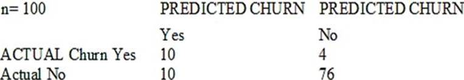

- [ ] The model is 86% accurate and the cost incurred by the company as a result of false negatives is less than the false positives.
- [ ] The precision of the model is 86%, which is less than the accuracy of the model.
- [x] The model is 86% accurate and the cost incurred by the company as a result of false positives is less than the false negatives.
- [ ] The precision of the model is 86%, which is greater than the accuracy of the model.

**[⬆ Back to Top](#table-of-contents)**

### A Machine Learning Specialist is designing a system for improving sales for a company. The objective is to use the large amount of information the company has on users' behavior and product preferences to predict which products users would like based on the users' similarity to other users. What should the Specialist do to meet this objective?

- [ ] Build a content-based filtering recommendation engine with Apache Spark ML on Amazon EMR.
- [x] Build a collaborative filtering recommendation engine with Apache Spark ML on Amazon EMR.
- [ ] Build a model-based filtering recommendation engine with Apache Spark ML on Amazon EMR.
- [ ] Build a combinative filtering recommendation engine with Apache Spark ML on Amazon EMR.

**[⬆ Back to Top](#table-of-contents)**

### A Mobile Network Operator is building an analytics platform to analyze and optimize a company's operations using Amazon Athena and Amazon S3. The source systems send data in .CSV format in real time. The Data Engineering team wants to transform the data to the Apache Parquet format before storing it on Amazon S3. Which solution takes the LEAST effort to implement?

- [ ] Ingest .CSV data using Apache Kafka Streams on Amazon EC2 instances and use Kafka Connect S3 to serialize data as Parquet
- [ ] Ingest .CSV data from Amazon Kinesis Data Streams and use Amazon Glue to convert data into Parquet.
- [ ] Ingest .CSV data using Apache Spark Structured Streaming in an Amazon EMR cluster and use Apache Spark to convert data into Parquet.
- [x] Ingest .CSV data from Amazon Kinesis Data Streams and use Amazon Kinesis Data Firehose to convert data into Parquet.

**[⬆ Back to Top](#table-of-contents)**

### A city wants to monitor its air quality to address the consequences of air pollution. A Machine Learning Specialist needs to forecast the air quality in parts per million of contaminates for the next 2 days in the city. As this is a prototype, only daily data from the last year is available. Which model is MOST likely to provide the best results in Amazon SageMaker?

- [ ] Use the Amazon SageMaker k-Nearest-Neighbors (kNN) algorithm on the single time series consisting of the full year of data with a predictor_typeof regressor.
- [ ] Use Amazon SageMaker Random Cut Forest (RCF) on the single time series consisting of the full year of data.
- [x] Use the Amazon SageMaker Linear Learner algorithm on the single time series consisting of the full year of data with a predictor_typeof regressor.
- [ ] Use the Amazon SageMaker Linear Learner algorithm on the single time series consisting of the full year of data with a predictor_typeof classifier.

**[⬆ Back to Top](#table-of-contents)**

### A Data Engineer needs to build a model using a dataset containing customer credit card information. How can the Data Engineer ensure the data remains encrypted and the credit card information is secure?

- [ ] Use a custom encryption algorithm to encrypt the data and store the data on an Amazon SageMaker instance in a VPC. Use the SageMaker DeepAR algorithm to randomize the credit card numbers..
- [ ] Use an IAM policy to encrypt the data on the Amazon S3 bucket and Amazon Kinesis to automatically discard credit card numbers and insert fake credit card numbers.
- [ ] Use an Amazon SageMaker launch configuration to encrypt the data once it is copied to the SageMaker instance in a VPC. Use the SageMaker Principal Component Analysis (PCA) algorithm to reduce the length of the credit card numbers.
- [x] Use AWS KMS to encrypt the data on Amazon S3 and Amazon SageMaker, and redact the credit card numbers from the customer data with AWS Glue.

**[⬆ Back to Top](#table-of-contents)**

### A Machine Learning Specialist is using an Amazon SageMaker notebook instance in a private subnet of a corporate VPC. The ML Specialist has important data stored on the Amazon SageMaker notebook instance's Amazon EBS volume, and needs to take a snapshot of that EBS volume. However, the ML Specialist cannot find the Amazon SageMaker notebook instance's EBS volume or Amazon EC2 instance within the VPC. Why is the ML Specialist not seeing the instance visible in the VPC?

- [ ] Amazon SageMaker notebook instances are based on the EC2 instances within the customer account, but they run outside of VPCs.
- [ ] Amazon SageMaker notebook instances are based on the Amazon ECS service within customer accounts.
- [x] Amazon SageMaker notebook instances are based on EC2 instances running within AWS service accounts.
- [ ] Amazon SageMaker notebook instances are based on AWS ECS instances running within AWS service accounts.

**[⬆ Back to Top](#table-of-contents)**

### A Machine Learning Specialist is building a model that will perform time series forecasting using Amazon SageMaker. The Specialist has finished training the model and is now planning to perform load testing on the endpoint so they can configure Auto Scaling for the model variant. Which approach will allow the Specialist to review the latency, memory utilization, and CPU utilization during the load test?

- [ ] Review SageMaker logs that have been written to Amazon S3 by leveraging Amazon Athena and Amazon QuickSight to visualize logs as they are being produced.
- [x] Generate an Amazon CloudWatch dashboard to create a single view for the latency, memory utilization, and CPU utilization metrics that are outputted by Amazon SageMaker.
- [ ] Build custom Amazon CloudWatch Logs and then leverage Amazon ES and Kibana to query and visualize the log data as it is generated by Amazon SageMaker.
- [ ] Send Amazon CloudWatch Logs that were generated by Amazon SageMaker to Amazon ES and use Kibana to query and visualize the log data.

**[⬆ Back to Top](#table-of-contents)**

### A manufacturing company has structured and unstructured data stored in an Amazon S3 bucket. A Machine Learning Specialist wants to use SQL to run queries on this data. Which solution requires the LEAST effort to be able to query this data?

- [ ] Use AWS Data Pipeline to transform the data and Amazon RDS to run queries.
- [x] Use AWS Glue to catalogue the data and Amazon Athena to run queries.
- [ ] Use AWS Batch to run ETL on the data and Amazon Aurora to run the queries.
- [ ] Use AWS Lambda to transform the data and Amazon Kinesis Data Analytics to run queries.

**[⬆ Back to Top](#table-of-contents)**

### A Machine Learning Specialist is developing a custom video recommendation model for an application. The dataset used to train this model is very large with millions of data points and is hosted in an Amazon S3 bucket. The Specialist wants to avoid loading all of this data onto an Amazon SageMaker notebook instance because it would take hours to move and will exceed the attached 5 GB Amazon EBS volume on the notebook instance. Which approach allows the Specialist to use all the data to train the model?

- [x] Load a smaller subset of the data into the SageMaker notebook and train locally. Confirm that the training code is executing and the model parameters seem reasonable. Initiate a SageMaker training job using the full dataset from the S3 bucket using Pipe input mode.
- [ ] Launch an Amazon EC2 instance with an AWS Deep Learning AMI and attach the S3 bucket to the instance. Train on a small amount of the data to verify the training code and hyperparameters. Go back to Amazon SageMaker and train using the full dataset
- [ ] Use AWS Glue to train a model using a small subset of the data to confirm that the data will be compatible with Amazon SageMaker. Initiate a SageMaker training job using the full dataset from the S3 bucket using Pipe input mode.
- [ ] Load a smaller subset of the data into the SageMaker notebook and train locally. Confirm that the training code is executing and the model parameters seem reasonable. Launch an Amazon EC2 instance with an AWS Deep Learning AMI and attach the S3 bucket to train the full dataset.

**[⬆ Back to Top](#table-of-contents)**

### A Machine Learning Specialist has completed a proof of concept for a company using a small data sample, and now the Specialist is ready to implement an end-to-end solution in AWS using Amazon SageMaker. The historical training data is stored in Amazon RDS. Which approach should the Specialist use for training a model using that data?

- [ ] Write a direct connection to the SQL database within the notebook and pull data in.
- [x] Push the data from Microsoft SQL Server to Amazon S3 using an AWS Data Pipeline and provide the S3 location within the notebook.
- [ ] Move the data to Amazon DynamoDB and set up a connection to DynamoDB within the notebook to pull data in.
- [ ] Move the data to Amazon ElastiCache using AWS DMS and set up a connection within the notebook to pull data in for fast access.

**[⬆ Back to Top](#table-of-contents)**

### A Machine Learning Specialist receives customer data for an online shopping website. The data includes demographics, past visits, and locality information. The Specialist must develop a machine learning approach to identify the customer shopping patterns, preferences, and trends to enhance the website-for better service and smart recommendations. Which solution should the Specialist recommend?

- [ ] Latent Dirichlet Allocation (LDA) for the given collection of discrete data to identify patterns in the customer database.
- [ ] A neural network with a minimum of three layers and random initial weights to identify patterns in the customer database.
- [x] Collaborative filtering based on user interactions and correlations to identify patterns in the customer database.
- [ ] Random Cut Forest (RCF) over random subsamples to identify patterns in the customer database.

**[⬆ Back to Top](#table-of-contents)**

### A Machine Learning Specialist is working with a large company to leverage machine learning within its products. The company wants to group its customers into categories based on which customers will and will not churn within the next 6 months. The company has labeled the data available to the Specialist. Which machine learning model type should the Specialist use to accomplish this task?

- [ ] Linear Regression.
- [x] Classification.
- [ ] Clustering.
- [ ] Reinforcement learning.

**[⬆ Back to Top](#table-of-contents)**

### The displayed graph is from a forecasting model for testing a time series. Considering the graph only, which conclusion should a Machine Learning Specialist make about the behavior of the model?

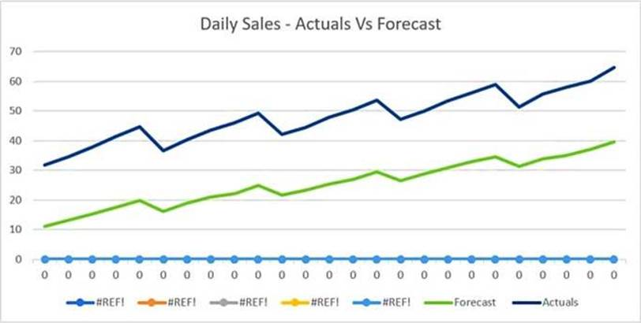

- [x] The model predicts both the trend and the seasonality well.
- [ ] The model predicts the trend well, but not the seasonality.
- [ ] The model predicts the seasonality well, but not the trend.
- [ ] The model does not predict the trend or the seasonality well.

**[⬆ Back to Top](#table-of-contents)**

### A company wants to classify user behavior as either fraudulent or normal. Based on internal research, a machine learning specialist will build a binary classifier based on two features: age of account, denoted by x, and transaction month, denoted by y. The class distributions are illustrated in the provided figure. The positive class is portrayed in red, while the negative class is portrayed in black. Which model would have the HIGHEST accuracy?

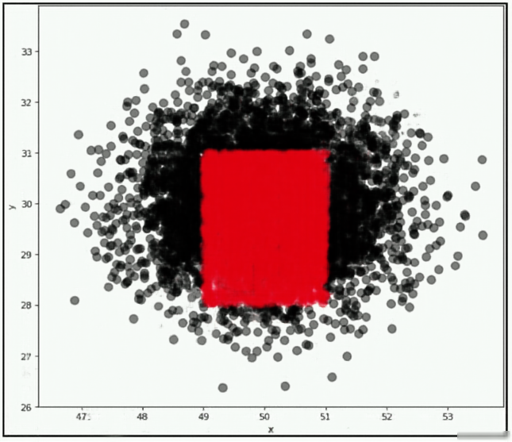

- [ ] Long short-term memory (LSTM) model with scaled exponential linear unit (SELU).
- [ ] Logistic Regression.
- [x] Support vector machine (SVM) with non-linear kernel.
- [ ] Single perceptron with tanh activation function.

**[⬆ Back to Top](#table-of-contents)**

### A Machine Learning Specialist at a company sensitive to security is preparing a dataset for model training. The dataset is stored in Amazon S3 and contains Personally Identifiable Information (PII). The dataset: Must be accessible from a VPC only. Must not traverse the public internet. How can these requirements be satisfied?

- [x] Create a VPC endpoint and apply a bucket access policy that restricts access to the given VPC endpoint and the VPC.
- [ ] Create a VPC endpoint and apply a bucket access policy that allows access from the given VPC endpoint and an Amazon EC2 instance.
- [ ] Create a VPC endpoint and use Network Access Control Lists (NACLs) to allow traffic between only the given VPC endpoint and an Amazon EC2 instance.
- [ ] Create a VPC endpoint and use security groups to restrict access to the given VPC endpoint and an Amazon EC2 instance.

**[⬆ Back to Top](#table-of-contents)**

### During mini-batch training of a neural network for a classification problem, a Data Scientist notices that training accuracy oscillates. What is the MOST likely cause of this issue?

- [ ] The class distribution in the dataset is imbalanced.
- [ ] Dataset shuffling is disabled.
- [ ] The batch size is too big.
- [x] The learning rate is very high.

**[⬆ Back to Top](#table-of-contents)**

### An employee found a video clip with audio on a company's social media feed. The language used in the video is Spanish. English is the employee's first language, and they do not understand Spanish. The employee wants to do a sentiment analysis. What combination of services is the MOST efficient to accomplish the task?

- [x] Amazon Transcribe, Amazon Translate, and Amazon Comprehend.
- [ ] Amazon Transcribe, Amazon Comprehend, and Amazon SageMaker seq2seq
- [ ] Amazon Transcribe, Amazon Translate, and Amazon SageMaker Neural Topic Model (NTM)
- [ ] Amazon Transcribe, Amazon Translate and Amazon SageMaker BlazingText.

**[⬆ Back to Top](#table-of-contents)**

### A Machine Learning Specialist is packaging a custom ResNet model into a Docker container so the company can leverage Amazon SageMaker for training. The Specialist is using Amazon EC2 P3 instances to train the model and needs to properly configure the Docker container to leverage the NVIDIA GPUs. What does the Specialist need to do?

- [ ] Bundle the NVIDIA drivers with the Docker image.
- [x] Build the Docker container to be NVIDIA-Docker compatible.
- [ ] Organize the Docker container's file structure to execute on GPU instances.
- [ ] Set the GPU flag in the Amazon SageMaker CreateTrainingJob request body.

**[⬆ Back to Top](#table-of-contents)**

### A Machine Learning Specialist is building a Logistic Regression model that will predict whether or not a person will order a pizza. The Specialist is trying to build the optimal model with an ideal classification threshold. What model evaluation technique should the Specialist use to understand how different classification thresholds will impact the model's performance?

- [x] Receiver operating characteristic (ROC) curve.
- [ ] Misclassification rate.
- [ ] Root Mean Square Error (RMSE).
- [ ] L1 norm.

**[⬆ Back to Top](#table-of-contents)**

### An interactive online dictionary wants to add a widget that displays words used in similar contexts. A Machine Learning Specialist is asked to provide word features for the downstream nearest neighbor model powering the widget. What should the Specialist do to meet these requirements?

- [ ] Create one-hot word encoding vectors.
- [ ] Produce a set of synonyms for every word using Amazon Mechanical Turk.
- [ ] Create word embedding vectors that store edit distance with every other word.
- [x] Download word embeddings pre-trained on a large corpus.

**[⬆ Back to Top](#table-of-contents)**

### A Machine Learning Specialist is configuring Amazon SageMaker so multiple Data Scientists can access notebooks, train models, and deploy endpoints. To ensure the best operational performance, the Specialist needs to be able to track how often the Scientists are deploying models, GPU and CPU utilization on the deployed SageMaker endpoints, and all errors that are generated when an endpoint is invoked. Which services are integrated with Amazon SageMaker to track this information? (Choose two.)

- [x] AWS CloudTrail.
- [ ] AWS Health.
- [ ] AWS Trusted Advisor.
- [x] Amazon CloudWatch.
- [ ] AWS Config.

**[⬆ Back to Top](#table-of-contents)**

### A retail chain has been ingesting purchasing records from its network of 20,000 stores to Amazon S3 using Amazon Kinesis Data Firehose. To support training an improved machine learning model, training records will require new but simple transformations, and some attributes will be combined. The model needs to be retrained daily. Given the large number of stores and the legacy data ingestion, which change will require the LEAST amount of development effort?

- [ ] Require that the stores to switch to capturing their data locally on AWS Storage Gateway for loading into Amazon S3, then use AWS Glue to do the transformation.
- [ ] Deploy an Amazon EMR cluster running Apache Spark with the transformation logic, and have the cluster run each day on the accumulating records in Amazon S3, outputting new/transformed records to Amazon S3.
- [ ] Spin up a fleet of Amazon EC2 instances with the transformation logic, have them transform the data records accumulating on Amazon S3, and output the transformed records to Amazon S3.
- [x] Insert an Amazon Kinesis Data Analytics stream downstream of the Kinesis Data Firehose stream that transforms raw record attributes into simple transformed values using SQL.

**[⬆ Back to Top](#table-of-contents)**

### A Machine Learning Specialist is building a Convolutional Neural Network (CNN) that will classify 10 types of animals. The Specialist has built a series of layers in a neural network that will take an input image of an animal, pass it through a series of convolutional and pooling layers, and then finally pass it through a dense and fully connected layer with 10 nodes. The Specialist would like to get an output from the neural network that is a probability distribution of how likely it is that the input image belongs to each of the 10 classes. Which function will produce the desired output?

- [ ] Dropout.
- [ ] Smooth L1 loss.
- [x] Softmax.
- [ ] Rectified linear units (ReLU).

**[⬆ Back to Top](#table-of-contents)**

### A Machine Learning Specialist trained a regression model, but the first iteration needs optimizing. The Specialist needs to understand whether the model is more frequently overestimating or underestimating the target. What option can the Specialist use to determine whether it is overestimating or underestimating the target value?

- [ ] Root Mean Square Error (RMSE).
- [x] Residual plots.
- [ ] Area under the curve.
- [ ] Confusion matrix.

**[⬆ Back to Top](#table-of-contents)**

### A company wants to classify user behavior as either fraudulent or normal. Based on internal research, a Machine Learning Specialist would like to build a binary classifier based on two features: age of account and transaction month. The class distribution for these features is illustrated in the figure provided. Based on this information, which model would have the HIGHEST recall with respect to the fraudulent class?

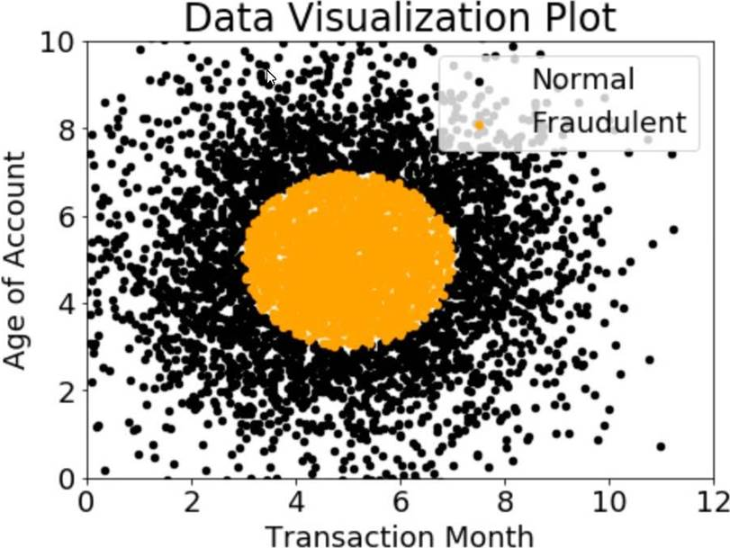

- [ ] Decision tree.
- [ ] Linear support vector machine (SVM).
- [x] Naive Bayesian classifier.
- [ ] Single Perceptron with sigmoidal activation function.

**[⬆ Back to Top](#table-of-contents)**

### A Machine Learning Specialist kicks off a hyperparameter tuning job for a tree-based ensemble model using Amazon SageMaker with Area Under the ROC Curve (AUC) as the objective metric. This workflow will eventually be deployed in a pipeline that retrains and tunes hyperparameters each night to model click-through on data that goes stale every 24 hours. With the goal of decreasing the amount of time it takes to train these models, and ultimately to decrease costs, the Specialist wants to reconfigure the input hyperparameter range(s). Which visualization will accomplish this?

- [ ] A histogram showing whether the most important input feature is Gaussian.
- [ ] A scatter plot with points colored by target variable that uses t-Distributed Stochastic Neighbor Embedding (t-SNE) to visualize the large number of input variables in an easier-to-read dimension.
- [ ] A scatter plot showing the performance of the objective metric over each training iteration.
- [x] A scatter plot showing the correlation between maximum tree depth and the objective metric.

**[⬆ Back to Top](#table-of-contents)**

### A Machine Learning Specialist is creating a new natural language processing application that processes a dataset comprised of 1 million sentences. The aim is to then run Word2Vec to generate embeddings of the sentences and enable different types of predictions. Here is an example from the dataset: 'The quck BROWN FOX jumps over the lazy dog.' Which of the following are the operations the Specialist needs to perform to correctly sanitize and prepare the data in a repeatable manner? (Choose three.)

- [ ] Perform part-of-speech tagging and keep the action verb and the nouns only.
- [x] Normalize all words by making the sentence lowercase.
- [x] Remove stop words using an English stopword dictionary.
- [ ] Correct the typography on 'quck' to 'quick'.
- [ ] One-hot encode all words in the sentence.
- [x] Tokenize the sentence into words.

**[⬆ Back to Top](#table-of-contents)**

### A company is using Amazon Polly to translate plaintext documents to speech for automated company announcements. However, company acronyms are being mispronounced in the current documents. How should a Machine Learning Specialist address this issue for future documents?

- [ ] Convert current documents to SSML with pronunciation tags.
- [x] Create an appropriate pronunciation lexicon.
- [ ] Output speech marks to guide in pronunciation.
- [ ] Use Amazon Lex to preprocess the text files for pronunciation.

**[⬆ Back to Top](#table-of-contents)**

### An insurance company is developing a new device for vehicles that uses a camera to observe drivers' behavior and alert them when they appear distracted. The company created approximately 10,000 training images in a controlled environment that a Machine Learning Specialist will use to train and evaluate machine learning models. During the model evaluation, the Specialist notices that the training error rate diminishes faster as the number of epochs increases and the model is not accurately inferring on the unseen test images. Which of the following should be used to resolve this issue? (Choose two.)

- [ ] Add vanishing gradient to the model.
- [x] Perform data augmentation on the training data.
- [ ] Make the neural network architecture complex.
- [ ] Use gradient checking in the model.
- [x] Add L2 regularization to the model.

**[⬆ Back to Top](#table-of-contents)**

### When submitting Amazon SageMaker training jobs using one of the built-in algorithms, which common parameters MUST be specified? (Choose three.)

- [ ] The training channel identifying the location of training data on an Amazon S3 bucket.
- [ ] The validation channel identifying the location of validation data on an Amazon S3 bucket.
- [x] The IAM role that Amazon SageMaker can assume to perform tasks on behalf of the users.
- [ ] Hyperparameters in a JSON array as documented for the algorithm used.
- [x] The Amazon EC2 instance class specifying whether training will be run using CPU or GP
- [x] The output path specifying where on an Amazon S3 bucket the trained model will persist.

**[⬆ Back to Top](#table-of-contents)**

### A monitoring service generates 1 TB of scale metrics record data every minute. A Research team performs queries on this data using Amazon Athena. The queries run slowly due to the large volume of data, and the team requires better performance. How should the records be stored in Amazon S3 to improve query performance?

- [ ] CSV files.
- [x] Parquet files.
- [ ] Compressed JSON.
- [ ] RecordIO.

**[⬆ Back to Top](#table-of-contents)**

### Machine Learning Specialist is working with a media company to perform classification on popular articles from the company's website. The company is using random forests to classify how popular an article will be before it is published. A sample of the data being used is below. Given the dataset, the Specialist wants to convert the Day_Of_Week column to binary values. What technique should be used to convert this column to binary values?

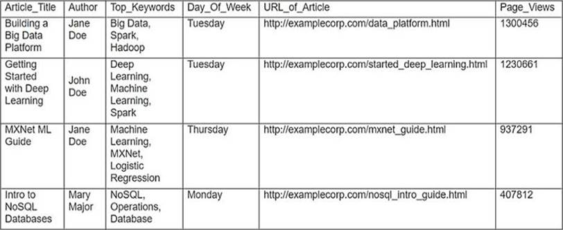

- [ ] Binarization.
- [x] One-hot encoding.
- [ ] Tokenization.
- [ ] Normalization transformation.

**[⬆ Back to Top](#table-of-contents)**

### A gaming company has launched an online game where people can start playing for free, but they need to pay if they choose to use certain features. The company needs to build an automated system to predict whether or not a new user will become a paid user within 1 year. The company has gathered a labeled dataset from 1 million users. The training dataset consists of 1,000 positive samples (from users who ended up paying within 1 year) and 999,000 negative samples (from users who did not use any paid features). Each data sample consists of 200 features including user age, device, location, and play patterns. Using this dataset for training, the Data Science team trained a random forest model that converged with over 99% accuracy on the training set. However, the prediction results on a test dataset were not satisfactory. Which of the following approaches should the Data Science team take to mitigate this issue? (Choose two.)

- [ ] Add more deep trees to the random forest to enable the model to learn more features.
- [ ] Include a copy of the samples in the test dataset in the training dataset.
- [x] Generate more positive samples by duplicating the positive samples and adding a small amount of noise to the duplicated data.
- [x] Change the cost function so that false negatives have a higher impact on the cost value than false positives.
- [ ] Change the cost function so that false positives have a higher impact on the cost value than false negatives.

**[⬆ Back to Top](#table-of-contents)**

### A Data Scientist is developing a machine learning model to predict future patient outcomes based on information collected about each patient and their treatment plans. The model should output a continuous value as its prediction. The data available includes labeled outcomes for a set of 4,000 patients. The study was conducted on a group of individuals over the age of 65 who have a particular disease that is known to worsen with age. Initial models have performed poorly. While reviewing the underlying data, the Data Scientist notices that, out of 4,000 patient observations, there are 450 where the patient age has been input as 0. The other features for these observations appear normal compared to the rest of the sample population. How should the Data Scientist correct this issue?

- [ ] Drop all records from the dataset where age has been set to 0.
- [x] Replace the age field value for records with a value of 0 with the mean or median value from the dataset.
- [ ] Drop the age feature from the dataset and train the model using the rest of the features.
- [ ] Use K-means clustering to handle missing features.

**[⬆ Back to Top](#table-of-contents)**

### A Data Science team is designing a dataset repository where it will store a large amount of training data commonly used in its machine learning models. As Data Scientists may create an arbitrary number of new datasets every day, the solution has to scale automatically and be cost-effective. Also, it must be possible to explore the data using SQL. Which storage scheme is MOST adapted to this scenario?

- [x] Store datasets as files in Amazon S3.
- [ ] Store datasets as files in an Amazon EBS volume attached to an Amazon EC2 instance.
- [ ] Store datasets as tables in a multi-node Amazon Redshift cluster.
- [ ] Store datasets as global tables in Amazon DynamoDB.

**[⬆ Back to Top](#table-of-contents)**

### PLACEHOLDER

- [ ] One.
- [ ] Two.
- [ ] Three.
- [ ] Four.

**[⬆ Back to Top](#table-of-contents)**

### Which characteristic applies to a catalog backup?

- [ ] Catalog staging files deleted after a successful catalog backup.
- [x] A catalog backup can be configured to send disaster recovery information to an e-mail address.
- [ ] A catalog backup must fit on a single tape.
- [ ] A catalog backup shuts down the NetBackup database.

**[⬆ Back to Top](#table-of-contents)**

### A data scientist is developing a pipeline to ingest streaming web traffic data. The data scientist needs to implement a process to identify unusual web traffic patterns as part of the pipeline. The patterns will be used downstream for alerting and incident response. The data scientist has access to unlabeled historic data to use, if needed. The solution needs to do the following: Calculate an anomaly score for each web traffic entry. Adapt unusual event identification to changing web patterns over time. Which approach should the data scientist implement to meet these requirements?

- [ ] Use historic web traffic data to train an anomaly detection model using the Amazon SageMaker Random Cut Forest (RCF) built-in model. Use an Amazon Kinesis Data Stream to process the incoming web traffic data. Attach a preprocessing AWS Lambda function to perform data enrichment by calling the RCF model to calculate the anomaly score for each record.
- [ ] Use historic web traffic data to train an anomaly detection model using the Amazon SageMaker built-in XGBoost model. Use an Amazon Kinesis Data Stream to process the incoming web traffic data. Attach a preprocessing AWSLambda function to perform data enrichment by calling the XGBoost model to calculate the anomaly score for each record.
- [ ] Collect the streaming data using Amazon Kinesis Data Firehose. Map the delivery stream as an input source for Amazon Kinesis Data Analytics. Write a SQL query to run in real time against the streaming data with the k-NearestNeighbors (kNN) SQL extension to calculate anomaly scores for each record using a tumbling window.
- [x] Collect the streaming data using Amazon Kinesis Data Firehose. Map the delivery stream as an input source for Amazon Kinesis Data Analytics. Write a SQL query to run in real time against the streaming data with the Amazon RandomCut Forest (RCF) SQL extension to calculate anomaly scores for each record using a sliding window.

**[⬆ Back to Top](#table-of-contents)**

### A Data Scientist received a set of insurance records, each consisting of a record ID, the final outcome among 200 categories, and the date of the final outcome. Some partial information on claim contents is also provided, but only for a few of the 200 categories. For each outcome category, there are hundreds of records distributed over the past 3 years. The Data Scientist wants to predict how many claims to expect in each category from month to month, a few months in advance. What type of machine learning model should be used?

- [ ] Classification month-to-month using supervised learning of the 200 categories based on claim contents.
- [ ] Reinforcement learning using claim IDs and timestamps where the agent will identify how many claims in each category to expect from month to month.
- [x] Forecasting using claim IDs and timestamps to identify how many claims in each category to expect from month to month.
- [ ] Classification with supervised learning of the categories for which partial information on claim contents is provided, and forecasting using claim IDs and timestamps for all other categories.

**[⬆ Back to Top](#table-of-contents)**

### A company that promotes healthy sleep patterns by providing cloud-connected devices currently hosts a sleep tracking application on AWS. The application collects device usage information from device users. The company's Data Science team is building a machine learning model to predict if and when a user will stop utilizing the company's devices. Predictions from this model are used by a downstream application that determines the best approach for contacting users. The Data Science team is building multiple versions of the machine learning model to evaluate each version against the company's business goals. To measure long-term effectiveness, the team wants to run multiple versions of the model in parallel for long periods of time, with the ability to control the portion of inferences served by the models. Which solution satisfies these requirements with MINIMAL effort?

- [ ] Build and host multiple models in Amazon SageMaker. Create multiple Amazon SageMaker endpoints, one for each model. Programmatically control invoking different models for inference at the application layer.
- [x] Build and host multiple models in Amazon SageMaker. Create an Amazon SageMaker endpoint configuration with multiple production variants. Programmatically control the portion of the inferences served by the multiple models by updating the endpoint configuration.
- [ ] Build and host multiple models in Amazon SageMaker Neo to take into account different types of medical devices. Programmatically control which model is invoked for inference based on the medical device type.
- [ ] Build and host multiple models in Amazon SageMaker. Create a single endpoint that accesses multiple models. Use Amazon SageMaker batch transform to control invoking the different models through the single endpoint.

**[⬆ Back to Top](#table-of-contents)**

### A Machine Learning Specialist is assigned to a Fraud Detection team and must tune an XGBoost model, which is working appropriately for test data. However, with unknown data, it is not working as expected. The existing parameters are provided as follows. Which parameter tuning guidelines should the Specialist follow to avoid overfitting?

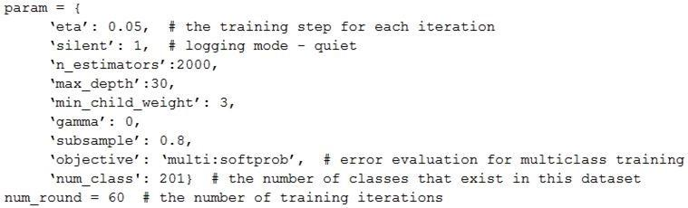

- [ ] Increase the max_depth parameter value.
- [x] Lower the max_depth parameter value.
- [ ] Update the objective to binary:logistic.
- [ ] Lower the min_child_weight parameter value.

**[⬆ Back to Top](#table-of-contents)**

### A media company with a very large archive of unlabeled images, text, audio, and video footage wishes to index its assets to allow rapid identification of relevant content by the Research team. The company wants to use machine learning to accelerate the efforts of its in-house researchers who have limited machine learning expertise. Which is the FASTEST route to index the assets?

- [x] Use Amazon Rekognition, Amazon Comprehend, and Amazon Transcribe to tag data into distinct categories/classes.
- [ ] Create a set of Amazon Mechanical Turk Human Intelligence Tasks to label all footage.
- [ ] Use Amazon Transcribe to convert speech to text. Use the Amazon SageMaker Neural Topic Model (NTM) and Object Detection algorithms to tag data into distinct categories/classes.
- [ ] Use the AWS Deep Learning AMI and Amazon EC2 GPU instances to create custom models for audio transcription and topic modeling, and use object detection to tag data into distinct categories/classes.

**[⬆ Back to Top](#table-of-contents)**

### A Machine Learning Specialist is working for an online retailer that wants to run analytics on every customer visit, processed through a machine learning pipeline. The data needs to be ingested by Amazon Kinesis Data Streams at up to 100 transactions per second, and the JSON data blob is 100 KB in size. What is the MINIMUM number of shards in Kinesis Data Streams the Specialist should use to successfully ingest this data?

- [ ] 1 shards.
- [x] 10 shards.
- [ ] 100 shards.
- [ ] 1,000 shards.

**[⬆ Back to Top](#table-of-contents)**

### A Machine Learning Specialist is deciding between building a naive Bayesian model or a full Bayesian network for a classification problem. The Specialist computes the Pearson correlation coefficients between each feature and finds that their absolute values range between 0.1 to 0.95. Which model describes the underlying data in this situation?

- [ ] A naive Bayesian model, since the features are all conditionally independent.
- [ ] A full Bayesian network, since the features are all conditionally independent.
- [ ] A naive Bayesian model, since some of the features are statistically dependent.
- [x] A full Bayesian network, since some of the features are statistically dependent.

**[⬆ Back to Top](#table-of-contents)**

### A Data Scientist is building a Linear Regression model and will use resulting p-values to evaluate the statistical significance of each coefficient. Upon inspection of the dataset, the Data Scientist discovers that most of the features are normally distributed. The plot of one feature in the dataset is shown in the graphic. What transformation should the Data Scientist apply to satisfy the statistical assumptions of the Linear Regression model?

- [ ] Exponential transformation.
- [x] Logarithmic transformation.
- [ ] Polynomial transformation.
- [ ] Sinusoidal transformation.

**[⬆ Back to Top](#table-of-contents)**

### A technology startup is using complex deep neural networks and GPU compute to recommend the company's products to its existing customers based upon each customer's habits and interactions. The solution currently pulls each dataset from an Amazon S3 bucket before loading the data into a TensorFlow model pulled from the company's Git repository that runs locally. This job then runs for several hours while continually outputting its progress to the same S3 bucket. The job can be paused, restarted, and continued at any time in the event of a failure, and is run from a central queue. Senior managers are concerned about the complexity of the solution's resource management and the costs involved in repeating the process regularly. They ask for the workload to the automated so it runs once a week, starting Monday and completing by the close of business Friday. Which architecture should be used to scale the solution at the lowest cost?

- [x] Implement the solution using AWS Deep Learning Containers and run the container as a job using AWS Batch on a GPU-compatible Spot Instance.
- [ ] Implement the solution using a low-cost GPU compatible Amazon EC2 instance and use the AWS Instance Scheduler to schedule the task.
- [ ] Implement the solution using AWS Deep Learning Containers, run the workload using AWS Fargate running on Spot Instances, and then schedule the task using the built-in task scheduler.
- [ ] Implement the solution using Amazon ECS running on Spot Instances and schedule the task using the ECS service scheduler.

**[⬆ Back to Top](#table-of-contents)**

### A Machine Learning Specialist prepared the following graph displaying the results of K-means for k = [1..10]. Considering the graph, what is a reasonable selection for the optimal choice of k?

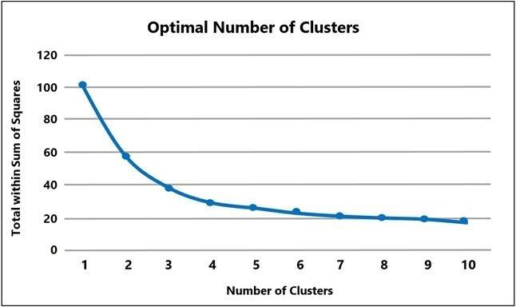

- [ ] 1.
- [x] 4.
- [ ] 7.
- [ ] 10.

**[⬆ Back to Top](#table-of-contents)**

### A machine learning specialist works for a fruit processing company and needs to build a system that categorizes apples into three types. The specialist has collected a dataset that contains 150 images for each type of apple and applied transfer learning on a neural network that was pretrained on ImageNet with this dataset. The company requires at least 85% accuracy to make use of the model. After an exhaustive grid search, the optimal hyperparameters produced the following: 68% accuracy on the training set. 67% accuracy on the validation set. What can the machine learning specialist do to improve the system's accuracy?

- [ ] Upload the model to an Amazon SageMaker notebook instance and use the Amazon SageMaker HPO feature to optimize the model's hyperparameters.
- [x] Add more data to the training set and retrain the model using transfer learning to reduce the bias.
- [ ] Use a neural network model with more layers that are pretrained on ImageNet and apply transfer learning to increase the variance.
- [ ] Train a new model using the current neural network architecture.

**[⬆ Back to Top](#table-of-contents)**

### A company uses camera images of the tops of items displayed on store shelves to determine which items were removed and which ones still remain. After several hours of data labeling, the company has a total of 1,000 hand-labeled images covering 10 distinct items. The training results were poor. Which machine learning approach fulfills the company's long-term needs?

- [ ] Convert the images to grayscale and retrain the model.
- [ ] Reduce the number of distinct items from 10 to 2, build the model, and iterate.
- [ ] Attach different colored labels to each item, take the images again, and build the model.
- [x] Augment training data for each item using image variants like inversions and translations, build the model, and iterate.

**[⬆ Back to Top](#table-of-contents)**

### A Data Scientist is developing a binary classifier to predict whether a patient has a particular disease on a series of test results. The Data Scientist has data on 400 patients randomly selected from the population. The disease is seen in 3% of the population. Which cross-validation strategy should the Data Scientist adopt?

- [ ] A k-fold cross-validation strategy with k=5.
- [x] A stratified k-fold cross-validation strategy with k=5.
- [ ] A k-fold cross-validation strategy with k=5 and 3 repeats.
- [ ] An 80/20 stratified split between training and validation.

**[⬆ Back to Top](#table-of-contents)**

### A Machine Learning Specialist is attempting to build a Linear Regression model. Given the displayed residual plot only, what is the MOST likely problem with the model?

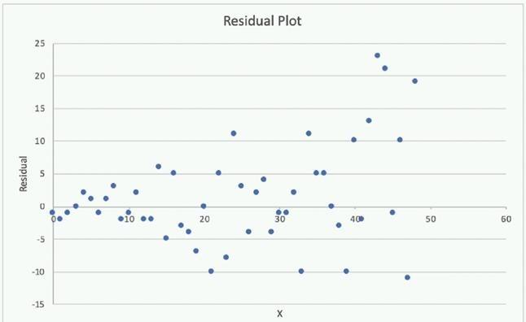

- [x] Linear Regression is inappropriate. The residuals do not have constant variance.
- [ ] Linear Regression is inappropriate. The underlying data has outliers.
- [ ] Linear Regression is appropriate. The residuals have a zero mean.
- [ ] Linear Regression is appropriate. The residuals have constant variance.

**[⬆ Back to Top](#table-of-contents)**

### A large company has developed a BI application that generates reports and dashboards using data collected from various operational metrics. The company wants to provide executives with an enhanced experience so they can use natural language to get data from the reports. The company wants the executives to be able ask questions using written and spoken interfaces. Which combination of services can be used to build this conversational interface? (Choose three.)

- [ ] Alexa for Business.
- [ ] Amazon Connect.
- [x] Amazon Lex.
- [ ] Amazon Polly.
- [x] Amazon Comprehend.
- [x] Amazon Transcribe.

**[⬆ Back to Top](#table-of-contents)**

### A health care company is planning to use neural networks to classify their X-ray images into normal and abnormal classes. The labeled data is divided into a training set of 1,000 images and a test set of 200 images. The initial training of a neural network model with 50 hidden layers yielded 99% accuracy on the training set, but only 55% accuracy on the test set. What changes should the Specialist consider to solve this issue? (Choose three.)

- [ ] Choose a higher number of layers.
- [x] Choose a lower number of layers.
- [ ] Choose a smaller learning rate.
- [x] Enable dropout.
- [ ] Include all the images from the test set in the training set.
- [x] Enable early stopping.

**[⬆ Back to Top](#table-of-contents)**

### This graph shows the training and validation loss against the epochs for a neural network. The network being trained is as follows: Two dense layers, one output neuron. 100 neurons in each layer. 100 epochs. Random initialization of weights. Which technique can be used to improve model performance in terms of accuracy in the validation set?

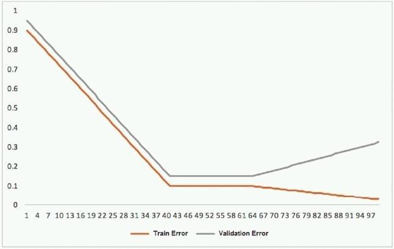

- [x] Early stopping.
- [ ] Random initialization of weights with appropriate seed.
- [ ] Increasing the number of epochs.
- [ ] Adding another layer with the 100 neurons.

**[⬆ Back to Top](#table-of-contents)**

### A company wants to predict the sale prices of houses based on available historical sales data. The target variable in the company's dataset is the sale price. The features include parameters such as the lot size, living area measurements, non-living area measurements, number of bedrooms, number of bathrooms, year built, and postal code. The company wants to use multi-variable Linear Regression to predict house sale prices. Which step should a machine learning specialist take to remove features that are irrelevant for the analysis and reduce the model's complexity?

- [ ] Plot a histogram of the features and compute their standard deviation. Remove features with high variance.
- [ ] Plot a histogram of the features and compute their standard deviation. Remove features with low variance.
- [ ] Build a heatmap showing the correlation of the dataset against itself. Remove features with low mutual correlation scores.
- [x] Run a correlation check of all features against the target variable. Remove features with low target variable correlation scores.

**[⬆ Back to Top](#table-of-contents)**

### A Machine Learning Specialist is given a structured dataset on the shopping habits of a company's customer base. The dataset contains thousands of columns of data and hundreds of numerical columns for each customer. The Specialist wants to identify whether there are natural groupings for these columns across all customers and visualize the results as quickly as possible. What approach should the Specialist take to accomplish these tasks?

- [x] Embed the numerical features using the t-distributed stochastic neighbor embedding (t-SNE) algorithm and create a scatter plot.
- [ ] Run K-means using the Euclidean distance measure for different values of k and create an elbow plot.
- [ ] Embed the numerical features using the t-distributed stochastic neighbor embedding (t-SNE) algorithm and create a line graph.
- [ ] Run K-means using the Euclidean distance measure for different values of k and create box plots for each numerical column within each cluster.

**[⬆ Back to Top](#table-of-contents)**

### A Machine Learning Specialist is planning to create a long-running Amazon EMR cluster. The EMR cluster will have 1 master node, 10 core nodes, and 20 task nodes. To save on costs, the Specialist will use Spot Instances in the EMR cluster. Which nodes should the Specialist launch on Spot Instances?

- [ ] Master node.
- [ ] Any of the core nodes.
- [x] Any of the task nodes.
- [ ] Both core and task nodes.

**[⬆ Back to Top](#table-of-contents)**

### A manufacturer of car engines collects data from cars as they are being driven. The data collected includes timestamp, engine temperature, rotations per minute (RPM), and other sensor readings. The company wants to predict when an engine is going to have a problem, so it can notify drivers in advance to get engine maintenance. The engine data is loaded into a data lake for training. Which is the MOST suitable predictive model that can be deployed into production?

- [x] Add labels over time to indicate which engine faults occur at what time in the future to turn this into a supervised learning problem. Use a Recurrent Neural Network (RNN) to train the model to recognize when an engine might need maintenance for a certain fault.
- [ ] This data requires an unsupervised learning algorithm. Use Amazon SageMaker K-means to cluster the data.
- [ ] Add labels over time to indicate which engine faults occur at what time in the future to turn this into a supervised learning problem. Use a Convolutional Neural Network (CNN) to train the model to recognize when an engine might need maintenance for a certain fault.
- [ ] This data is already formulated as a time series. Use Amazon SageMaker seq2seq to model the time series.

**[⬆ Back to Top](#table-of-contents)**

### A Machine Learning Specialist wants to bring a custom algorithm to Amazon SageMaker. The Specialist implements the algorithm in a Docker container supported by Amazon SageMaker. How should the Specialist package the Docker container so that Amazon SageMaker can launch the training correctly?

- [ ] Modify the bash_profile file in the container and add a bash command to start the training program.
- [ ] Use CMD config in the Dockerfile to add the training program as a CMD of the image.
- [x] Configure the training program as an ENTRYPOINT named train.
- [ ] Copy the training program to directory /opt/ml/train.

**[⬆ Back to Top](#table-of-contents)**

### A Data Scientist needs to analyze employment data. The dataset contains approximately 10 million observations on people across 10 different features. During the preliminary analysis, the Data Scientist notices that income and age distributions are not normal. While income levels shows a right skew as expected, with fewer individuals having a higher income, the age distribution also shows a right skew, with fewer older individuals participating in the workforce. Which feature transformations can the Data Scientist apply to fix the incorrectly skewed data? (Choose two.)

- [ ] Cross-validation.
- [x] Numerical value binning.
- [ ] High-degree polynomial transformation.
- [x] Logarithmic transformation.
- [ ] One hot encoding.

**[⬆ Back to Top](#table-of-contents)**

### A web-based company wants to improve its conversion rate on its landing page. Using a large historical dataset of customer visits, the company has repeatedly trained a multi-class deep learning network algorithm on Amazon SageMaker. However, there is an overfitting problem: training data shows 90% accuracy in predictions, while test data shows 70% accuracy only. The company needs to boost the generalization of its model before deploying it into production to maximize conversions of visits to purchases. Which action is recommended to provide the HIGHEST accuracy model for the company's test and validation data?

- [ ] Increase the randomization of training data in the mini-batches used in training.
- [ ] Allocate a higher proportion of the overall data to the training dataset.
- [x] Apply L1 or L2 regularization and dropouts to the training.
- [ ] Reduce the number of layers and units (or neurons) from the deep learning network.

**[⬆ Back to Top](#table-of-contents)**

### A real estate company wants to create a machine learning model for predicting housing prices based on a historical dataset. The dataset contains 32 features. Which model will meet the business requirement?

- [ ] Logistic Regression.
- [x] Linear Regression.
- [ ] K-means.
- [ ] Principal Component Analysis (PCA).

**[⬆ Back to Top](#table-of-contents)**

### A Machine Learning Specialist is applying a linear least squares regression model to a dataset with 1,000 records and 50 features. Prior to training, the ML Specialist notices that two features are perfectly linearly dependent. Why could this be an issue for the linear least squares regression model?

- [ ] It could cause the backpropagation algorithm to fail during training.
- [x] It could create a singular matrix during optimization, which fails to define a unique solution.
- [ ] It could modify the loss function during optimization, causing it to fail during training.
- [ ] It could introduce non-linear dependencies within the data, which could invalidate the linear assumptions of the model.

**[⬆ Back to Top](#table-of-contents)**

### Given the following confusion matrix for a movie classification model, what is the true class frequency for Romance and the predicted class frequency for Adventure?

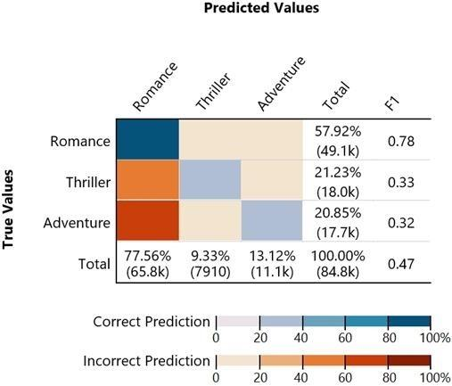

- [ ] The true class frequency for Romance is 77.56% and the predicted class frequency for Adventure is 20.85%.
- [x] The true class frequency for Romance is 57.92% and the predicted class frequency for Adventure is 13.12%.
- [ ] The true class frequency for Romance is 0.78% and the predicted class frequency for Adventure is (0.47 - 0.32).
- [ ] The true class frequency for Romance is 77.56% * 0.78 and the predicted class frequency for Adventure is 20.85% * 0.32.

**[⬆ Back to Top](#table-of-contents)**

### A credit card company wants to build a credit scoring model to help predict whether a new credit card applicant will default on a credit card payment. The company has collected data from a large number of sources with thousands of raw attributes. Early experiments to train a classification model revealed that many attributes are highly correlated, the large number of features slows down the training speed significantly, and that there are some overfitting issues. The Data Scientist on this project would like to speed up the model training time without losing a lot of information from the original dataset. Which feature engineering technique should the Data Scientist use to meet the objectives?

- [ ] Run self-correlation on all features and remove highly correlated features.
- [ ] Normalize all numerical values to be between 0 and 1.
- [x] Use an autoencoder or Principal Component Analysis (PCA) to replace original features with new features.
- [ ] Cluster raw data using K-means and use sample data from each cluster to build a new dataset.

**[⬆ Back to Top](#table-of-contents)**

### A Data Scientist is training a multilayer perception (MLP) on a dataset with multiple classes. The target class of interest is unique compared to the other classes within the dataset, but it does not achieve and acceptable recall metric. The Data Scientist has already tried varying the number and size of the MLP's hidden layers, which has not significantly improved the results. A solution to improve recall must be implemented as quickly as possible. Which techniques should be used to meet these requirements?

- [ ] Gather more data using Amazon Mechanical Turk and then retrain.
- [ ] Train an anomaly detection model instead of an MLP.
- [ ] Train an XGBoost model instead of an MLP.
- [x] Add class weights to the MLP's loss function and then retrain.

**[⬆ Back to Top](#table-of-contents)**

### A Machine Learning Specialist works for a credit card processing company and needs to predict which transactions may be fraudulent in near-real time. Specifically, the Specialist must train a model that returns the probability that a given transaction may fraudulent. How should the Specialist frame this business problem?

- [ ] Streaming classification.
- [x] Binary classification.
- [ ] Multi-category classification.
- [ ] Regression classification.

**[⬆ Back to Top](#table-of-contents)**

### A Machine Learning Specialist needs to move and transform data in preparation for training. Some of the data needs to be processed in near-real time, and other data can be moved hourly. There are existing Amazon EMR MapReduce jobs to clean and feature engineering to perform on the data. Which of the following services can feed data to the MapReduce jobs? (Choose two.)

- [ ] AWS DMS.
- [x] Amazon Kinesis.
- [x] AWS Data Pipeline.
- [ ] Amazon Athena.
- [ ] Amazon ES.

**[⬆ Back to Top](#table-of-contents)**

### A Machine Learning Specialist previously trained a Logistic Regression model using scikit-learn on a local machine, and the Specialist now wants to deploy it to production for inference only. What steps should be taken to ensure Amazon SageMaker can host a model that was trained locally?

- [x] Build the Docker image with the inference code. Tag the Docker image with the registry hostname and upload it to Amazon ECR.
- [ ] Serialize the trained model so the format is compressed for deployment. Tag the Docker image with the registry hostname and upload it to Amazon S3.
- [ ] Serialize the trained model so the format is compressed for deployment. Build the image and upload it to Docker Hub.
- [ ] Build the Docker image with the inference code. Configure Docker Hub and upload the image to Amazon ECR.

**[⬆ Back to Top](#table-of-contents)**

### A trucking company is collecting live image data from its fleet of trucks across the globe. The data is growing rapidly and approximately 100 GB of new data is generated every day. The company wants to explore machine learning uses cases while ensuring the data is only accessible to specific IAM users. Which storage option provides the most processing flexibility and will allow access control with IAM?

- [ ] Use a database, such as Amazon DynamoDB, to store the images, and set the IAM policies to restrict access to only the desired IAM users.
- [x] Use an Amazon S3-backed data lake to store the raw images, and set up the permissions using bucket policies.
- [ ] Setup up Amazon EMR with Hadoop Distributed File System (HDFS) to store the files, and restrict access to the EMR instances using IAM policies.
- [ ] Configure Amazon EFS with IAM policies to make the data available to Amazon EC2 instances owned by the IAM users.

**[⬆ Back to Top](#table-of-contents)**

### A Machine Learning team runs its own training algorithm on Amazon SageMaker. The training algorithm requires external assets. The team needs to submit both its own algorithm code and algorithm-specific parameters to Amazon SageMaker. What combination of services should the team use to build a custom algorithm in Amazon SageMaker? (Choose two.)

- [ ] AWS Secrets Manager.
- [ ] AWS CodeStar.
- [x] Amazon ECR.
- [ ] Amazon ECS.
- [x] Amazon S3.

**[⬆ Back to Top](#table-of-contents)**

### A Machine Learning Specialist wants to determine the appropriate SageMakerVariantInvocationsPerInstance setting for an endpoint automatic scaling configuration. The Specialist has performed a load test on a single instance and determined that peak requests per second (RPS) without service degradation is about 20 RPS. As this is the first deployment, the Specialist intends to set the invocation safety factor to 0.5. Based on the stated parameters and given that the invocations per instance setting is measured on a per-minute basis, what should the Specialist set as the SageMakerVariantInvocationsPerInstance setting?

- [ ] 10.
- [ ] 30.
- [x] 600.
- [ ] 2,400.

**[⬆ Back to Top](#table-of-contents)**

### A company uses a long short-term memory (LSTM) model to evaluate the risk factors of a particular energy sector. The model reviews multi-page text documents to analyze each sentence of the text and categorize it as either a potential risk or no risk. The model is not performing well, even though the Data Scientist has experimented with many different network structures and tuned the corresponding hyperparameters. Which approach will provide the MAXIMUM performance boost?

- [ ] Initialize the words by term frequency-inverse document frequency (TF-IDF) vectors pretrained on a large collection of news articles related to the energy sector.
- [ ] Use gated recurrent units (GRUs) instead of LSTM and run the training process until the validation loss stops decreasing.
- [ ] Reduce the learning rate and run the training process until the training loss stops decreasing.
- [x] Initialize the words by word2vec embeddings pretrained on a large collection of news articles related to the energy sector.

**[⬆ Back to Top](#table-of-contents)**

### A Data Scientist is building a model to predict customer churn using a dataset of 100 continuous numerical features. The Marketing team has not provided any insight about which features are relevant for churn prediction. The Marketing team wants to interpret the model and see the direct impact of relevant features on the model outcome. While training a Logistic Regression model, the Data Scientist observes that there is a wide gap between the training and validation set accuracy. Which methods can the Data Scientist use to improve the model performance and satisfy the Marketing team's needs? (Choose two.)

- [x] Add L1 regularization to the classifier.
- [ ] Add features to the dataset.
- [x] Perform recursive feature elimination.
- [ ] Perform t-distributed stochastic neighbor embedding (t-SNE).
- [ ] Perform linear discriminant analysis.

**[⬆ Back to Top](#table-of-contents)**

### An aircraft engine manufacturing company is measuring 200 performance metrics in a time-series. Engineers want to detect critical manufacturing defects in near-real time during testing. All of the data needs to be stored for offline analysis. What approach would be the MOST effective to perform near-real time defect detection?

- [ ] Use AWS IoT Analytics for ingestion, storage, and further analysis. Use Jupyter notebooks from within AWS IoT Analytics to carry out analysis for anomalies.
- [ ] Use Amazon S3 for ingestion, storage, and further analysis. Use an Amazon EMR cluster to carry out Apache Spark ML K-means clustering to determine anomalies.
- [ ] Use Amazon S3 for ingestion, storage, and further analysis. Use the Amazon SageMaker Random Cut Forest (RCF) algorithm to determine anomalies.
- [x] Use Amazon Kinesis Data Firehose for ingestion and Amazon Kinesis Data Analytics Random Cut Forest (RCF) to perform anomaly detection. Use Kinesis Data Firehose to store data in Amazon S3 for further analysis.

**[⬆ Back to Top](#table-of-contents)**

### A Data Scientist needs to migrate an existing on-premises ETL process to the cloud. The current process runs at regular time intervals and uses PySpark to combine and format multiple large data sources into a single consolidated output for downstream processing. The Data Scientist has been given the following requirements to the cloud solution: Combine multiple data sources. Reuse existing PySpark logic. Run the solution on the existing schedule. Minimize the number of servers that will need to be managed. Which architecture should the Data Scientist use to build this solution?

- [ ] Write the raw data to Amazon S3. Schedule an AWS Lambda function to submit a Spark step to a persistent Amazon EMR cluster based on the existing schedule. Use the existing PySpark logic to run the ETL job on the EMR cluster. Output the results to a 'processed' location in Amazon S3 that is accessible for downstream use.
- [x] Write the raw data to Amazon S3. Create an AWS Glue ETL job to perform the ETL processing against the input data. Write the ETL job in PySpark to leverage the existing logic. Create a new AWS Glue trigger to trigger the ETL job based on the existing schedule. Configure the output target of the ETL job to write to a 'processed' location in Amazon S3 that is accessible for downstream use.
- [ ] Write the raw data to Amazon S3. Schedule an AWS Lambda function to run on the existing schedule and process the input data from Amazon S3. Write the Lambda logic in Python and implement the existing PySpark logic to perform the ETL process. Have the Lambda function output the results to a 'processed' location in Amazon S3 that is accessible for downstream use.
- [ ] Use Amazon Kinesis Data Analytics to stream the input data and perform real-time SQL queries against the stream to carry out the required transformations within the stream. Deliver the output results to a 'processed' location in AmazonS3 that is accessible for downstream use.

**[⬆ Back to Top](#table-of-contents)**

### A Machine Learning Specialist is developing a daily ETL workflow containing multiple ETL jobs. The workflow consists of the following processes: Start the workflow as soon as data is uploaded to Amazon S3. When all the datasets are available in Amazon S3, start an ETL job to join the uploaded datasets with multiple terabyte-sized datasets already stored in Amazon S3. Store the results of joining datasets in Amazon S3. If one of the jobs fails, send a notification to the Administrator. Which configuration will meet these requirements?

- [x] Use AWS Lambda to trigger an AWS Step Functions workflow to wait for dataset uploads to complete in Amazon S3. Use AWS Glue to join the datasets. Use an Amazon CloudWatch alarm to send an SNS notification to theAdministrator in the case of a failure.
- [ ] Develop the ETL workflow using AWS Lambda to start an Amazon SageMaker notebook instance. Use a lifecycle configuration script to join the datasets and persist the results in Amazon S3. Use an Amazon CloudWatch alarm to sendan SNS notification to the Administrator in the case of a failure.
- [ ] Develop the ETL workflow using AWS Batch to trigger the start of ETL jobs when data is uploaded to Amazon S3. Use AWS Glue to join the datasets in Amazon S3. Use an Amazon CloudWatch alarm to send an SNS notification to theAdministrator in the case of a failure.
- [ ] Use AWS Lambda to chain other Lambda functions to read and join the datasets in Amazon S3 as soon as the data is uploaded to Amazon S3. Use an Amazon CloudWatch alarm to send an SNS notification to the Administrator in the case of a failure.

**[⬆ Back to Top](#table-of-contents)**

### An agency collects census information within a country to determine healthcare and social program needs by province and city. The census form collects responses for approximately 500 questions from each citizen. Which combination of algorithms would provide the appropriate insights? (Select TWO.)

- [ ] The factorization machines (FM) algorithm.
- [ ] The Latent Dirichlet Allocation (LDA) algorithm.
- [x] The Principal Component Analysis (PCA) algorithm.
- [x] The K-means algorithm.
- [ ] The Random Cut Forest (RCF) algorithm.

**[⬆ Back to Top](#table-of-contents)**

### A large consumer goods manufacturer has the following products on sale: 34 different toothpaste variants. 48 different toothbrush variants. 43 different mouthwash variants. The entire sales history of all these products is available in Amazon S3. Currently, the company is using custom-built autoregressive integrated moving average (ARIMA) models to forecast demand for these products. The company wants to predict the demand for a new product that will soon be launched. Which solution should a Machine Learning Specialist apply?

- [ ] Train a custom ARIMA model to forecast demand for the new product.
- [x] Train an Amazon SageMaker DeepAR algorithm to forecast demand for the new product.
- [ ] Train an Amazon SageMaker K-means clustering algorithm to forecast demand for the new product.
- [ ] Train a custom XGBoost model to forecast demand for the new product.

**[⬆ Back to Top](#table-of-contents)**

### A Machine Learning Specialist uploads a dataset to an Amazon S3 bucket protected with server-side encryption using AWS KMS. How should the ML Specialist define the Amazon SageMaker notebook instance so it can read the same dataset from Amazon S3?

- [ ] Define security group(s) to allow all HTTP inbound/outbound traffic and assign those security group(s) to the Amazon SageMaker notebook instance.
- [ ] Configure the Amazon SageMaker notebook instance to have access to the VPC. Grant permission in the KMS key policy to the notebook's KMS role.
- [x] Assign an IAM role to the Amazon SageMaker notebook with S3 read access to the dataset. Grant permission in the KMS key policy to that role.
- [ ] Assign the same KMS key used to encrypt data in Amazon S3 to the Amazon SageMaker notebook instance.

**[⬆ Back to Top](#table-of-contents)**

### A Data Scientist is working on an application that performs sentiment analysis. The validation accuracy is poor, and the Data Scientist thinks that the cause may be a rich vocabulary and a low average frequency of words in the dataset. Which tool should be used to improve the validation accuracy?

- [ ] Amazon Comprehend syntax analysis and entity detection.
- [ ] Amazon SageMaker BlazingText cbow mode.
- [ ] Natural Language Toolkit (NLTK) stemming and stop word removal.
- [x] Scikit-leam term frequency-inverse document frequency (TF-IDF) vectorizer.

**[⬆ Back to Top](#table-of-contents)**

### Machine Learning Specialist is building a model to predict future employment rates based on a wide range of economic factors. While exploring the data, the Specialist notices that the magnitude of the input features vary greatly. The Specialist does not want variables with a larger magnitude to dominate the model. What should the Specialist do to prepare the data for model training?

- [ ] Apply quantile binning to group the data into categorical bins to keep any relationships in the data by replacing the magnitude with distribution.
- [ ] Apply the Cartesian product transformation to create new combinations of fields that are independent of the magnitude.
- [x] Apply normalization to ensure each field will have a mean of 0 and a variance of 1 to remove any significant magnitude.
- [ ] Apply the orthogonal sparse bigram (OSB) transformation to apply a fixed-size sliding window to generate new features of a similar magnitude.

**[⬆ Back to Top](#table-of-contents)**

### A Machine Learning Specialist must build out a process to query a dataset on Amazon S3 using Amazon Athena. The dataset contains more than 800,000 records stored as plaintext CSV files. Each record contains 200 columns and is approximately 1.5 MB in size. Most queries will span 5 to 10 columns only. How should the Machine Learning Specialist transform the dataset to minimize query runtime?

- [x] Convert the records to Apache Parquet format.
- [ ] Convert the records to JSON format.
- [ ] Convert the records to GZIP CSV format.
- [ ] Convert the records to XML format.

**[⬆ Back to Top](#table-of-contents)**

### A Machine Learning Specialist is working with a large cybersecurity company that manages security events in real time for companies around the world. The cybersecurity company wants to design a solution that will allow it to use machine learning to score malicious events as anomalies on the data as it is being ingested. The company also wants be able to save the results in its data lake for later processing and analysis. What is the MOST efficient way to accomplish these tasks?

- [x] Ingest the data using Amazon Kinesis Data Firehose, and use Amazon Kinesis Data Analytics Random Cut Forest (RCF) for anomaly detection. Then use Kinesis Data Firehose to stream the results to Amazon S3.
- [ ] Ingest the data into Apache Spark Streaming using Amazon EMR, and use Spark MLlib with K-means to perform anomaly detection. Then store the results in an Apache Hadoop Distributed File System (HDFS) using Amazon EMR with a replication factor of three as the data lake.
- [ ] Ingest the data and store it in Amazon S3. Use AWS Batch along with the AWS Deep Learning AMIs to train a K-means model using TensorFlow on the data in Amazon S3.
- [ ] Ingest the data and store it in Amazon S3. Have an AWS Glue job that is triggered on demand transform the new data. Then use the built-in Random Cut Forest (RCF) model within Amazon SageMaker to detect anomalies in the data.

**[⬆ Back to Top](#table-of-contents)**

### A Data Scientist wants to gain real-time insights into a data stream of GZIP files. Which solution would allow the use of SQL to query the stream with the LEAST latency?

- [x] Amazon Kinesis Data Analytics with an AWS Lambda function to transform the data.
- [ ] AWS Glue with a custom ETL script to transform the data.
- [ ] An Amazon Kinesis Client Library to transform the data and save it to an Amazon ES cluster.
- [ ] Amazon Kinesis Data Firehose to transform the data and put it into an Amazon S3 bucket.

**[⬆ Back to Top](#table-of-contents)**

### A retail company intends to use machine learning to categorize new products. A labeled dataset of current products was provided to the Data Science team. The dataset includes 1,200 products. The labeled dataset has 15 features for each product such as title dimensions, weight, and price. Each product is labeled as belonging to one of six categories such as books, games, electronics, and movies. Which model should be used for categorizing new products using the provided dataset for training?

- [x] AnXGBoost model where the objective parameter is set to multi:softmax.
- [ ] A deep Convolutional Neural Network (CNN) with a softmax activation function for the last layer.
- [ ] A regression forest where the number of trees is set equal to the number of product categories.
- [ ] A DeepAR forecasting model based on a Recurrent Neural Network (RNN).

**[⬆ Back to Top](#table-of-contents)**

### A Machine Learning Specialist is assigned a TensorFlow project using Amazon SageMaker for training, and needs to continue working for an extended period with no Wi-Fi access. Which approach should the Specialist use to continue working?

- [ ] Install Python 3 and boto3 on their laptop and continue the code development using that environment.
- [x] Download the TensorFlow Docker container used in Amazon SageMaker from GitHub to their local environment, and use the Amazon SageMaker Python SDK to test the code.
- [ ] Download TensorFlow from tensorflow.org to emulate the TensorFlow kernel in the SageMaker environment.
- [ ] Download the SageMaker notebook to their local environment, then install Jupyter Notebooks on their laptop and continue the development in a local notebook.

**[⬆ Back to Top](#table-of-contents)**

### A Machine Learning Specialist is required to build a supervised image-recognition model to identify a cat. The ML Specialist performs some tests and records the following results for a neural network-based image classifier. Total number of images available = 1,000 Test set images = 100 (constant test set). The ML Specialist notices that, in over 75% of the misclassified images, the cats were held upside down by their owners. Which techniques can be used by the ML Specialist to improve this specific test error?

- [x] Increase the training data by adding variation in rotation for training images.
- [ ] Increase the number of epochs for model training.
- [ ] Increase the number of layers for the neural network.
- [ ] Increase the dropout rate for the second-to-last layer.

**[⬆ Back to Top](#table-of-contents)**

### A Machine Learning Specialist needs to be able to ingest streaming data and store it in Apache Parquet files for exploration and analysis. Which of the following services would both ingest and store this data in the correct format?

- [ ] AWS DMS.
- [ ] Amazon Kinesis Data Streams.
- [x] Amazon Kinesis Data Firehose.
- [ ] Amazon Kinesis Data Analytics.

**[⬆ Back to Top](#table-of-contents)**

### A Data Scientist is developing a machine learning model to classify whether a financial transaction is fraudulent. The labeled data available for training consists of 100,000 non-fraudulent observations and 1,000 fraudulent observations. The Data Scientist applies the XGBoost algorithm to the data, resulting in the following confusion matrix when the trained model is applied to a previously unseen validation dataset. The accuracy of the model is 99.1%, but the Data Scientist has been asked to reduce the number of false negatives. Which combination of steps should the Data Scientist take to reduce the number of false positive predictions by the model? (Choose two.)

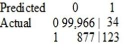

- [ ] Change the XGBoost eval_metric parameter to optimize based on rmse instead of error.
- [x] Increase the XGBoost scale_pos_weight parameter to adjust the balance of positive and negative weights.
- [ ] Increase the XGBoost max_depth parameter because the model is currently underfitting the data.
- [x] Change the XGBoost eval_metric parameter to optimize based on AUC instead of error.
- [ ] Decrease the XGBoost max_depth parameter because the model is currently overfitting the data.

**[⬆ Back to Top](#table-of-contents)**

### A company is running a machine learning prediction service that generates 100 TB of predictions every day. A Machine Learning Specialist must generate a visualization of the daily precision-recall curve from the predictions, and forward a read-only version to the Business team. Which solution requires the LEAST coding effort?

- [ ] Run a daily Amazon EMR workflow to generate precision-recall data, and save the results in Amazon S3. Give the Business team read-only access to S3.
- [ ] Generate daily precision-recall data in Amazon QuickSight, and publish the results in a dashboard shared with the Business team.
- [x] Run a daily Amazon EMR workflow to generate precision-recall data, and save the results in Amazon S3. Visualize the arrays in Amazon QuickSight, and publish them in a dashboard shared with the Business team.
- [ ] Generate daily precision-recall data in Amazon ES, and publish the results in a dashboard shared with the Business team.

**[⬆ Back to Top](#table-of-contents)**

### A Machine Learning Specialist is preparing data for training on Amazon SageMaker. The Specialist is using one of the SageMaker built-in algorithms for the training. The dataset is stored in .CSV format and is transformed into a numpy.array, which appears to be negatively affecting the speed of the training. What should the Specialist do to optimize the data for training on SageMaker?

- [ ] Use the SageMaker batch transform feature to transform the training data into a DataFrame.
- [ ] Use AWS Glue to compress the data into the Apache Parquet format.
- [x] Transform the dataset into the RecordIO protobuf format.
- [ ] Use the SageMaker hyperparameter optimization feature to automatically optimize the data.

**[⬆ Back to Top](#table-of-contents)**

### A financial services company is building a robust serverless data lake on Amazon S3. The data lake should be flexible and meet the following requirements. Support querying old and new data on Amazon S3 through Amazon Athena and Amazon Redshift Spectrum. Support event-driven ETL pipelines Provide a quick and easy way to understand metadata Which approach meets these requirements?

- [x] Use an AWS Glue crawler to crawl S3 data, an AWS Lambda function to trigger an AWS Glue ETL job, and an AWS Glue Data Catalog to search and discover metadata.
- [ ] Use an AWS Glue crawler to crawl S3 data, an AWS Lambda function to trigger an AWS Batch job, and an external Apache Hive metastore to search and discover metadata.
- [ ] Use an AWS Glue crawler to crawl S3 data, an Amazon CloudWatch alarm to trigger an AWS Batch job, and an AWS Glue Data Catalog to search and discover metadata.
- [ ] Use an AWS Glue crawler to crawl S3 data, an Amazon CloudWatch alarm to trigger an AWS Glue ETL job, and an external Apache Hive metastore to search and discover metadata.

**[⬆ Back to Top](#table-of-contents)**

### A company's Machine Learning Specialist needs to improve the training speed of a time-series forecasting model using TensorFlow. The training is currently implemented on a single-GPU machine and takes approximately 23 hours to complete. The training needs to be run daily. The model accuracy is acceptable, but the company anticipates a continuous increase in the size of the training data and a need to update the model on an hourly, rather than a daily, basis. The company also wants to minimize coding effort and infrastructure changes. What should the Machine Learning Specialist do to the training solution to allow it to scale for future demand?

- [ ] Do not change the TensorFlow code. Change the machine to one with a more powerful GPU to speed up the training.
- [x] Change the TensorFlow code to implement a Horovod distributed framework supported by Amazon SageMaker. Parallelize the training to as many machines as needed to achieve the business goals.
- [ ] Switch to using a built-in AWS SageMaker DeepAR model. Parallelize the training to as many machines as needed to achieve the business goals.
- [ ] Move the training to Amazon EMR and distribute the workload to as many machines as needed to achieve the business goals.

**[⬆ Back to Top](#table-of-contents)**

### Which of the following metrics should a Machine Learning Specialist generally use to compare/evaluate machine learning classification models against each other?

- [ ] Recall.
- [ ] Misclassification rate.
- [ ] Mean absolute percentage error (MAPE).
- [x] Area Under the ROC Curve (AUC).

**[⬆ Back to Top](#table-of-contents)**

### An office security agency conducted a successful pilot using 100 cameras installed at key locations within the main office. Images from the cameras were uploaded to Amazon S3 and tagged using Amazon Rekognition, and the results were stored in Amazon ES. The agency is now looking to expand the pilot into a full production system using thousands of video cameras in its office locations globally. The goal is to identify activities performed by non-employees in real time Which solution should the agency consider?

- [x] Use a proxy server at each local office and for each camera, and stream the RTSP feed to a unique Amazon Kinesis Video Streams video stream. On each stream, use Amazon Rekognition Video and create a stream processor to detect faces from a collection of known employees, and alert when non-employees are detected.
- [ ] Use a proxy server at each local office and for each camera, and stream the RTSP feed to a unique Amazon Kinesis Video Streams video stream. On each stream, use Amazon Rekognition Image to detect faces from a collection of known employees and alert when non-employees are detected.
- [ ] Install AWS DeepLens cameras and use the DeepLens_Kinesis_Video module to stream video to Amazon Kinesis Video Streams for each camera. On each stream, use Amazon Rekognition Video and create a stream processor to detect faces from a collection on each stream, and alert when non-employees are detected.
- [ ] Install AWS DeepLens cameras and use the DeepLens_Kinesis_Video module to stream video to Amazon Kinesis Video Streams for each camera. On each stream, run an AWS Lambda function to capture image fragments and then call Amazon Rekognition Image to detect faces from a collection of known employees, and alert when non-employees are detected.

**[⬆ Back to Top](#table-of-contents)**

### A Marketing Manager at a pet insurance company plans to launch a targeted marketing campaign on social media to acquire new customers. Currently, the company has the following data in Amazon Aurora: Profiles for all past and existing customers. Profiles for all past and existing insured pets. Policy-level information. Premiums received Claims paid. What steps should be taken to implement a machine learning model to identify potential new customers on social media?

- [ ] Use regression on customer profile data to understand key characteristics of consumer segments. Find similar profiles on social media.
- [x] Use clustering on customer profile data to understand key characteristics of consumer segments. Find similar profiles on social media.
- [ ] Use a recommendation engine on customer profile data to understand key characteristics of consumer segments. Find similar profiles on social media.
- [ ] Use a decision tree classifier engine on customer profile data to understand key characteristics of consumer segments. Find similar profiles on social media.

**[⬆ Back to Top](#table-of-contents)**

### A manufacturing company has a large set of labeled historical sales data. The manufacturer would like to predict how many units of a particular part should be produced each quarter. Which machine learning approach should be used to solve this problem?

- [ ] Logistic Regression.
- [ ] Random Cut Forest (RCF).
- [ ] Principal Component Analysis (PCA).
- [x] Linear Regression.

**[⬆ Back to Top](#table-of-contents)**

### An online reseller has a large, multi-column dataset with one column missing 30% of its data. A Machine Learning Specialist believes that certain columns in the dataset could be used to reconstruct the missing data. Which reconstruction approach should the Specialist use to preserve the integrity of the dataset?

- [ ] Listwise deletion.
- [ ] Last observation carried forward.
- [x] Multiple imputation.
- [ ] Mean substitution.

**[⬆ Back to Top](#table-of-contents)**

### A company is setting up an Amazon SageMaker environment. The corporate data security policy does not allow communication over the internet. How can the company enable the Amazon SageMaker service without enabling direct internet access to Amazon SageMaker notebook instances?

- [ ] Create a NAT gateway within the corporate VPC.
- [ ] Route Amazon SageMaker traffic through an on-premises network.
- [x] Create Amazon SageMaker VPC interface endpoints within the corporate VPC.
- [ ] Create VPC peering with Amazon VPC hosting Amazon SageMaker.

**[⬆ Back to Top](#table-of-contents)**

### Machine Learning Specialist is training a model to identify the make and model of vehicles in images. The Specialist wants to use transfer learning and an existing model trained on images of general objects. The Specialist collated a large custom dataset of pictures containing different vehicle makes and models. What should the Specialist do to initialize the model to re-train it with the custom data?

- [ ] Initialize the model with random weights in all layers including the last fully connected layer.
- [x] Initialize the model with pre-trained weights in all layers and replace the last fully connected layer.
- [ ] Initialize the model with random weights in all layers and replace the last fully connected layer.
- [ ] Initialize the model with pre-trained weights in all layers including the last fully connected layer.

**[⬆ Back to Top](#table-of-contents)**

### A Machine Learning Specialist has created a deep learning neural network model that performs well on the training data but performs poorly on the test data. Which of the following methods should the Specialist consider using to correct this? (Choose three.)

- [ ] Decrease regularization.
- [x] Increase regularization.
- [x] Increase dropout.
- [ ] Decrease dropout.
- [ ] Increase feature combinations.
- [x] Decrease feature combinations.

**[⬆ Back to Top](#table-of-contents)**

### A Data Scientist needs to create a serverless ingestion and analytics solution for high-velocity, real-time streaming data. The ingestion process must buffer and convert incoming records from JSON to a query-optimized, columnar format without data loss. The output datastore must be highly available, and Analysts must be able to run SQL queries against the data and connect to existing business intelligence dashboards. Which solution should the Data Scientist build to satisfy the requirements?

- [x] Create a schema in the AWS Glue Data Catalog of the incoming data format. Use an Amazon Kinesis Data Firehose delivery stream to stream the data and transform the data to Apache Parquet or ORC format using the AWS GlueData Catalog before delivering to Amazon S3. Have the Analysts query the data directly from Amazon S3 using Amazon Athena, and connect to BI tools using the Athena Java Database Connectivity (JDBC) connector.
- [ ] Write each JSON record to a staging location in Amazon S3. Use the S3 Put event to trigger an AWS Lambda function that transforms the data into Apache Parquet or ORC format and writes the data to a processed data location inAmazon S3. Have the Analysts query the data directly from Amazon S3 using Amazon Athena, and connect to BI tools using the Athena Java Database Connectivity (JDBC) connector.
- [ ] Write each JSON record to a staging location in Amazon S3. Use the S3 Put event to trigger an AWS Lambda function that transforms the data into Apache Parquet or ORC format and inserts it into an Amazon RDS PostgreSQLdatabase. Have the Analysts query and run dashboards from the RDS database.
- [ ] Use Amazon Kinesis Data Analytics to ingest the streaming data and perform real-time SQL queries to convert the records to Apache Parquet before delivering to Amazon S3. Have the Analysts query the data directly from Amazon S3using Amazon Athena and connect to BI tools using the Athena Java Database Connectivity (JDBC) connector.

**[⬆ Back to Top](#table-of-contents)**

### A Machine Learning Specialist is building a prediction model for a large number of features using linear models, such as Linear Regression and Logistic Regression. During exploratory data analysis, the Specialist observes that many features are highly correlated with each other. This may make the model unstable. What should be done to reduce the impact of having such a large number of features?

- [ ] Perform one-hot encoding on highly correlated features.
- [ ] Use matrix multiplication on highly correlated features.
- [x] Create a new feature space using Principal Component Analysis (PCA).
- [ ] Apply the Pearson correlation coefficient.

**[⬆ Back to Top](#table-of-contents)**

### A Machine Learning Specialist is implementing a full Bayesian network on a dataset that describes public transit in New York City. One of the random variables is discrete, and represents the number of minutes New Yorkers wait for a bus given that the buses cycle every 10 minutes, with a mean of 3 minutes. Which prior probability distribution should the ML Specialist use for this variable?

- [x] Poisson distribution.
- [ ] Uniform distribution.
- [ ] Normal distribution.
- [ ] Binomial distribution.

**[⬆ Back to Top](#table-of-contents)**

### A Data Science team within a large company uses Amazon SageMaker notebooks to access data stored in Amazon S3 buckets. The IT Security team is concerned that internet-enabled notebook instances create a security vulnerability where malicious code running on the instances could compromise data privacy. The company mandates that all instances stay within a secured VPC with no internet access, and data communication traffic must stay within the AWS network. How should the Data Science team configure the notebook instance placement to meet these requirements?

- [ ] Associate the Amazon SageMaker notebook with a private subnet in a VPC. Place the Amazon SageMaker endpoint and S3 buckets within the same VPC.
- [ ] Associate the Amazon SageMaker notebook with a private subnet in a VPC. Use IAM policies to grant access to Amazon S3 and Amazon SageMaker.
- [x] Associate the Amazon SageMaker notebook with a private subnet in a VPC. Ensure the VPC has S3 VPC endpoints and Amazon SageMaker VPC endpoints attached to it.
- [ ] Associate the Amazon SageMaker notebook with a private subnet in a VPC. Ensure the VPC has a NAT gateway and an associated security group allowing only outbound connections to Amazon S3 and Amazon SageMaker.

**[⬆ Back to Top](#table-of-contents)**

### A company is observing low accuracy while training on the default built-in image classification algorithm in Amazon SageMaker. The Data Science team wants to use an Inception neural network architecture instead of a ResNet architecture. Which of the following will accomplish this? (Choose two.)

- [ ] Customize the built-in image classification algorithm to use Inception and use this for model training.
- [ ] Create a support case with the SageMaker team to change the default image classification algorithm to Inception.
- [x] Bundle a Docker container with TensorFlow Estimator loaded with an Inception network and use this for model training.
- [x] Use custom code in Amazon SageMaker with TensorFlow Estimator to load the model with an Inception network, and use this for model training.
- [ ] Download and apt-get install the inception network code into an Amazon EC2 instance and use this instance as a Jupyter notebook in Amazon SageMaker.

**[⬆ Back to Top](#table-of-contents)**

### A Machine Learning Specialist built an image classification deep learning model. However, the Specialist ran into an overfitting problem in which the training and testing accuracies were 99% and 75%, respectively. How should the Specialist address this issue and what is the reason behind it?

- [ ] The learning rate should be increased because the optimization process was trapped at a local minimum.
- [x] The dropout rate at the flatten layer should be increased because the model is not generalized enough.
- [ ] The dimensionality of dense layer next to the flatten layer should be increased because the model is not complex enough.
- [ ] The epoch number should be increased because the optimization process was terminated before it reached the global minimum.

**[⬆ Back to Top](#table-of-contents)**

### A Machine Learning team uses Amazon SageMaker to train an Apache MXNet handwritten digit classifier model using a research dataset. The team wants to receive a notification when the model is overfitting. Auditors want to view the Amazon SageMaker log activity report to ensure there are no unauthorized API calls. What should the Machine Learning team do to address the requirements with the least amount of code and fewest steps?

- [ ] Implement an AWS Lambda function to log Amazon SageMaker API calls to Amazon S3. Add code to push a custom metric to Amazon CloudWatch. Create an alarm in CloudWatch with Amazon SNS to receive a notification when the model is overfitting.
- [x] Use AWS CloudTrail to log Amazon SageMaker API calls to Amazon S3. Add code to push a custom metric to Amazon CloudWatch. Create an alarm in CloudWatch with Amazon SNS to receive a notification when the model is overfitting.
- [ ] Implement an AWS Lambda function to log Amazon SageMaker API calls to AWS CloudTrail. Add code to push a custom metric to Amazon CloudWatch.
- [ ] Use AWS CloudTrail to log Amazon SageMaker API calls to Amazon S3. Set up Amazon SNS to receive a notification when the model is overfitting.

**[⬆ Back to Top](#table-of-contents)**

### A Machine Learning Specialist deployed a model that provides product recommendations on a company's website. Initially, the model was performing very well and resulted in customers buying more products on average. However, within the past few months, the Specialist has noticed that the effect of product recommendations has diminished and customers are starting to return to their original habits of spending less. The Specialist is unsure of what happened, as the model has not changed from its initial deployment over a year ago. Which method should the Specialist try to improve model performance?

- [ ] The model needs to be completely re-engineered because it is unable to handle product inventory changes.
- [ ] The model's hyperparameters should be periodically updated to prevent drift.
- [ ] The model should be periodically retrained from scratch using the original data while adding a regularization term to handle product inventory changes.
- [x] The model should be periodically retrained using the original training data plus new data as product inventory changes.

**[⬆ Back to Top](#table-of-contents)**

### A Machine Learning Specialist working for an online fashion company wants to build a data ingestion solution for the company's Amazon S3-based data lake. The Specialist wants to create a set of ingestion mechanisms that will enable future capabilities comprised of: Real-time analytics. Interactive analytics of historical data. Clickstream analytics. Product recommendations. Which services should the Specialist use?

- [x] AWS Glue as the data catalog; Amazon Kinesis Data Streams and Amazon Kinesis Data Analytics for real-time data insights; Amazon Kinesis Data Firehose
for delivery to Amazon ES for clickstream analytics; Amazon EMR to generate personalized product recommendations.
- [ ] Amazon Athena as the data catalog: Amazon Kinesis Data Streams and Amazon Kinesis Data Analytics for near-real-time data insights; Amazon Kinesis
Data Firehose for clickstream analytics; AWS Glue to generate personalized product recommendations.
- [ ] AWS Glue as the data catalog; Amazon Kinesis Data Streams and Amazon Kinesis Data Analytics for historical data insights; Amazon Kinesis Data Firehose
for delivery to Amazon ES for clickstream analytics; Amazon EMR to generate personalized product recommendations.
- [ ] Amazon Athena as the data catalog; Amazon Kinesis Data Streams and Amazon Kinesis Data Analytics for historical data insights; Amazon DynamoDB streams for clickstream analytics; AWS Glue to generate personalized product recommendations.

**[⬆ Back to Top](#table-of-contents)**

### A manufacturing company has structured and unstructured data stored in an Amazon S3 bucket. A Machine Learning Specialist wants to use SQL to run queries on this data Which solution requires the LEAST effort to be able to query this data?

- [ ] Use AWS Data Pipeline to transform the data and Amazon RDS to run queries.
- [x] Use AWS Glue to catalogue the data and Amazon Athena to run queries.
- [ ] Use AWS Batch to run ETL on the data and Amazon Aurora to run the queries.
- [ ] Use AWS Lambda to transform the data and Amazon Kinesis Data Analytics to run queries.

**[⬆ Back to Top](#table-of-contents)**

### A data scientist has explored and sanitized a dataset in preparation for the modeling phase of a supervised learning task. The statistical dispersion can vary widely between features, sometimes by several orders of magnitude. Before moving on to the modeling phase, the data scientist wants to ensure that the prediction performance on the production data is as accurate as possible. Which sequence of steps should the data scientist take to meet these requirements?

- [ ] Apply random sampling to the dataset. Then split the dataset into training, validation, and test sets.
- [x] Split the dataset into training, validation, and test sets. Then rescale the training set and apply the same scaling to the validation and test sets.
- [ ] Rescale the dataset. Then split the dataset into training, validation, and test sets.
- [ ] Split the dataset into training, validation, and test sets. Then rescale the training set, the validation set, and the test set independently.

**[⬆ Back to Top](#table-of-contents)**

### A machine learning (ML) specialist uploads a dataset to an Amazon S3 bucket that is protected by server-side encryption with AWS KMS keys (SSE-KMS). The ML specialist needs to ensure that an Amazon SageMaker notebook instance can read the dataset that is in Amazon S3. Which solution will meet these requirements?

- [ ] Define security groups to allow all HTTP inbound and outbound traffic. Assign the security groups to the SageMaker notebook instance.
- [ ] Configure the SageMaker notebook instance to have access to the VPC. Grant permission in the AWS Key Management Service (AWS KMS) key policy to the notebook's VPC.
- [x] Assign an IAM role that provides S3 read access for the dataset to the SageMaker notebook. Grant permission in the KMS key policy to the IAM role.
- [ ] Assign the same KMS key that encrypts the data in Amazon S3 to the SageMaker notebook instance.

**[⬆ Back to Top](#table-of-contents)**

### An agricultural company is interested in using machine learning to detect specific types of weeds in a 100-acre grassland field. Currently, the company uses tractor-mounted cameras to capture multiple images of the field as 10 - 10 grids. The company also has a large training dataset that consists of annotated images of popular weed classes like broadleaf and non-broadleaf docks. The company wants to build a weed detection model that will detect specific types of weeds and the location of each type within the field. Once the model is ready, it will be hosted on Amazon SageMaker endpoints. The model will perform real-time inferencing using the images captured by the cameras. Which approach should a Machine Learning Specialist take to obtain accurate predictions?

- [ ] Prepare the images in RecordIO format and upload them to Amazon S3. Use Amazon SageMaker to train, test, and validate the model using an image classification algorithm to categorize images into various weed classes.
- [ ] Prepare the images in Apache Parquet format and upload them to Amazon S3. Use Amazon SageMaker to train, test, and validate the model using an object- detection single-shot multibox detector (SSD) algorithm.
- [x] Prepare the images in RecordIO format and upload them to Amazon S3. Use Amazon SageMaker to train, test, and validate the model using an object- detection single-shot multibox detector (SSD) algorithm.
- [ ] Prepare the images in Apache Parquet format and upload them to Amazon S3. Use Amazon SageMaker to train, test, and validate the model using an image classification algorithm to categorize images into various weed classes.

**[⬆ Back to Top](#table-of-contents)**

### A manufacturer is operating a large number of factories with a complex supply chain relationship where unexpected downtime of a machine can cause production to stop at several factories. A data scientist wants to analyze sensor data from the factories to identify equipment in need of preemptive maintenance and then dispatch a service team to prevent unplanned downtime. The sensor readings from a single machine can include up to 200 data points including temperatures, voltages, vibrations, RPMs, and pressure readings. To collect this sensor data, the manufacturer deployed Wi-Fi and LANs across the factories. Even though many factory locations do not have reliable or high- speed internet connectivity, the manufacturer would like to maintain near-real-time inference capabilities. Which deployment architecture for the model will address these business requirements?

- [ ] Deploy the model in Amazon SageMaker. Run sensor data through this model to predict which machines need maintenance.
- [x] Deploy the model on AWS IoT Greengrass in each factory. Run sensor data through this model to infer which machines need maintenance.
- [ ] Deploy the model to an Amazon SageMaker batch transformation job. Generate inferences in a daily batch report to identify machines that need maintenance.
- [ ] Deploy the model in Amazon SageMaker and use an IoT rule to write data to an Amazon DynamoDB table. Consume a DynamoDB stream from the table with an AWS Lambda function to invoke the endpoint.

**[⬆ Back to Top](#table-of-contents)**

### A Machine Learning Specialist is designing a scalable data storage solution for Amazon SageMaker. There is an existing TensorFlow-based model implemented as a train.py script that relies on static training data that is currently stored as TFRecords. Which method of providing training data to Amazon SageMaker would meet the business requirements with the LEAST development overhead?

- [ ] Use Amazon SageMaker script mode and use train.py unchanged. Point the Amazon SageMaker training invocation to the local path of the data without reformatting the training data.
- [x] Use Amazon SageMaker script mode and use train.py unchanged. Put the TFRecord data into an Amazon S3 bucket. Point the Amazon SageMaker training invocation to the S3 bucket without reformatting the training data.
- [ ] Rewrite the train.py script to add a section that converts TFRecords to protobuf and ingests the protobuf data instead of TFRecords.
- [ ] Prepare the data in the format accepted by Amazon SageMaker. Use AWS Glue or AWS Lambda to reformat and store the data in an Amazon S3 bucket.

**[⬆ Back to Top](#table-of-contents)**

### The chief editor for a product catalog wants the research and development team to build a machine learning system that can be used to detect whether or not individuals in a collection of images are wearing the company's retail brand. The team has a set of training data. Which machine learning algorithm should the researchers use that BEST meets their requirements?

- [ ] Latent Dirichlet Allocation (LDA).
- [ ] Recurrent Neural Network (RNN).
- [ ] K-means.
- [x] Convolutional Neural Network (CNN).

**[⬆ Back to Top](#table-of-contents)**

### A retail company is using Amazon Personalize to provide personalized product recommendations for its customers during a marketing campaign. The company sees a significant increase in sales of recommended items to existing customers immediately after deploying a new solution version, but these sales decrease a short time after deployment. Only historical data from before the marketing campaign is available for training. How should a data scientist adjust the solution?

- [x] Use the event tracker in Amazon Personalize to include real-time user interactions.
- [ ] Add user metadata and use the HRNN-Metadata recipe in Amazon Personalize.
- [ ] Implement a new solution using the built-in factorization machines (FM) algorithm in Amazon SageMaker.
- [ ] Add event type and event value fields to the interactions dataset in Amazon Personalize.

**[⬆ Back to Top](#table-of-contents)**

### A machine learning (ML) specialist wants to secure calls to the Amazon SageMaker Service API. The specialist has configured Amazon VPC with a VPC interface endpoint for the Amazon SageMaker Service API and is attempting to secure traffic from specific sets of instances and IAM users. The VPC is configured with a single public subnet. Which combination of steps should the ML specialist take to secure the traffic? (Choose two.)

- [x] Add a VPC endpoint policy to allow access to the IAM users.
- [ ] Modify the users' IAM policy to allow access to Amazon SageMaker Service API calls only.
- [x] Modify the security group on the endpoint network interface to restrict access to the instances.
- [ ] Modify the ACL on the endpoint network interface to restrict access to the instances.
- [ ] Add a SageMaker Runtime VPC endpoint interface to the VPC.

**[⬆ Back to Top](#table-of-contents)**

### An e commerce company wants to launch a new cloud-based product recommendation feature for its web application. Due to data localization regulations, any sensitive data must not leave its on-premises data center, and the product recommendation model must be trained and tested using nonsensitive data only. Data transfer to the cloud must use IPsec. The web application is hosted on premises with a PostgreSQL database that contains all the data. The company wants the data to be uploaded securely to Amazon S3 each day for model retraining. How should a machine learning specialist meet these requirements?

- [x] Create an AWS Glue job to connect to the PostgreSQL DB instance. Ingest tables without sensitive data through an AWS Site-to-Site VPN connection directly into Amazon S3.
- [ ] Create an AWS Glue job to connect to the PostgreSQL DB instance. Ingest all data through an AWS Site-to-Site VPN connection into Amazon S3 while removing sensitive data using a PySpark job.
- [ ] Use AWS Database Migration Service (AWS DMS) with table mapping to select PostgreSQL tables with no sensitive data through an SSL connection. Replicate data directly into Amazon S3.
- [ ] Use PostgreSQL logical replication to replicate all data to PostgreSQL in Amazon EC2 through AWS Direct Connect with a VPN connection. Use AWS Glue to move data from Amazon EC2 to Amazon S3.

**[⬆ Back to Top](#table-of-contents)**

### A logistics company needs a forecast model to predict next month's inventory requirements for a single item in 10 warehouses. A machine learning specialist uses Amazon Forecast to develop a forecast model from 3 years of monthly data. There is no missing data. The specialist selects the DeepAR+ algorithm to train a predictor. The predictor means absolute percentage error (MAPE) is much larger than the MAPE produced by the current human forecasters. Which changes to the CreatePredictor API call could improve the MAPE? (Choose two.)

- [x] Set PerformAutoML to true.
- [ ] Set ForecastHorizon to 4.
- [ ] Set ForecastFrequency to W for weekly.
- [x] Set PerformHPO to true.
- [ ] Set FeaturizationMethodName to filling.

**[⬆ Back to Top](#table-of-contents)**

### A data scientist wants to use Amazon Forecast to build a forecasting model for inventory demand for a retail company. The company has provided a dataset of historic inventory demand for its products as a .csv file stored in an Amazon S3 bucket. The table below shows a sample of the dataset. How should the data scientist transform the data?

- [x] Use ETL jobs in AWS Glue to separate the dataset into a target time series dataset and an item metadata dataset. Upload both datasets as .csv files to Amazon S3.
- [ ] Use a Jupyter notebook in Amazon SageMaker to separate the dataset into a related time series dataset and an item metadata dataset. Upload both datasets as tables in Amazon Aurora.
- [ ] Use AWS Batch jobs to separate the dataset into a target time series dataset, a related time series dataset, and an item metadata dataset. Upload them directly to Forecast from a local machine.
- [ ] Use a Jupyter notebook in Amazon SageMaker to transform the data into the optimized protobuf recordIO format. Upload the dataset in this format to Amazon S3.

**[⬆ Back to Top](#table-of-contents)**

### A machine learning specialist is running an Amazon SageMaker endpoint using the built-in object detection algorithm on a P3 instance for real-time predictions in a company's production application. When evaluating the model's resource utilization, the specialist notices that the model is using only a fraction of the GPU. Which architecture changes would ensure that provisioned resources are being utilized effectively?

- [ ] Redeploy the model as a batch transform job on an M5 instance.
- [x] Redeploy the model on an M5 instance. Attach Amazon Elastic Inference to the instance.
- [ ] Redeploy the model on a P3dn instance.
- [ ] Deploy the model onto an Amazon Elastic Container Service (Amazon ECS) cluster using a P3 instance.

**[⬆ Back to Top](#table-of-contents)**

### A data scientist uses an Amazon SageMaker notebook instance to conduct data exploration and analysis. This requires certain Python packages that are not natively available on Amazon SageMaker to be installed on the notebook instance. How can a machine learning specialist ensure that required packages are automatically available on the notebook instance for the data scientist to use?

- [ ] Install AWS Systems Manager Agent on the underlying Amazon EC2 instance and use Systems Manager Automation to execute the package installation commands.
- [ ] Create a Jupyter notebook file (.ipynb) with cells containing the package installation commands to execute and place the file under the /etc/init directory of each Amazon SageMaker notebook instance.
- [ ] Use the conda package manager from within the Jupyter notebook console to apply the necessary conda packages to the default kernel of the notebook.
- [x] Create an Amazon SageMaker lifecycle configuration with package installation commands and assign the lifecycle configuration to the notebook instance.

**[⬆ Back to Top](#table-of-contents)**

### A data scientist needs to identify fraudulent user accounts for a company's ecommerce platform. The company wants the ability to determine if a newly created account is associated with a previously known fraudulent user. The data scientist is using AWS Glue to cleanse the company's application logs during ingestion. Which strategy will allow the data scientist to identify fraudulent accounts?

- [ ] Execute the built-in FindDuplicates Amazon Athena query.
- [x] Create a FindMatches machine learning transform in AWS Glue.
- [ ] Create an AWS Glue crawler to infer duplicate accounts in the source data.
- [ ] Search for duplicate accounts in the AWS Glue Data Catalog.

**[⬆ Back to Top](#table-of-contents)**

### A data scientist has developed a machine learning translation model for English to Japanese by using Amazon SageMaker's built-in seq2seq algorithm with 500,000 aligned sentence pairs. While testing with sample sentences, the data scientist finds that the translation quality is reasonable for an example as short as five words. However, the quality becomes unacceptable if the sentence is 100 words long. Which action will resolve the problem?

- [ ] Change preprocessing to use n-grams.
- [ ] Add more nodes to the Recurrent Neural Network (RNN) than the largest sentence's word count.
- [x] Adjust hyperparameters related to the attention mechanism.
- [ ] Choose a different weight initialization type.

**[⬆ Back to Top](#table-of-contents)**

### A financial company is trying to detect credit card fraud. The company observed that, on average, 2% of credit card transactions were fraudulent. A data scientist trained a classifier on a year's worth of credit card transactions data. The model needs to identify the fraudulent transactions (positives) from the regular ones (negatives). The company's goal is to accurately capture as many positives as possible. Which metrics should the data scientist use to optimize the model? (Choose two.)

- [ ] Specificity.
- [ ] False positive rate.
- [ ] Accuracy.
- [x] Area under the precision-recall curve.
- [x] True positive rate.

**[⬆ Back to Top](#table-of-contents)**

### A machine learning specialist is developing a proof of concept for government users whose primary concern is security. The specialist is using Amazon SageMaker to train a Convolutional Neural Network (CNN) model for a photo classifier application. The specialist wants to protect the data so that it cannot be accessed and transferred to a remote host by malicious code accidentally installed on the training container. Which action will provide the MOST secure protection?

- [ ] Remove Amazon S3 access permissions from the SageMaker execution role.
- [ ] Encrypt the weights of the CNN model.
- [ ] Encrypt the training and validation dataset.
- [x] Enable network isolation for training jobs.

**[⬆ Back to Top](#table-of-contents)**

### A medical imaging company wants to train a computer vision model to detect areas of concern on patients' CT scans. The company has a large collection of unlabeled CT scans that are linked to each patient and stored in an Amazon S3 bucket. The scans must be accessible to authorized users only. A machine learning engineer needs to build a labeling pipeline. Which set of steps should the engineer take to build the labeling pipeline with the LEAST effort?

- [ ] Create a workforce with AWS Identity and Access Management (IAM). Build a labeling tool on Amazon EC2 Queue images for labeling by using Amazon Simple Queue Service (Amazon SQS). Write the labeling instructions.
- [ ] Create an Amazon Mechanical Turk workforce and manifest file. Create a labeling job by using the built-in image classification task type in Amazon SageMaker Ground Truth. Write the labeling instructions.
- [x] Create a private workforce and manifest file. Create a labeling job by using the built-in bounding box task type in Amazon SageMaker Ground Truth. Write the labeling instructions.
- [ ] Create a workforce with Amazon Cognito. Build a labeling web application with AWS Amplify. Build a labeling workflow backend using AWS Lambda. Write the labeling instructions.

**[⬆ Back to Top](#table-of-contents)**

### A company is using Amazon Textract to extract textual data from thousands of scanned text-heavy legal documents daily. The company uses this information to process loan applications automatically. Some of the documents fail business validation and are returned to human reviewers, who investigate the errors. This activity increases the time to process the loan applications. What should the company do to reduce the processing time of loan applications?

- [ ] Configure Amazon Textract to route low-confidence predictions to Amazon SageMaker Ground Truth. Perform a manual review on those words before performing a business validation.
- [ ] Use an Amazon Textract synchronous operation instead of an asynchronous operation.
- [x] Configure Amazon Textract to route low-confidence predictions to Amazon Augmented AI (Amazon A2I). Perform a manual review on those words before performing a business validation.
- [ ] Use Amazon Rekognition's feature to detect text in an image to extract the data from scanned images. Use this information to process the loan applications.

**[⬆ Back to Top](#table-of-contents)**

### A company ingests machine learning (ML) data from web advertising clicks into an Amazon S3 data lake. Click data is added to an Amazon Kinesis data stream by using the Kinesis Producer Library (KPL). The data is loaded into the S3 data lake from the data stream by using an Amazon Kinesis Data Firehose delivery stream. As the data volume increases, an ML specialist notices that the rate of data ingested into Amazon S3 is relatively constant. There also is an increasing backlog of data for Kinesis Data Streams and Kinesis Data Firehose to ingest. Which next step is MOST likely to improve the data ingestion rate into Amazon S3?

- [ ] Increase the number of S3 prefixes for the delivery stream to write to.
- [ ] Decrease the retention period for the data stream.
- [x] Increase the number of shards for the data stream.
- [ ] Add more consumers using the Kinesis Client Library (KCL).

**[⬆ Back to Top](#table-of-contents)**

### A data scientist must build a custom recommendation model in Amazon SageMaker for an online retail company. Due to the nature of the company's products, customers buy only 4-5 products every 5-10 years. So, the company relies on a steady stream of new customers. When a new customer signs up, the company collects data on the customer's preferences. Below is a sample of the data available to the data scientist. How should the data scientist split the dataset into a training and test set for this use case?

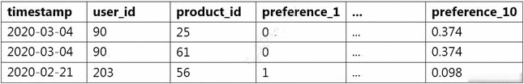

- [ ] Shuffle all interaction data. Split off the last 10% of the interaction data for the test set.
- [x] Identify the most recent 10% of interactions for each user. Split off these interactions for the test set.
- [ ] Identify the 10% of users with the least interaction data. Split off all interaction data from these users for the test set.
- [ ] Randomly select 10% of the users. Split off all interaction data from these users for the test set.

**[⬆ Back to Top](#table-of-contents)**

### A financial services company wants to adopt Amazon SageMaker as its default data science environment. The company's data scientists run machine learning (ML) models on confidential financial data. The company is worried about data egress and wants an ML engineer to secure the environment. Which mechanisms can the ML engineer use to control data egress from SageMaker? (Choose three.)

- [x] Connect to SageMaker by using a VPC interface endpoint powered by AWS PrivateLink.
- [ ] Use SCPs to restrict access to SageMaker.
- [ ] Disable root access on the SageMaker notebook instances.
- [x] Enable network isolation for training jobs and models.
- [ ] Restrict notebook presigned URLs to specific IPs used by the company.
- [x] Protect data with encryption at rest and in transit. Use AWS Key Management Service (AWS KMS) to manage encryption keys.

**[⬆ Back to Top](#table-of-contents)**

### A company needs to quickly make sense of a large amount of data and gain insight from it. The data is in different formats, the schemas change frequently, and new data sources are added regularly. The company wants to use AWS services to explore multiple data sources, suggest schemas, and enrich and transform the data. The solution should require the least possible coding effort for the data flows and the least possible infrastructure management. Which combination of AWS services will meet these requirements?

- [ ] Amazon EMR for data discovery, enrichment, and transformation. Amazon Athena for querying and analyzing the results in Amazon S3 using standard SQL. Amazon QuickSight for reporting and getting insights.
- [ ] Amazon Kinesis Data Analytics for data ingestion. Amazon EMR for data discovery, enrichment, and transformation. Amazon Redshift for querying and analyzing the results in Amazon S3.
- [x] AWS Glue for data discovery, enrichment, and transformation. Amazon Athena for querying and analyzing the results in Amazon S3 using standard SQL. Amazon QuickSight for reporting and getting insights.
- [ ] AWS Data Pipeline for data transfer. AWS Step Functions for orchestrating AWS Lambda jobs for data discovery, enrichment, and transformation. Amazon Athena for querying and analyzing the results in Amazon S3 using standard SQL. Amazon QuickSight for reporting and getting insights.

**[⬆ Back to Top](#table-of-contents)**

### A company is converting a large number of unstructured paper receipts into images. The company wants to create a model based on natural language processing (NLP) to find relevant entities such as date, location, and notes, as well as some custom entities such as receipt numbers. The company is using optical character recognition (OCR) to extract text for data labeling. However, documents are in different structures and formats, and the company is facing challenges with setting up the manual workflows for each document type. Additionally, the company trained a named entity recognition (NER) model for custom entity detection using a small sample size. This model has a very low confidence score and will require retraining with a large dataset. Which solution for text extraction and entity detection will require the LEAST amount of effort?

- [ ] Extract text from receipt images by using Amazon Textract. Use the Amazon SageMaker BlazingText algorithm to train on the text for entities and custom entities.
- [ ] Extract text from receipt images by using a deep learning OCR model from the AWS Marketplace. Use the NER deep learning model to extract entities.
- [x] Extract text from receipt images by using Amazon Textract. Use Amazon Comprehend for entity detection, and use Amazon Comprehend custom entity recognition for custom entity detection.
- [ ] Extract text from receipt images by using a deep learning OCR model from the AWS Marketplace. Use Amazon Comprehend for entity detection, and use Amazon Comprehend custom entity recognition for custom entity detection.

**[⬆ Back to Top](#table-of-contents)**

### A company is building a predictive maintenance model based on machine learning (ML). The data is stored in a fully private Amazon S3 bucket that is encrypted at rest with AWS Key Management Service (AWS KMS) CMKs. An ML specialist must run data preprocessing by using an Amazon SageMaker Processing job that is triggered from code in an Amazon SageMaker notebook. The job should read data from Amazon S3, process it, and upload it back to the same S3 bucket. The preprocessing code is stored in a container image in Amazon Elastic Container Registry (Amazon ECR). The ML specialist needs to grant permissions to ensure a smooth data preprocessing workflow. Which set of actions should the ML specialist take to meet these requirements?

- [x] Create an IAM role that has permissions to create Amazon SageMaker Processing jobs, S3 read and write access to the relevant S3 bucket, and appropriate KMS and ECR permissions. Attach the role to the SageMaker notebook instance. Create an Amazon SageMaker Processing job from the notebook.
- [ ] Create an IAM role that has permissions to create Amazon SageMaker Processing jobs. Attach the role to the SageMaker notebook instance. Create an Amazon SageMaker Processing job with an IAM role that has read and write permissions to the relevant S3 bucket, and appropriate KMS and ECR permissions.
- [ ] Create an IAM role that has permissions to create Amazon SageMaker Processing jobs and to access Amazon ECR. Attach the role to the SageMaker notebook instance. Set up both an S3 endpoint and a KMS endpoint in the default VPC. Create Amazon SageMaker Processing jobs from the notebook.
- [ ] Create an IAM role that has permissions to create Amazon SageMaker Processing jobs. Attach the role to the SageMaker notebook instance. Set up an S3 endpoint in the default VPC. Create Amazon SageMaker Processing jobs with the access key and secret key of the IAM user with appropriate KMS and ECR permissions.

**[⬆ Back to Top](#table-of-contents)**

### A data scientist has been running an Amazon SageMaker notebook instance for a few weeks. During this time, a new version of Jupyter Notebook was released along with additional software updates. The security team mandates that all running SageMaker notebook instances use the latest security and software updates provided by SageMaker. How can the data scientist meet this requirements?

- [ ] Call the CreateNotebookInstanceLifecycleConfig API operation.
- [ ] Create a new SageMaker notebook instance and mount the Amazon Elastic Block Store (Amazon EBS) volume from the original instance.
- [x] Stop and then restart the SageMaker notebook instance.
- [ ] Call the UpdateNotebookInstanceLifecycleConfig API operation.

**[⬆ Back to Top](#table-of-contents)**
