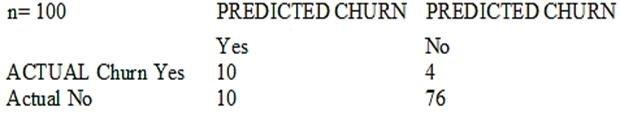

# ⬆️ Amazon Web Services Certified (AWS Certified) Machine Learning (MLS-C01) Practice Tests Exams Questions & Answers

### A large mobile network operating company is building a machine learning model to predict customers who are likely to unsubscribe from the service. The company plans to offer an incentive for these customers as the cost of churn is far greater than the cost of the incentive. The model produces the following confusion matrix after evaluating on a test dataset of 100 customers. Based on the model evaluation results, why is this a viable model for production?

- [x] The model is 86% accurate and the cost incurred by the company as a result of false negatives is less than the false positives.
- [ ] The precision of the model is 86%, which is less than the accuracy of the model.
- [ ] The model is 86% accurate and the cost incurred by the company as a result of false positives is less than the false negatives.
- [ ] The precision of the model is 86%, which is greater than the accuracy of the model.

### A Machine Learning Specialist is designing a system for improving sales for a company. The objective is to use the large amount of information the company has on users' behavior and product preferences to predict which products users would like based on the users' similarity to other users. What should the Specialist do to meet this objective?

- [x] Build a content-based filtering recommendation engine with Apache Spark ML on Amazon EMR.
- [x] Build a collaborative filtering recommendation engine with Apache Spark ML on Amazon EMR.
- [ ] Build a model-based filtering recommendation engine with Apache Spark ML on Amazon EMR.
- [x] Build a combinative filtering recommendation engine with Apache Spark ML on Amazon EMR.

### A Mobile Network Operator is building an analytics platform to analyze and optimize a company's operations using Amazon Athena and Amazon S3. The source systems send data in .CSV format in real time. The Data Engineering team wants to transform the data to the Apache Parquet format before storing it on Amazon S3. Which solution takes the LEAST effort to implement?

- [ ] Ingest .CSV data using Apache Kafka Streams on Amazon EC2 instances and use Kafka Connect S3 to serialize data as Parquet
- [ ] Ingest .CSV data from Amazon Kinesis Data Streams and use Amazon Glue to convert data into Parquet.
- [x] Ingest .CSV data using Apache Spark Structured Streaming in an Amazon EMR cluster and use Apache Spark to convert data into Parquet.
- [ ] Ingest .CSV data from Amazon Kinesis Data Streams and use Amazon Kinesis Data Firehose to convert data into Parquet.

### A city wants to monitor its air quality to address the consequences of air pollution. A Machine Learning Specialist needs to forecast the air quality in parts per million of contaminates for the next 2 days in the city. As this is a prototype, only daily data from the last year is available. Which model is MOST likely to provide the best results in Amazon SageMaker?

- [x] Use the Amazon SageMaker k-Nearest-Neighbors (kNN) algorithm on the single time series consisting of the full year of data with a predictor_typeof regressor.
- [ ] Use Amazon SageMaker Random Cut Forest (RCF) on the single time series consisting of the full year of data.
- [x] Use the Amazon SageMaker Linear Learner algorithm on the single time series consisting of the full year of data with a predictor_typeof regressor.
- [ ] Use the Amazon SageMaker Linear Learner algorithm on the single time series consisting of the full year of data with a predictor_typeof classifier.

### A Data Engineer needs to build a model using a dataset containing customer credit card information. How can the Data Engineer ensure the data remains encrypted and the credit card information is secure?

- [x] Use a custom encryption algorithm to encrypt the data and store the data on an Amazon SageMaker instance in a VPC.
- [ ] Use the SageMaker DeepAR algorithm to randomize the credit card numbers.
- [x] Use an IAM policy to encrypt the data on the Amazon S3 bucket and Amazon Kinesis to automatically discard credit card numbers and insert fake credit card numbers.
- [ ] Use an Amazon SageMaker launch configuration to encrypt the data once it is copied to the SageMaker instance in a VP
- [x] Use the SageMaker principal component analysis (PCA) algorithm to reduce the length of the credit card numbers.
- [ ] Use AWS KMS to encrypt the data on Amazon S3 and Amazon SageMaker, and redact the credit card numbers from the customer data with AWS Glue.

### A Machine Learning Specialist is using an Amazon SageMaker notebook instance in a private subnet of a corporate VPC. The ML Specialist has important data stored on the Amazon SageMaker notebook instance's Amazon EBS volume, and needs to take a snapshot of that EBS volume. However, the ML Specialist cannot find the Amazon SageMaker notebook instance's EBS volume or Amazon EC2 instance within the VPC. Why is the ML Specialist not seeing the instance visible in the VPC?

- [ ] Amazon SageMaker notebook instances are based on the EC2 instances within the customer account, but they run outside of VPCs.
- [ ] Amazon SageMaker notebook instances are based on the Amazon ECS service within customer accounts.
- [x] Amazon SageMaker notebook instances are based on EC2 instances running within AWS service accounts.
- [ ] Amazon SageMaker notebook instances are based on AWS ECS instances running within AWS service accounts.

### A Machine Learning Specialist is building a model that will perform time series forecasting using Amazon SageMaker. The Specialist has finished training the model and is now planning to perform load testing on the endpoint so they can configure Auto Scaling for the model variant. Which approach will allow the Specialist to review the latency, memory utilization, and CPU utilization during the load test?

- [x] Review SageMaker logs that have been written to Amazon S3 by leveraging Amazon Athena and Amazon QuickSight to visualize logs as they are being produced.
- [x] Generate an Amazon CloudWatch dashboard to create a single view for the latency, memory utilization, and CPU utilization metrics that are outputted by Amazon SageMaker.
- [ ] Build custom Amazon CloudWatch Logs and then leverage Amazon ES and Kibana to query and visualize the log data as it is generated by Amazon SageMaker.
- [ ] Send Amazon CloudWatch Logs that were generated by Amazon SageMaker to Amazon ES and use Kibana to query and visualize the log data

### A manufacturing company has structured and unstructured data stored in an Amazon S3 bucket. A Machine Learning Specialist wants to use SQL to run queries on this data. Which solution requires the LEAST effort to be able to query this data?

- [ ] Use AWS Data Pipeline to transform the data and Amazon RDS to run queries.
- [x] Use AWS Glue to catalogue the data and Amazon Athena to run queries.
- [ ] Use AWS Batch to run ETL on the data and Amazon Aurora to run the queries.
- [ ] Use AWS Lambda to transform the data and Amazon Kinesis Data Analytics to run queries.

### A Machine Learning Specialist is developing a custom video recommendation model for an application. The dataset used to train this model is very large with millions of data points and is hosted in an Amazon S3 bucket. The Specialist wants to avoid loading all of this data onto an Amazon SageMaker notebook instance because it would take hours to move and will exceed the attached 5 GB Amazon EBS volume on the notebook instance. Which approach allows the Specialist to use all the data to train the model?

- [x] Load a smaller subset of the data into the SageMaker notebook and train locally. Confirm that the training code is executing and the model parameters seem reasonable. Initiate a SageMaker training job using the full dataset from the S3 bucket using Pipe input mode.
- [ ] Launch an Amazon EC2 instance with an AWS Deep Learning AMI and attach the S3 bucket to the instance. Train on a small amount of the data to verify the training code and hyperparameters. Go back to Amazon SageMaker and train using the full dataset
- [ ] Use AWS Glue to train a model using a small subset of the data to confirm that the data will be compatible with Amazon SageMaker. Initiate a SageMaker training job using the full dataset from the S3 bucket using Pipe input mode.
- [ ] Load a smaller subset of the data into the SageMaker notebook and train locally. Confirm that the training code is executing and the model parameters seem reasonable. Launch an Amazon EC2 instance with an AWS Deep Learning AMI and attach the S3 bucket to train the full dataset.

### A Machine Learning Specialist has completed a proof of concept for a company using a small data sample, and now the Specialist is ready to implement an end-to-end solution in AWS using Amazon SageMaker. The historical training data is stored in Amazon RDS. Which approach should the Specialist use for training a model using that data?

- [ ] Write a direct connection to the SQL database within the notebook and pull data in
- [x] Push the data from Microsoft SQL Server to Amazon S3 using an AWS Data Pipeline and provide the S3 location within the notebook.
- [ ] Move the data to Amazon DynamoDB and set up a connection to DynamoDB within the notebook to pull data in.
- [ ] Move the data to Amazon ElastiCache using AWS DMS and set up a connection within the notebook to pull data in for fast access.

### A Machine Learning Specialist receives customer data for an online shopping website. The data includes demographics, past visits, and locality information. The Specialist must develop a machine learning approach to identify the customer shopping patterns, preferences, and trends to enhance the website-for better service and smart recommendations. Which solution should the Specialist recommend?

- [ ] Latent Dirichlet Allocation (LDA) for the given collection of discrete data to identify patterns in the customer database.
- [ ] A neural network with a minimum of three layers and random initial weights to identify patterns in the customer database.
- [x] Collaborative filtering based on user interactions and correlations to identify patterns in the customer database.
- [ ] Random Cut Forest (RCF) over random subsamples to identify patterns in the customer database.

### A Machine Learning Specialist is working with a large company to leverage machine learning within its products. The company wants to group its customers into categories based on which customers will and will not churn within the next 6 months. The company has labeled the data available to the Specialist. Which machine learning model type should the Specialist use to accomplish this task?

- [x] Linear regression.
- [x] Classification.
- [x] Clustering.
- [ ] Reinforcement learning.

### The displayed graph is from a forecasting model for testing a time series. Considering the graph only, which conclusion should a Machine Learning Specialist make about the behavior of the model?

- [ ] The model predicts both the trend and the seasonality well.
- [ ] The model predicts the trend well, but not the seasonality.
- [ ] The model predicts the seasonality well, but not the trend.
- [x] The model does not predict the trend or the seasonality well.

### A company wants to classify user behavior as either fraudulent or normal. Based on internal research, a Machine Learning Specialist would like to build a binary classifier based on two features: age of account and transaction month. The class distribution for these features is illustrated in the figure provided. Based on this information, which model would have the HIGHEST accuracy?

- [ ] Long short-term memory (LSTM) model with scaled exponential linear unit (SELU).
- [ ] Logistic regression.
- [x] Support vector machine (SVM) with non-linear kernel.
- [ ] Single perceptron with tanh activation function.

### A Machine Learning Specialist at a company sensitive to security is preparing a dataset for model training. The dataset is stored in Amazon S3 and contains Personally Identifiable Information (PII). The dataset: Must be accessible from a VPC only. Must not traverse the public internet. How can these requirements be satisfied?

- [x] Create a VPC endpoint and apply a bucket access policy that restricts access to the given VPC endpoint and the VPC.
- [ ] Create a VPC endpoint and apply a bucket access policy that allows access from the given VPC endpoint and an Amazon EC2 instance.
- [ ] Create a VPC endpoint and use Network Access Control Lists (NACLs) to allow traffic between only the given VPC endpoint and an Amazon EC2 instance.
- [x] Create a VPC endpoint and use security groups to restrict access to the given VPC endpoint and an Amazon EC2 instance.

### During mini-batch training of a neural network for a classification problem, a Data Scientist notices that training accuracy oscillates. What is the MOST likely cause of this issue?

- [x] The class distribution in the dataset is imbalanced.
- [ ] Dataset shuffling is disabled.
- [ ] The batch size is too big.
- [x] The learning rate is very high.

### An employee found a video clip with audio on a company's social media feed. The language used in the video is Spanish. English is the employee's first language, and they do not understand Spanish. The employee wants to do a sentiment analysis. What combination of services is the MOST efficient to accomplish the task?

- [x] Amazon Transcribe, Amazon Translate, and Amazon Comprehend.
- [ ] Amazon Transcribe, Amazon Comprehend, and Amazon SageMaker seq2seq
- [ ] Amazon Transcribe, Amazon Translate, and Amazon SageMaker Neural Topic Model (NTM)
- [ ] Amazon Transcribe, Amazon Translate and Amazon SageMaker BlazingText.

### A Machine Learning Specialist is packaging a custom ResNet model into a Docker container so the company can leverage Amazon SageMaker for training. The Specialist is using Amazon EC2 P3 instances to train the model and needs to properly configure the Docker container to leverage the NVIDIA GPUs. What does the Specialist need to do?

- [ ] Bundle the NVIDIA drivers with the Docker image.
- [x] Build the Docker container to be NVIDIA-Docker compatible.
- [ ] Organize the Docker container's file structure to execute on GPU instances.
- [ ] Set the GPU flag in the Amazon SageMaker CreateTrainingJob request body.

### A Machine Learning Specialist is building a logistic regression model that will predict whether or not a person will order a pizza. The Specialist is trying to build the optimal model with an ideal classification threshold. What model evaluation technique should the Specialist use to understand how different classification thresholds will impact the model's performance?

- [x] Receiver operating characteristic (ROC) curve.
- [ ] Misclassification rate.
- [ ] Root Mean Square Error (RMSE).
- [ ] L1 norm.

### An interactive online dictionary wants to add a widget that displays words used in similar contexts. A Machine Learning Specialist is asked to provide word features for the downstream nearest neighbor model powering the widget. What should the Specialist do to meet these requirements?

- [x] Create one-hot word encoding vectors.
- [ ] Produce a set of synonyms for every word using Amazon Mechanical Turk.
- [ ] Create word embedding vectors that store edit distance with every other word.
- [ ] Download word embeddings pre-trained on a large corpus.

### A Machine Learning Specialist is configuring Amazon SageMaker so multiple Data Scientists can access notebooks, train models, and deploy endpoints. To ensure the best operational performance, the Specialist needs to be able to track how often the Scientists are deploying models, GPU and CPU utilization on the deployed SageMaker endpoints, and all errors that are generated when an endpoint is invoked. Which services are integrated with Amazon SageMaker to track this information? (Choose two.)

- [x] AWS CloudTrail.
- [ ] AWS Health.
- [ ] AWS Trusted Advisor.
- [x] Amazon CloudWatch.
- [x] AWS Config.

### A retail chain has been ingesting purchasing records from its network of 20,000 stores to Amazon S3 using Amazon Kinesis Data Firehose. To support training an improved machine learning model, training records will require new but simple transformations, and some attributes will be combined. The model needs to be retrained daily. Given the large number of stores and the legacy data ingestion, which change will require the LEAST amount of development effort?

- [ ] Require that the stores to switch to capturing their data locally on AWS Storage Gateway for loading into Amazon S3, then use AWS Glue to do the transformation.
- [ ] Deploy an Amazon EMR cluster running Apache Spark with the transformation logic, and have the cluster run each day on the accumulating records in Amazon S3, outputting new/transformed records to Amazon S3.
- [ ] Spin up a fleet of Amazon EC2 instances with the transformation logic, have them transform the data records accumulating on Amazon S3, and output the transformed records to Amazon S3.
- [x] Insert an Amazon Kinesis Data Analytics stream downstream of the Kinesis Data Firehose stream that transforms raw record attributes into simple transformed values using SQL.

### A Machine Learning Specialist is building a convolutional neural network (CNN) that will classify 10 types of animals. The Specialist has built a series of layers in a neural network that will take an input image of an animal, pass it through a series of convolutional and pooling layers, and then finally pass it through a dense and fully connected layer with 10 nodes. The Specialist would like to get an output from the neural network that is a probability distribution of how likely it is that the input image belongs to each of the 10 classes. Which function will produce the desired output?

- [x] Dropout.
- [ ] Smooth L1 loss.
- [ ] Softmax.
- [x] Rectified linear units (ReLU).

### A Machine Learning Specialist trained a regression model, but the first iteration needs optimizing. The Specialist needs to understand whether the model is more frequently overestimating or underestimating the target. What option can the Specialist use to determine whether it is overestimating or underestimating the target value?

- [ ] Root Mean Square Error (RMSE).
- [ ] Residual plots.
- [x] Area under the curve.
- [ ] Confusion matrix.

### A company wants to classify user behavior as either fraudulent or normal. Based on internal research, a Machine Learning Specialist would like to build a binary classifier based on two features: age of account and transaction month. The class distribution for these features is illustrated in the figure provided. Based on this information, which model would have the HIGHEST recall with respect to the fraudulent class?

- [ ] Decision tree.
- [ ] Linear support vector machine (SVM).
- [x] Naive Bayesian classifier.
- [ ] Single Perceptron with sigmoidal activation function.

### A Machine Learning Specialist kicks off a hyperparameter tuning job for a tree-based ensemble model using Amazon SageMaker with Area Under the ROC Curve (AUC) as the objective metric. This workflow will eventually be deployed in a pipeline that retrains and tunes hyperparameters each night to model click-through on data that goes stale every 24 hours. With the goal of decreasing the amount of time it takes to train these models, and ultimately to decrease costs, the Specialist wants to reconfigure the input hyperparameter range(s). Which visualization will accomplish this?

- [ ] A histogram showing whether the most important input feature is Gaussian.
- [ ] A scatter plot with points colored by target variable that uses t-Distributed Stochastic Neighbor Embedding (t-SNE) to visualize the large number of input variables in an easier-to-read dimension.
- [ ] A scatter plot showing the performance of the objective metric over each training iteration.
- [x] A scatter plot showing the correlation between maximum tree depth and the objective metric.

### A Machine Learning Specialist is creating a new natural language processing application that processes a dataset comprised of 1 million sentences. The aim is to then run Word2Vec to generate embeddings of the sentences and enable different types of predictions. Here is an example from the dataset: 'The quck BROWN FOX jumps over the lazy dog.' Which of the following are the operations the Specialist needs to perform to correctly sanitize and prepare the data in a repeatable manner? (Choose three.)

- [x] Perform part-of-speech tagging and keep the action verb and the nouns only.
- [x] Normalize all words by making the sentence lowercase.
- [ ] Remove stop words using an English stopword dictionary.
- [x] Correct the typography on 'quck' to 'quick'.
- [ ] One-hot encode all words in the sentence.
- [ ] Tokenize the sentence into words.

### A company is using Amazon Polly to translate plaintext documents to speech for automated company announcements. However, company acronyms are being mispronounced in the current documents. How should a Machine Learning Specialist address this issue for future documents?

- [x] Convert current documents to SSML with pronunciation tags.
- [ ] Create an appropriate pronunciation lexicon.
- [ ] Output speech marks to guide in pronunciation.
- [ ] Use Amazon Lex to preprocess the text files for pronunciation.

### An insurance company is developing a new device for vehicles that uses a camera to observe drivers' behavior and alert them when they appear distracted. The company created approximately 10,000 training images in a controlled environment that a Machine Learning Specialist will use to train and evaluate machine learning models. During the model evaluation, the Specialist notices that the training error rate diminishes faster as the number of epochs increases and the model is not accurately inferring on the unseen test images. Which of the following should be used to resolve this issue? (Choose two.)

- [x] Add vanishing gradient to the model.
- [x] Perform data augmentation on the training data.
- [ ] Make the neural network architecture complex.
- [x] Use gradient checking in the model.
- [ ] Add L2 regularization to the model.

### When submitting Amazon SageMaker training jobs using one of the built-in algorithms, which common parameters MUST be specified? (Choose three.)

- [ ] The training channel identifying the location of training data on an Amazon S3 bucket.
- [ ] The validation channel identifying the location of validation data on an Amazon S3 bucket.
- [x] The IAM role that Amazon SageMaker can assume to perform tasks on behalf of the users.
- [ ] Hyperparameters in a JSON array as documented for the algorithm used.
- [x] The Amazon EC2 instance class specifying whether training will be run using CPU or GP
- [x] The output path specifying where on an Amazon S3 bucket the trained model will persist.

### A monitoring service generates 1 TB of scale metrics record data every minute. A Research team performs queries on this data using Amazon Athena. The queries run slowly due to the large volume of data, and the team requires better performance. How should the records be stored in Amazon S3 to improve query performance?

- [ ] CSV files.
- [x] Parquet files.
- [ ] Compressed JSON.
- [ ] RecordIO.

### Machine Learning Specialist is working with a media company to perform classification on popular articles from the company's website. The company is using random forests to classify how popular an article will be before it is published. A sample of the data being used is below. Given the dataset, the Specialist wants to convert the Day_Of_Week column to binary values. What technique should be used to convert this column to binary values?

- [ ] Binarization.
- [x] One-hot encoding.
- [ ] Tokenization.
- [ ] Normalization transformation.

### A gaming company has launched an online game where people can start playing for free, but they need to pay if they choose to use certain features. The company needs to build an automated system to predict whether or not a new user will become a paid user within 1 year. The company has gathered a labeled dataset from 1 million users. The training dataset consists of 1,000 positive samples (from users who ended up paying within 1 year) and 999,000 negative samples (from users who did not use any paid features). Each data sample consists of 200 features including user age, device, location, and play patterns. Using this dataset for training, the Data Science team trained a random forest model that converged with over 99% accuracy on the training set. However, the prediction results on a test dataset were not satisfactory. Which of the following approaches should the Data Science team take to mitigate this issue? (Choose two.)

- [ ] Add more deep trees to the random forest to enable the model to learn more features.
- [ ] Include a copy of the samples in the test dataset in the training dataset.
- [x] Generate more positive samples by duplicating the positive samples and adding a small amount of noise to the duplicated data.
- [x] Change the cost function so that false negatives have a higher impact on the cost value than false positives.
- [ ] Change the cost function so that false positives have a higher impact on the cost value than false negatives.

### A Data Scientist is developing a machine learning model to predict future patient outcomes based on information collected about each patient and their treatment plans. The model should output a continuous value as its prediction. The data available includes labeled outcomes for a set of 4,000 patients. The study was conducted on a group of individuals over the age of 65 who have a particular disease that is known to worsen with age. Initial models have performed poorly. While reviewing the underlying data, the Data Scientist notices that, out of 4,000 patient observations, there are 450 where the patient age has been input as 0. The other features for these observations appear normal compared to the rest of the sample population. How should the Data Scientist correct this issue?

- [x] Drop all records from the dataset where age has been set to 0.
- [ ] Replace the age field value for records with a value of 0 with the mean or median value from the dataset.
- [ ] Drop the age feature from the dataset and train the model using the rest of the features.
- [ ] Use k-means clustering to handle missing features

### A Data Science team is designing a dataset repository where it will store a large amount of training data commonly used in its machine learning models. As Data Scientists may create an arbitrary number of new datasets every day, the solution has to scale automatically and be cost-effective. Also, it must be possible to explore the data using SQL. Which storage scheme is MOST adapted to this scenario?

- [x] Store datasets as files in Amazon S3.
- [ ] Store datasets as files in an Amazon EBS volume attached to an Amazon EC2 instance.
- [ ] Store datasets as tables in a multi-node Amazon Redshift cluster.
- [ ] Store datasets as global tables in Amazon DynamoDB.

### Tom has been tasked to install Check Point R80 in a distributed deployment. Before Tom installs the systems this way, how many machines will he need if he does NOT include a SmartConsole machine in his calculations?

- [ ] One machine, but it needs to be installed using SecurePlatform for compatibility purposes.
- [ ] One machine.
- [x] Two machines.
- [ ] Three machines.

### Which characteristic applies to a catalog backup?

- [ ] Catalog staging files deleted after a successful catalog backup.
- [x] A catalog backup can be configured to send disaster recovery information to an e-mail address.
- [ ] A catalog backup must fit on a single tape.
- [ ] A catalog backup shuts down the NetBackup database.
